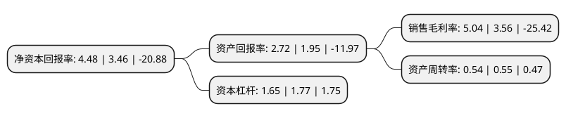

> 本页面由自动化程序生成于 2022年5月20日 01:06
> 内容可能存在错误，如有bug请提交issue至：https://github.com/Eroleice/doc-pi/issues
{.is-warning}

# 上市公司基本情况

## 基本资料

北京北斗星通导航技术股份有限公司（以下简称“北斗星通”）成立于2000年09月25日，北京市。于2007年08月13日在深交所中小板上市。

北斗星通注册资本51,220万元，主营业务:卫星导航定位产品，基于位置的信息系统应用和基于位置的运营服务三大业务。以下是详细信息：

- 公司名称: 北京北斗星通导航技术股份有限公司
- 股票代码: 002151.SZ
- 所在地: 北京 - 北京市
- 成立日期: 2000年09月25日
- 注册资本: 51,220万元
- 法定代表人: 周儒欣
- 主营业务: 主营业务:卫星导航定位产品，基于位置的信息系统应用和基于位置的运营服务三大业务
- 公司官网: www.BDStar.com
- 公司介绍: 公司是我国卫星导航产业首家上市公司，以推动北斗产业化应用、助力导航产业发展为己任，为全球用户提供卓越的产品、解决方案及服务。公司专业从事卫星导航定位产品、基于位置的信息系统应用和基于位置的运营服务业务，形成了“产品+系统应用+运营服务”的经营模式。公司是经北斗系统主管部门授权许可、专门从事北斗卫星导航定位系统运营服务业务的运营机构。公司集聚了“千人计划”、“万人计划”、科技部创新人才推进计划、北京市科技领军人才等一批业内一流人才；取得了一批高水平研发成果，其卫星导航芯片、板卡、天线等基础产品在各行业得到广泛应用。多年形成的“产品+系统应用+运营服务”的业务模式不断深化，四大业务板块协调发展，为我国北斗导航产业发展做出了卓越贡献。

## 股东及高管情况

上市公司第一大股东为周儒欣，持股132,431,059股，占比25.86%，**疑似为**上市公司实际控制人。

截至2022年03月31日，上市公司的前十大股东中，共有3名自然人股东，2名机构股东，4个产品账户，1个海外主体，其中5%以上大股东共有2名。上市公司前十大股东明细如下：

> 未能通过持股比例判定出上市公司实际控制人（持股30%以上）
> 可能存在通过间接持股、联合持股、协议控制等方式拥有实际控制权的主体，具体请参考上市公司定期公告！
{.is-warning}

> 截至2022年03月31日，上市公司前十大股东信息如下：

| 股东名称 | 持股数量（股） | 持股比例 |
| --- | --- | --- |
| 周儒欣 | 132,431,059 | 25.86% |
| 国家集成电路产业投资基金股份有限公司 | 43,878,607 | 8.57% |
| 香港中央结算有限公司(陆股通) | 6,071,878 | 1.19% |
| 李建辉 | 3,203,786 | 0.63% |
| 浙江正原电气股份有限公司 | 2,390,000 | 0.47% |
| 温州启元资产管理有限公司-启元优享11号私募证券投资基金 | 2,330,000 | 0.45% |
| 温州启元资产管理有限公司-启元优享19号私募证券投资基金 | 2,330,000 | 0.45% |
| 温州启元资产管理有限公司-启元优享7号私募证券投资基金 | 2,330,000 | 0.45% |
| 华融瑞通股权投资管理有限公司 | 2,164,970 | 0.42% |
| 任伟芳 | 1,676,443 | 0.33% |

## 利润表分析

上市公司2021年总收入为38.5亿元，净利润为1.94亿元，实现盈利。

## 杜邦分析

> 数据列示周期：2021年 | 2020年 | 2019年
{.is-info}

上市公司的净资产收益率在近一年有所上升，上升幅度为29.48%，其变化情况分解如下：
- 上市公司的销售毛利率在近一年上升了41.57%，可能是生产效率的提升、商品原材料价格下跌或商品价格的上涨所致。
- 上市公司的资产周转率在近一年下降了-1.82%，可能是源自于更慢的销售回款或库存管理效果下降。
- 上市公司的财务杠杆比率在近一年下降了-6.78%，可能是减少负债降低财务费用。

