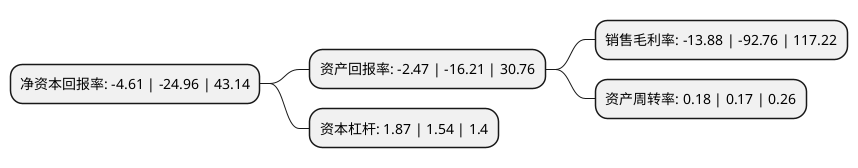

> 本页面由自动化程序生成于 2022年5月20日 01:06
> 内容可能存在错误，如有bug请提交issue至：https://github.com/Eroleice/doc-pi/issues
{.is-warning}

# 上市公司基本情况

## 基本资料

深圳市远望谷信息技术股份有限公司（以下简称“远望谷”）成立于1999年12月21日，深圳市。于2007年08月21日在深交所中小板上市。

远望谷注册资本73,975.74万元，主营业务，超高频RFID技术开发及超高频RFID产品的生产，销售。公司主要产品包括地面装置，标签读写器，电子标签(含机车电子标签，货车电子标签，客车电子标签，系列化电子标签)，应用软件，备品备件及其他(含检测设备，配套天线等)。以下是详细信息：

- 公司名称: 深圳市远望谷信息技术股份有限公司
- 股票代码: 002161.SZ
- 所在地: 广东 - 深圳市
- 成立日期: 1999年12月21日
- 注册资本: 73,975.74万元
- 法定代表人: 陈光珠
- 主营业务: 主营业务，超高频RFID技术开发及超高频RFID产品的生产，销售公司主要产品包括地面装置，标签读写器，电子标签(含机车电子标签，货车电子标签，客车电子标签，系列化电子标签)，应用软件，备品备件及其他(含检测设备，配套天线等)
- 公司官网: www.invengo.cn
- 公司介绍: 公司是中国物联网产业的代表企业，全球领先的RFID技术、产品和整体解决方案供应商，是国内首家RFID行业上市公司。公司聚焦铁路、图书、零售三大业务，同时大力发展纺织洗涤、智慧旅游、烟酒管理、智能交通等RFID物联网垂直应用领域，提供高性能的RFID技术、产品和整体解决方案。公司专注于研发RFID核心技术、产品与解决方案。公司拥有自主研发的RFID芯片，电子标签、读写器、手持设备等产品多种；公司设有深圳市射频识别工程技术研究开发中心、基于RFID技术的物联网应用工程实验室、企业博士后科研工作站、射频设备检测实验室；拥有全球最先进的电子标签生产工艺和设备；建有全球领先的RFID产品动态性能测试中心，可为大规模的物联网建设提供RFID技术、产品和解决方案服务。

## 股东及高管情况

上市公司第一大股东为徐玉锁，持股150,172,513股，占比20.3%，**疑似为**上市公司实际控制人。

截至2022年03月31日，上市公司的前十大股东中，共有6名自然人股东，4个产品账户，其中5%以上大股东共有1名。上市公司前十大股东明细如下：

> 未能通过持股比例判定出上市公司实际控制人（持股30%以上）
> 可能存在通过间接持股、联合持股、协议控制等方式拥有实际控制权的主体，具体请参考上市公司定期公告！
{.is-warning}

> 截至2022年03月31日，上市公司前十大股东信息如下：

| 股东名称 | 持股数量（股） | 持股比例 |
| --- | --- | --- |
| 徐玉锁 | 150,172,513 | 20.3% |
| 陈光珠 | 34,866,728 | 4.71% |
| 陈长安 | 11,823,947 | 1.6% |
| 深圳市远望谷信息技术股份有限公司-第一期员工持股计划 | 8,099,053 | 1.09% |
| 上海呈瑞投资管理有限公司-呈瑞和兴4号私募证券投资基金 | 7,558,100 | 1.02% |
| 孝泽(杭州)资产管理有限公司-孝泽-全景8号私募证券投资基金 | 3,540,161 | 0.48% |
| 蔡晓东 | 3,000,000 | 0.41% |
| 孝泽(杭州)资产管理有限公司-孝泽-全景18号私募证券投资基金 | 2,666,400 | 0.36% |
| 闫松岩 | 2,298,268 | 0.31% |
| 刘存香 | 2,177,500 | 0.29% |

## 利润表分析

上市公司2021年总收入为4.92亿元，净利润为-0.69亿元，**未实现盈利**。

## 杜邦分析

> 数据列示周期：2021年 | 2020年 | 2019年
{.is-info}

上市公司的净资产收益率在近一年有所下降，下降幅度为-81.53%，其变化情况分解如下：
- 上市公司的销售毛利率在近一年下降了-85.04%，可能是生产效率的下降、商品原材料价格上涨或商品价格的下跌所致。
- 上市公司的资产周转率在近一年上升了5.88%，可能是源自于更快的销售回款或库存管理效果提升。
- 上市公司的财务杠杆比率在近一年上升了21.43%，可能是增加负债扩大生产规模。

