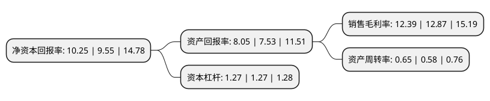

> 本页面由自动化程序生成于 2022年5月20日 01:07
> 内容可能存在错误，如有bug请提交issue至：https://github.com/Eroleice/doc-pi/issues
{.is-warning}

# 上市公司基本情况

## 基本资料

武汉凡谷电子技术股份有限公司（以下简称“武汉凡谷”）成立于1989年10月20日，武汉市。于2007年12月07日在深交所中小板上市。

武汉凡谷注册资本68,108.031万元，主营业务:移动通信天馈系统射频子系统及器件的研制，生产，销售和服务。主要产品包括各种类型的双工器，滤波器，射频子系统等。以下是详细信息：

- 公司名称: 武汉凡谷电子技术股份有限公司
- 股票代码: 002194.SZ
- 所在地: 湖北 - 武汉市
- 成立日期: 1989年10月20日
- 注册资本: 68,108.031万元
- 法定代表人: 杨红
- 主营业务: 主营业务:移动通信天馈系统射频子系统及器件的研制，生产，销售和服务主要产品包括各种类型的双工器，滤波器，射频子系统等
- 公司官网: www.fingu.com
- 公司介绍: 公司是跻身国际一流的移动通信天馈系统射频器件独立供应商。公司长期专注于发展移动通信天馈系统射频器件的核心技术，主要产品和解决方案有滤波器系列(双工器、合路器、塔顶放大器等)、介质材料、毫米波雷达系列(交通、安防、工业控制等)、行业网平台系列(公安、交通以及政府政务云等)，凭借自有知识产权和强大的软件和硬件研发平台，快速响应客户定制产品需求。凭借专业化产品研发平台、纵向集成的大规模生产能力、低成本结构以及优秀的客户协作能力，为全球领先的移动通信系统集成商提供基站天馈系统射频子系统和器件的定制产品及专业服务。公司长期专注于发展移动通信天馈系统射频器件的核心技术，凭借自有知识产权和强大的研发平台，快速响应客户定制产品需求。公司旨在创造一个“以不断满足客户需求为拉动力，以不断激发员工成功愿望为推动力”、以“不断发展壮大、始终奉献社会”为经营理念的全球化卓越型企业。公司坚持“技术创新，服务通信，核心业务，集中取胜，相邻业务，优选发展”的技术发展路线，稳健地在市场中捕捉机遇，实现可持续发展。

## 股东及高管情况

上市公司第一大股东为王丽丽，持股190,406,400股，占比27.96%，**疑似为**上市公司实际控制人。

截至2022年04月06日，上市公司的前十大股东中，共有6名自然人股东，4个产品账户，其中5%以上大股东共有5名。上市公司前十大股东明细如下：

> 未能通过持股比例判定出上市公司实际控制人（持股30%以上）
> 可能存在通过间接持股、联合持股、协议控制等方式拥有实际控制权的主体，具体请参考上市公司定期公告！
{.is-warning}

> 截至2022年04月06日，上市公司前十大股东信息如下：

| 股东名称 | 持股数量（股） | 持股比例 |
| --- | --- | --- |
| 王丽丽 | 190,406,400 | 27.96% |
| 孟庆南 | 50,438,267 | 7.41% |
| 孟庆南 | 50,438,267 | 7.41% |
| 孟凡博 | 42,048,141 | 6.17% |
| 孟凡博 | 42,048,141 | 6.17% |
| 深圳市恒信华业股权投资基金管理有限公司-平潭华业价值投资合伙企业(有限合伙) | 32,986,781 | 4.84% |
| 深圳市恒信华业股权投资基金管理有限公司-平潭华业战略投资合伙企业(有限合伙) | 32,967,842 | 4.84% |
| 中国银行股份有限公司-华夏中证5G通信主题交易型开放式指数证券投资基金 | 2,564,553 | 0.38% |
| 黄勇 | 2,496,000 | 0.37% |
| 广发基金-农业银行-广发中证金融资产管理计划 | 2,176,800 | 0.32% |

## 利润表分析

上市公司2021年总收入为18.37亿元，净利润为2.27亿元，实现盈利。

## 杜邦分析

> 数据列示周期：2021年 | 2020年 | 2019年
{.is-info}

上市公司的净资产收益率在近一年有所上升，上升幅度为7.33%，其变化情况分解如下：
- 上市公司的销售毛利率在近一年下降了-3.73%，可能是生产效率的下降、商品原材料价格上涨或商品价格的下跌所致。
- 上市公司的资产周转率在近一年上升了12.07%，可能是源自于更快的销售回款或库存管理效果提升。
- 上市公司的财务杠杆比率在近一年下降了0%，可能是减少负债降低财务费用。

