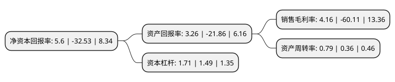

> 本页面由自动化程序生成于 2022年5月20日 01:07
> 内容可能存在错误，如有bug请提交issue至：https://github.com/Eroleice/doc-pi/issues
{.is-warning}

# 上市公司基本情况

## 基本资料

奥维通信股份有限公司（以下简称“奥维通信”）成立于2000年12月21日，沈阳市。于2008年05月12日在深交所中小板上市。

奥维通信注册资本34,685.002万元，微波射频产品及无线通信网络优化覆盖系统开发，生产，销售并提供相应服务。以下是详细信息：

- 公司名称: 奥维通信股份有限公司
- 股票代码: 002231.SZ
- 所在地: 辽宁 - 沈阳市
- 成立日期: 2000年12月21日
- 注册资本: 34,685.002万元
- 法定代表人: 杜方
- 主营业务: 微波射频产品及无线通信网络优化覆盖系统开发，生产，销售并提供相应服务
- 公司官网: www.syallwin.com
- 公司介绍: 公司是国内移动通信运营商无线网络优化覆盖设备专业供应商和服务商，主要从事微波射频产品及无线通信网络优化覆盖系统开发、生产、销售并提供相应服务，专业为通信运营商开发生产GSM/CDMA/PHS/WCDMA/TD-SCDMA/CDMA2000同频、移频直放站、光纤传输直放站、基站放大器、干线放大器、无源微波器件、天线、专业软件及网管监控等产品。专业提供室内信号分布系统、室外直放站系统、小区深度覆盖系统、基站延伸放大系统、智能载波调度系统、智能网管监控系统等全面解决方案。多年来在产品及系统开发、生产、应用、服务中积累了丰富的经验，能够满足不同网络体制、不同区域的信号覆盖要求。

## 股东及高管情况

上市公司第一大股东为瑞丽市瑞丽湾旅游开发有限公司，持股81,225,000股，占比23.42%，**疑似为**上市公司实际控制人。

截至2022年03月31日，上市公司的前十大股东中，共有8名自然人股东，1名机构股东，1个产品账户，其中5%以上大股东共有2名。上市公司前十大股东明细如下：

> 未能通过持股比例判定出上市公司实际控制人（持股30%以上）
> 可能存在通过间接持股、联合持股、协议控制等方式拥有实际控制权的主体，具体请参考上市公司定期公告！
{.is-warning}

> 截至2022年03月31日，上市公司前十大股东信息如下：

| 股东名称 | 持股数量（股） | 持股比例 |
| --- | --- | --- |
| 瑞丽市瑞丽湾旅游开发有限公司 | 81,225,000 | 23.42% |
| 杜方 | 69,375,000 | 20% |
| 肖飞 | 2,610,628 | 0.75% |
| 张海英 | 2,565,817 | 0.74% |
| 陈佳芬 | 1,350,000 | 0.39% |
| 陈树林 | 1,200,000 | 0.35% |
| 肖爱培 | 926,100 | 0.27% |
| 许明舟 | 858,900 | 0.25% |
| 中信银行股份有限公司-博时专精特新主题混合型证券投资基金 | 777,100 | 0.22% |
| 于飞 | 753,400 | 0.22% |

## 利润表分析

上市公司2021年总收入为5.61亿元，净利润为0.23亿元，实现盈利。

## 杜邦分析

> 数据列示周期：2021年 | 2020年 | 2019年
{.is-info}

上市公司的净资产收益率在近一年有所下降，下降幅度为-117.21%，其变化情况分解如下：
- 上市公司的销售毛利率在近一年下降了-106.92%，可能是生产效率的下降、商品原材料价格上涨或商品价格的下跌所致。
- 上市公司的资产周转率在近一年上升了119.44%，可能是源自于更快的销售回款或库存管理效果提升。
- 上市公司的财务杠杆比率在近一年上升了14.77%，可能是增加负债扩大生产规模。

