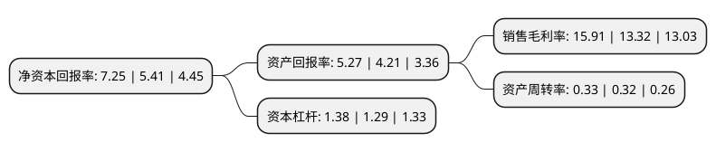

> 本页面由自动化程序生成于 2022年5月20日 01:07
> 内容可能存在错误，如有bug请提交issue至：https://github.com/Eroleice/doc-pi/issues
{.is-warning}

# 上市公司基本情况

## 基本资料

河南辉煌科技股份有限公司（以下简称“辉煌科技”）成立于2001年11月15日，郑州市。于2009年09月29日在深交所中小板上市。

辉煌科技注册资本38,961.642万元，主要产品:本公司主要产品包括铁路信号微机监测系统，列车调度指挥系统(TDCS)，无线调车机车信号和监控系统，分散自律调度集中系统(CTC)，无线车次号校核系统，机车综合无线通信设备，计轴系统，厂矿铁路综合信息管理系统以及电源维护测试产品。主营业务:本公司的主营业务为铁路信号通信领域产品的研制开发，生产及销售。以下是详细信息：

- 公司名称: 河南辉煌科技股份有限公司
- 股票代码: 002296.SZ
- 所在地: 河南 - 郑州市
- 成立日期: 2001年11月15日
- 注册资本: 38,961.642万元
- 法定代表人: 李海鹰
- 主营业务: 主要产品:本公司主要产品包括铁路信号微机监测系统，列车调度指挥系统(TDCS)，无线调车机车信号和监控系统，分散自律调度集中系统(CTC)，无线车次号校核系统，机车综合无线通信设备，计轴系统，厂矿铁路综合信息管理系统以及电源维护测试产品主营业务:本公司的主营业务为铁路信号通信领域产品的研制开发，生产及销售
- 公司官网: www.hhkj.cn
- 公司介绍: 公司是一家专注于交通及行车指挥自动化领域，集科研、生产、经营为一体的股份制高新技术企业。在铁路信号通信领域经营多年，充分发挥行业优势，通过多品种、交互支撑的产品结构建设以及巩固国家铁路市场、大力推进厂矿企业和地方铁路市场、探索开拓国际铁路市场的市场结构建设。是河南省高新技术企业和软件企业，铁道部微机监测系统、DMIS系统、CTC系统定点企业。被铁道部列为指定生产厂家，而且是国内通信系统配套产品的生产供应商，汽车电子检测设备的知名生产厂家。

## 股东及高管情况

上市公司第一大股东为李海鹰，持股30,969,300股，占比7.95%，**疑似为**上市公司实际控制人。

截至2022年03月31日，上市公司的前十大股东中，共有8名自然人股东，2名机构股东，其中5%以上大股东共有2名。上市公司前十大股东明细如下：

> 未能通过持股比例判定出上市公司实际控制人（持股30%以上）
> 可能存在通过间接持股、联合持股、协议控制等方式拥有实际控制权的主体，具体请参考上市公司定期公告！
{.is-warning}

> 上市公司第一大股东持股不超过10%，请检查是否存在公司控制权风险！
{.is-danger}

> 截至2022年03月31日，上市公司前十大股东信息如下：

| 股东名称 | 持股数量（股） | 持股比例 |
| --- | --- | --- |
| 李海鹰 | 30,969,300 | 7.95% |
| 谢春生 | 22,168,000 | 5.69% |
| 李力 | 16,628,274 | 4.27% |
| 胡江平 | 6,000,000 | 1.54% |
| 张金梅 | 6,000,000 | 1.54% |
| 苗卫东 | 5,884,354 | 1.51% |
| 宋丹斌 | 2,225,682 | 0.57% |
| 刘刚 | 2,119,700 | 0.54% |
| 河南惠众投资有限公司 | 1,733,064 | 0.44% |
| 华泰证券股份有限公司 | 1,399,283 | 0.36% |

## 利润表分析

上市公司2021年总收入为7.37亿元，净利润为1.17亿元，实现盈利。

## 杜邦分析

> 数据列示周期：2021年 | 2020年 | 2019年
{.is-info}

上市公司的净资产收益率在近一年有所上升，上升幅度为34.01%，其变化情况分解如下：
- 上市公司的销售毛利率在近一年上升了19.44%，可能是生产效率的提升、商品原材料价格下跌或商品价格的上涨所致。
- 上市公司的资产周转率在近一年上升了3.13%，可能是源自于更快的销售回款或库存管理效果提升。
- 上市公司的财务杠杆比率在近一年上升了6.98%，可能是增加负债扩大生产规模。

