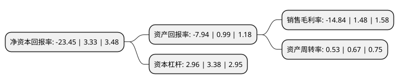

> 本页面由自动化程序生成于 2022年5月20日 01:08
> 内容可能存在错误，如有bug请提交issue至：https://github.com/Eroleice/doc-pi/issues
{.is-warning}

# 上市公司基本情况

## 基本资料

日海智能科技股份有限公司（以下简称“*ST日海”）成立于2003年11月14日，深圳市。于2009年12月03日在深交所中小板上市。

*ST日海注册资本37,440万元，通信网络连接，分配类产品，通信网络保护类产品，综合布线类产品，公司以三大系列产品为基础，向全球电信运营商，主设备商和集成商提供通信网络连接，分配，保护产品及整体解决方案。以下是详细信息：

- 公司名称: 日海智能科技股份有限公司
- 股票代码: 002313.SZ
- 所在地: 广东 - 深圳市
- 成立日期: 2003年11月14日
- 注册资本: 37,440万元
- 法定代表人: 杨宇翔
- 主营业务: 通信网络连接，分配类产品，通信网络保护类产品，综合布线类产品，公司以三大系列产品为基础，向全球电信运营商，主设备商和集成商提供通信网络连接，分配，保护产品及整体解决方案
- 公司官网: www.sunseagroup.com
- 公司介绍: 公司是一家在深交所上市的国家高新技术企业。公司形成物联网、综合通信服务以及通信设备的“三架马车”业务收入结构，公司在持续为中国移动、中国电信、中国联通等电信运营商及各垂直行业客户提供物联网无线通讯模组、物联网云平台及智能物联网端到端解决方案服务的同时，为中国移动、中国电信、中国联通等电信运营商与中国铁塔公司提供原有有线宽带/光纤宽带网络建设解决方案及产品、移动宽带/无线站点建设解决方案及产品、通信网络的勘察、设计、施工及代维服务，并积极推动传统业务的创新转型，赋能传统产品，实现传统产品智能化。公司为国内外电信运营商、ICT设备商、系统集成商以及各行业客户提供包括终端、云平台、多行业解决方案在内的物联网端到端产品和服务，以及通信网络基础设施、设备和通信服务。日海智能将建成“智慧连接万物”的日海人工智能物联网(Sunsea AIoT)作为公司战略目标，致力于成为行业领先的人工智能物联网服务提供商。

## 股东及高管情况

上市公司第一大股东为珠海润达泰投资合伙企业(有限合伙)，持股103,872,550股，占比27.74%，**疑似为**上市公司实际控制人。

截至2022年03月31日，上市公司的前十大股东中，共有5名自然人股东，4名机构股东，1个产品账户，其中5%以上大股东共有2名。上市公司前十大股东明细如下：

> 未能通过持股比例判定出上市公司实际控制人（持股30%以上）
> 可能存在通过间接持股、联合持股、协议控制等方式拥有实际控制权的主体，具体请参考上市公司定期公告！
{.is-warning}

> 截至2022年03月31日，上市公司前十大股东信息如下：

| 股东名称 | 持股数量（股） | 持股比例 |
| --- | --- | --- |
| 珠海润达泰投资合伙企业(有限合伙) | 103,872,550 | 27.74% |
| 珠海九洲控股集团有限公司 | 62,400,000 | 16.67% |
| 北信瑞丰基金-浦发银行-华润深国投信托-华润信托·日海通讯员工持股计划集合资金信托计划 | 16,693,622 | 4.46% |
| 中央汇金资产管理有限责任公司 | 7,532,700 | 2.01% |
| 黄永军 | 5,923,878 | 1.58% |
| 西藏福茂投资管理有限公司 | 3,001,000 | 0.8% |
| 黄刚珍 | 1,745,119 | 0.47% |
| 湛锦莲 | 1,453,000 | 0.39% |
| 应雪琦 | 1,234,802 | 0.33% |
| 张瑾 | 1,202,100 | 0.32% |

## 利润表分析

上市公司2021年总收入为46.82亿元，净利润为0.1亿元，实现盈利。

## 杜邦分析

> 数据列示周期：2020年 | 2019年 | 2018年
{.is-info}

上市公司的净资产收益率在近一年有所下降，下降幅度为-804.2%，其变化情况分解如下：
- 上市公司的销售毛利率在近一年下降了-1102.7%，可能是生产效率的下降、商品原材料价格上涨或商品价格的下跌所致。
- 上市公司的资产周转率在近一年下降了-20.9%，可能是源自于更慢的销售回款或库存管理效果下降。
- 上市公司的财务杠杆比率在近一年下降了-12.43%，可能是减少负债降低财务费用。

