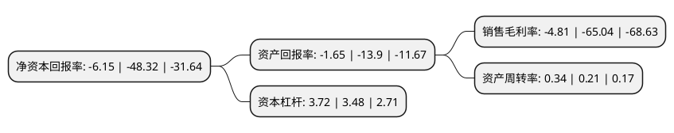

> 本页面由自动化程序生成于 2022年5月20日 01:08
> 内容可能存在错误，如有bug请提交issue至：https://github.com/Eroleice/doc-pi/issues
{.is-warning}

# 上市公司基本情况

## 基本资料

北京合众思壮科技股份有限公司（以下简称“合众思壮”）成立于1998年09月30日，北京市。于2010年04月02日在深交所中小板上市。

合众思壮注册资本74,036.031万元，主要产品:GIS数据采集产品，高精度测量产品，系统产品和车载导航产品中的车辆监控调度产品，大众消费产品主要为车载导航产品中的PND产品。本公司主要产品分为GIS数据采集产品，高精度测量产品，系统产品和车载导航产品等。主营业务:卫星导航定位产品的研发，生产，销售和服务，业务涵盖专业应用和大众消费两大领域。以下是详细信息：

- 公司名称: 北京合众思壮科技股份有限公司
- 股票代码: 002383.SZ
- 所在地: 北京 - 北京市
- 成立日期: 1998年09月30日
- 注册资本: 74,036.031万元
- 法定代表人: 郭信平
- 主营业务: 主要产品:GIS数据采集产品，高精度测量产品，系统产品和车载导航产品中的车辆监控调度产品，大众消费产品主要为车载导航产品中的PND产品本公司主要产品分为GIS数据采集产品，高精度测量产品，系统产品和车载导航产品等主营业务:卫星导航定位产品的研发，生产，销售和服务，业务涵盖专业应用和大众消费两大领域
- 公司官网: www.unistrong.com
- 公司介绍: 公司是国内进入卫星导航定位(GNSS)领域最早、技术储备最深厚、产业布局最完备的公司之一，是中国仅有的实现了全产业链布局的企业，拥有了从高精度核心技术、板卡部件、终端设备、解决方案到服务平台的全产业链产品与服务。公司以丰富的应用经验，率先实现卫星导航在多种行业的应用，开拓了大量中国时空信息应用的第一次，始终见证、推动、引领中国卫星导航定位市场的发展，合众思壮已形成全球化业务布局和服务能力，以全球化视野进行全球资源配置，构建了以中国、美国、加拿大、意大利在内的国内、外产品研发生产与营销架构体系，产品行销遍布全球的数十个国家和地区，为推动北斗全球发展奠定坚实基础。

## 股东及高管情况

上市公司第一大股东为郭信平，持股177,490,695股，占比23.97%，**疑似为**上市公司实际控制人。

截至2022年03月31日，上市公司的前十大股东中，共有8名自然人股东，2名机构股东，其中5%以上大股东共有4名。上市公司前十大股东明细如下：

> 未能通过持股比例判定出上市公司实际控制人（持股30%以上）
> 可能存在通过间接持股、联合持股、协议控制等方式拥有实际控制权的主体，具体请参考上市公司定期公告！
{.is-warning}

> 截至2022年03月31日，上市公司前十大股东信息如下：

| 股东名称 | 持股数量（股） | 持股比例 |
| --- | --- | --- |
| 郭信平 | 177,490,695 | 23.97% |
| 郭信平 | 168,580,695 | 22.77% |
| 郑州航空港区兴慧电子科技有限公司 | 149,031,577 | 20.13% |
| 郑州航空港区兴慧电子科技有限公司 | 149,031,577 | 20.13% |
| 靳荣伟 | 17,124,816 | 2.31% |
| 张钰桐 | 10,000,048 | 1.35% |
| 王静涛 | 5,881,951 | 0.79% |
| 孙丽丽 | 4,417,581 | 0.6% |
| 黄晓微 | 3,192,407 | 0.43% |
| 叶莉 | 2,900,000 | 0.39% |

## 利润表分析

上市公司2021年总收入为21.07亿元，净利润为-1.02亿元，**未实现盈利**。

## 杜邦分析

> 数据列示周期：2021年 | 2020年 | 2019年
{.is-info}

上市公司的净资产收益率在近一年有所下降，下降幅度为-87.27%，其变化情况分解如下：
- 上市公司的销售毛利率在近一年下降了-92.6%，可能是生产效率的下降、商品原材料价格上涨或商品价格的下跌所致。
- 上市公司的资产周转率在近一年上升了61.9%，可能是源自于更快的销售回款或库存管理效果提升。
- 上市公司的财务杠杆比率在近一年上升了6.9%，可能是增加负债扩大生产规模。

