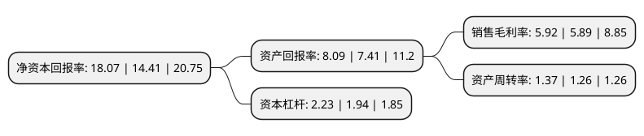

> 本页面由自动化程序生成于 2022年5月20日 01:08
> 内容可能存在错误，如有bug请提交issue至：https://github.com/Eroleice/doc-pi/issues
{.is-warning}

# 上市公司基本情况

## 基本资料

福建星网锐捷通讯股份有限公司（以下简称“星网锐捷”）成立于1996年11月11日，福州市。于2010年06月23日在深交所中小板上市。

星网锐捷注册资本58,328.028万元，研发，生产和销售企业级网络通讯系统设备及终端设备，主要产品线包括企业级网络设备(主要产品是交换机和路由器)，网络终端(主要产品是瘦客户机)和通讯产品(主要产品是无线固话终端和宽带接入终端设备)。主要产品包括:企业级网络设备(主要产品是路由器和交换机);网络终端(主要产品是瘦客户机);通讯产品(主要产品是无线通和ADSL Modem)。其他新兴应用产品有:ePOS，DMB，IP机顶盒，GPS等。以下是详细信息：

- 公司名称: 福建星网锐捷通讯股份有限公司
- 股票代码: 002396.SZ
- 所在地: 福建 - 福州市
- 成立日期: 1996年11月11日
- 注册资本: 58,328.028万元
- 法定代表人: 黄奕豪
- 主营业务: 研发，生产和销售企业级网络通讯系统设备及终端设备，主要产品线包括企业级网络设备(主要产品是交换机和路由器)，网络终端(主要产品是瘦客户机)和通讯产品(主要产品是无线固话终端和宽带接入终端设备)主要产品包括:企业级网络设备(主要产品是路由器和交换机);网络终端(主要产品是瘦客户机);通讯产品(主要产品是无线通和ADSL Modem)其他新兴应用产品有:ePOS，DMB，IP机顶盒，GPS等
- 公司官网: www.star-net.cn/star-net.cn
- 公司介绍: 公司是国内领先的ICT应用方案提供商，是国家首批技术创新示范企业。公司多次承接和入选国家火炬计划、国家863计划项目、国家核高基重大专项，形成大批具有国内和国际领先水平的核心技术。公司在网络通讯、交换机、云计算终端(瘦客户机)、支付终端、桌面云、无线接入、宽带接入、融合视讯、视频信息应用等各产品领域均形成了独特的领先优势，同时也致力于在智慧网络、智慧云、智慧社区、智慧通讯、智慧娱乐、智慧物联等应用领域为客户带来前瞻的应用解决方案，并成功进军欧洲、美洲、非洲、大洋洲等近百个国家和地区。

## 股东及高管情况

上市公司第一大股东为福建省电子信息(集团)有限责任公司，持股154,551,950股，占比26.5%，**疑似为**上市公司实际控制人。

截至2022年03月31日，上市公司的前十大股东中，共有4名自然人股东，4名机构股东，1个产品账户，1个海外主体，其中5%以上大股东共有1名。上市公司前十大股东明细如下：

> 未能通过持股比例判定出上市公司实际控制人（持股30%以上）
> 可能存在通过间接持股、联合持股、协议控制等方式拥有实际控制权的主体，具体请参考上市公司定期公告！
{.is-warning}

> 截至2022年03月31日，上市公司前十大股东信息如下：

| 股东名称 | 持股数量（股） | 持股比例 |
| --- | --- | --- |
| 福建省电子信息(集团)有限责任公司 | 154,551,950 | 26.5% |
| 中央汇金资产管理有限责任公司 | 20,936,700 | 3.59% |
| 维实(平潭)创业投资股份有限公司 | 19,943,035 | 3.42% |
| 香港中央结算有限公司(陆股通) | 12,140,154 | 2.08% |
| 福建隽丰投资有限公司 | 5,964,522 | 1.02% |
| 毛伟华 | 3,700,000 | 0.63% |
| 中国银行股份有限公司-华夏中证5G通信主题交易型开放式指数证券投资基金 | 3,104,908 | 0.53% |
| 高乐 | 2,990,000 | 0.51% |
| 刘灵辉 | 2,900,000 | 0.5% |
| 唐朝新 | 2,600,000 | 0.45% |

## 利润表分析

上市公司2021年总收入为135.48亿元，净利润为8.02亿元，实现盈利。

## 杜邦分析

> 数据列示周期：2021年 | 2020年 | 2019年
{.is-info}

上市公司的净资产收益率在近一年有所上升，上升幅度为25.4%，其变化情况分解如下：
- 上市公司的销售毛利率在近一年上升了0.51%，可能是生产效率的提升、商品原材料价格下跌或商品价格的上涨所致。
- 上市公司的资产周转率在近一年上升了8.73%，可能是源自于更快的销售回款或库存管理效果提升。
- 上市公司的财务杠杆比率在近一年上升了14.95%，可能是增加负债扩大生产规模。

