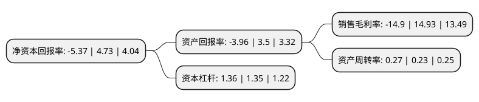

> 本页面由自动化程序生成于 2022年5月20日 01:09
> 内容可能存在错误，如有bug请提交issue至：https://github.com/Eroleice/doc-pi/issues
{.is-warning}

# 上市公司基本情况

## 基本资料

江苏雷科防务科技股份有限公司（以下简称“雷科防务”）成立于2002年12月11日，常州市。于2010年05月28日在深交所中小板上市。

雷科防务注册资本134,300.78万元，本公司主营业务为包括雷达系统，遥感测控，卫星导航，数字系统，模拟仿真，微波组件，射频信道设备，安全存储等系统级产品研发，制造。以下是详细信息：

- 公司名称: 江苏雷科防务科技股份有限公司
- 股票代码: 002413.SZ
- 所在地: 江苏 - 常州市
- 成立日期: 2002年12月11日
- 注册资本: 134,300.78万元
- 法定代表人: 戴斌
- 主营业务: 本公司主营业务为包括雷达系统，遥感测控，卫星导航，数字系统，模拟仿真，微波组件，射频信道设备，安全存储等系统级产品研发，制造
- 公司官网: www.racodf.com
- 公司介绍: 公司主要从事嵌入式实时信息处理、复杂电磁环境测试与验证及评估、北斗卫星导航接收机、雷达以及微波信号分配管理及接收处理业务。公司的主要业务包括雷达系统、遥感测控、卫星导航、数字系统、模拟仿真、安全存储、微波组件等产品研发、制造和销售。

## 股东及高管情况

上市公司第一大股东为华融华侨资产管理股份有限公司，持股32,645,037股，占比2.43%，**疑似为**上市公司实际控制人。

截至2022年03月31日，上市公司的前十大股东中，共有5名自然人股东，4名机构股东，1个产品账户。上市公司前十大股东明细如下：

> 未能通过持股比例判定出上市公司实际控制人（持股30%以上）
> 可能存在通过间接持股、联合持股、协议控制等方式拥有实际控制权的主体，具体请参考上市公司定期公告！
{.is-warning}

> 上市公司第一大股东持股不超过10%，请检查是否存在公司控制权风险！
{.is-danger}

> 截至2022年03月31日，上市公司前十大股东信息如下：

| 股东名称 | 持股数量（股） | 持股比例 |
| --- | --- | --- |
| 华融华侨资产管理股份有限公司 | 32,645,037 | 2.43% |
| 刘升 | 24,747,692 | 1.84% |
| 北京雷科众投科技发展中心(有限合伙) | 24,582,980 | 1.83% |
| 伍捍东 | 22,960,666 | 1.71% |
| 刘峰 | 22,788,407 | 1.7% |
| 上海通怡投资管理有限公司-通怡方圆9号私募证券投资基金 | 17,373,011 | 1.29% |
| 北京理工资产经营有限公司 | 16,923,081 | 1.26% |
| 北京翠微集团有限责任公司 | 16,539,596 | 1.23% |
| 魏茂华 | 9,998,855 | 0.74% |
| 曾涛 | 9,730,615 | 0.72% |

## 利润表分析

上市公司2021年总收入为16.22亿元，净利润为-2.42亿元，**未实现盈利**。

## 杜邦分析

> 数据列示周期：2021年 | 2020年 | 2019年
{.is-info}

上市公司的净资产收益率在近一年有所下降，下降幅度为-213.53%，其变化情况分解如下：
- 上市公司的销售毛利率在近一年下降了-199.8%，可能是生产效率的下降、商品原材料价格上涨或商品价格的下跌所致。
- 上市公司的资产周转率在近一年上升了17.39%，可能是源自于更快的销售回款或库存管理效果提升。
- 上市公司的财务杠杆比率在近一年上升了0.74%，可能是增加负债扩大生产规模。

