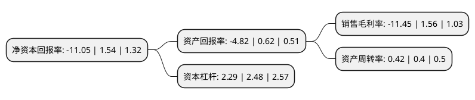

> 本页面由自动化程序生成于 2022年5月20日 01:10
> 内容可能存在错误，如有bug请提交issue至：https://github.com/Eroleice/doc-pi/issues
{.is-warning}

# 上市公司基本情况

## 基本资料

海能达通信股份有限公司（以下简称“海能达”）成立于1993年05月11日，深圳市。于2011年05月27日在深交所中小板上市。

海能达注册资本181,607.969万元，主要从事对讲机终端，集群系统等专业无线通信设备的研发，生产，销售和服务，并提供整体解决方案。公司的专业无线通信产品主要应用于政府公共安全部门，公用事业以及工商企业的应急通信，指挥调度和日常工作通信等。公司的产品主要分为两大类:终端产品和系统产品。根据产品的技术标准的不同，主要产品可细分为模拟终端产品，数字终端产品，模拟系统产品和数字系统产品。终端产品形态又可分为手持对讲机，车载台和中转台等。以下是详细信息：

- 公司名称: 海能达通信股份有限公司
- 股票代码: 002583.SZ
- 所在地: 广东 - 深圳市
- 成立日期: 1993年05月11日
- 注册资本: 181,607.969万元
- 法定代表人: 陈清州
- 主营业务: 主要从事对讲机终端，集群系统等专业无线通信设备的研发，生产，销售和服务，并提供整体解决方案公司的专业无线通信产品主要应用于政府公共安全部门，公用事业以及工商企业的应急通信，指挥调度和日常工作通信等公司的产品主要分为两大类:终端产品和系统产品根据产品的技术标准的不同，主要产品可细分为模拟终端产品，数字终端产品，模拟系统产品和数字系统产品终端产品形态又可分为手持对讲机，车载台和中转台等
- 公司官网: www.hytera.com
- 公司介绍: 公司是国内专业无线通信行业的龙头企业，也是全球主要的专业无线通信设备提供商之一。公司主要从事对讲机终端、集群系统等专业无线通信设备的研发、生产、销售和服务，并提供整体解决方案。公司的专业无线通信产品主要应用于政府公共安全部门、公用事业以及工商企业的应急通信、指挥调度和日常工作通信等。在国内，公司打破了专业无线通信市场长期被进口品牌主导的局面，超越了建伍、艾可慕等较早进入中国市场的国际知名企业，在专业无线通信行业树立了良好声誉。在全球市场，公司凭借强大的自主研发能力、丰富的产品创新设计、产品高性价比以及快速客户化定制等优势,市场份额和品牌影响力不断提升。近年来公司及其“HYT”牌产品先后被国家发展和改革委员会、工业和信息化部、商务部、国家税务总局、中华人民共和国科技部、环境保护部、商务部、质量监督检验检疫总局等机构评为“国家规划布局内重点软件企业”、“广东省自主创新100强企业”、“中国驰名商标”、“国家级高新技术企业”等荣誉称号。

## 股东及高管情况

上市公司第一大股东为陈清州，持股764,846,057股，占比42.12%，为上市公司实际控制人。

截至2022年03月31日，上市公司的前十大股东中，共有6名自然人股东，3个产品账户，1个海外主体，其中5%以上大股东共有2名。上市公司前十大股东明细如下：

> 截至2022年03月31日，上市公司前十大股东信息如下：

| 股东名称 | 持股数量（股） | 持股比例 |
| --- | --- | --- |
| 陈清州 | 764,846,057 | 42.12% |
| 深圳市投控资本有限公司-深圳投控共赢股权投资基金合伙企业(有限合伙) | 183,957,300 | 10.13% |
| 香港中央结算有限公司(陆股通) | 26,928,370 | 1.48% |
| 翁丽敏 | 17,600,000 | 0.97% |
| 中国建设银行股份有限公司-信达澳银新能源产业股票型证券投资基金 | 12,801,867 | 0.7% |
| 新余善思投资管理中心(有限合伙)-善思玺德一号私募证券投资基金 | 9,577,369 | 0.53% |
| 林德明 | 8,523,862 | 0.47% |
| 曾华 | 7,859,490 | 0.43% |
| 武美 | 7,381,337 | 0.41% |
| 刘双 | 7,380,500 | 0.41% |

## 利润表分析

上市公司2021年总收入为57.19亿元，净利润为-6.55亿元，**未实现盈利**。

## 杜邦分析

> 数据列示周期：2021年 | 2020年 | 2019年
{.is-info}

上市公司的净资产收益率在近一年有所下降，下降幅度为-817.53%，其变化情况分解如下：
- 上市公司的销售毛利率在近一年下降了-833.97%，可能是生产效率的下降、商品原材料价格上涨或商品价格的下跌所致。
- 上市公司的资产周转率在近一年上升了5%，可能是源自于更快的销售回款或库存管理效果提升。
- 上市公司的财务杠杆比率在近一年下降了-7.66%，可能是减少负债降低财务费用。

