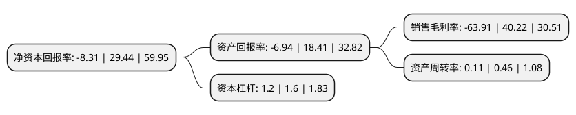

> 本页面由自动化程序生成于 2022年5月20日 01:12
> 内容可能存在错误，如有bug请提交issue至：https://github.com/Eroleice/doc-pi/issues
{.is-warning}

# 上市公司基本情况

## 基本资料

深圳市金溢科技股份有限公司（以下简称“金溢科技”）成立于2004年05月20日，深圳市。于2017年05月15日在深交所中小板上市。

金溢科技注册资本18,014.856万元，公司自成立以来一直专注于DSRC，RFID技术在智能交通射频识别与电子支付行业的应用开发，产品创新与推广。公司的经营范围涵盖智能交通射频识别与电子支付行业的核心技术研究，产品开发，设备制造，解决方案提供与服务。目前，公司产品主要包括高速公路ETC产品，停车场ETC产品，多车道自由流ETC产品和基于射频技术的路径识别产品。以下是详细信息：

- 公司名称: 深圳市金溢科技股份有限公司
- 股票代码: 002869.SZ
- 所在地: 广东 - 深圳市
- 成立日期: 2004年05月20日
- 注册资本: 18,014.856万元
- 法定代表人: 罗瑞发
- 主营业务: 公司自成立以来一直专注于DSRC，RFID技术在智能交通射频识别与电子支付行业的应用开发，产品创新与推广公司的经营范围涵盖智能交通射频识别与电子支付行业的核心技术研究，产品开发，设备制造，解决方案提供与服务目前，公司产品主要包括高速公路ETC产品，停车场ETC产品，多车道自由流ETC产品和基于射频技术的路径识别产品
- 公司官网: www.genvict.com
- 公司介绍: 公司专注于智慧交通和物联网领域身份识别与电子支付的应用开发、产品创新与推广，是国内领先的车辆身份识别与电子支付解决方案和核心设备提供商，是国家级高新技术企业、国家火炬计划重点高新技术企业。经过多年的技术积累和发展，公司已经成为中国智慧交通和物联网领域领先企业。公司主要产品包括高速公路ETC产品、路径识别产品、多车道自由流ETC产品、车路协同产品、智慧停车场产品，以及基于射频技术的物联网身份识别产品，主要应用于高速公路、城市交通、车辆管理等智慧交通和出行领域。公司曾参与起草《汽车电子标识通用技术条件》等6项国家标准。公司通过自主创新、开拓进取，打造了众多划时代意义的产品，奠定了在智慧交通行业的领先地位，也因此被评为“国家级高新技术企业”、“中国智能交通行业领军企业”“国家火炬计划重点高新技术企业”，获得“中国标准创新贡献奖”、“中国公路学会科学技术奖特等奖”等众多荣誉。

## 股东及高管情况

上市公司第一大股东为深圳市敏行电子有限公司，持股30,615,600股，占比16.99%，**疑似为**上市公司实际控制人。

截至2022年05月06日，上市公司的前十大股东中，共有8名自然人股东，2名机构股东，其中5%以上大股东共有2名。上市公司前十大股东明细如下：

> 未能通过持股比例判定出上市公司实际控制人（持股30%以上）
> 可能存在通过间接持股、联合持股、协议控制等方式拥有实际控制权的主体，具体请参考上市公司定期公告！
{.is-warning}

> 截至2022年05月06日，上市公司前十大股东信息如下：

| 股东名称 | 持股数量（股） | 持股比例 |
| --- | --- | --- |
| 深圳市敏行电子有限公司 | 30,615,600 | 16.99% |
| 刘咏平 | 12,596,800 | 6.99% |
| 罗瑞发 | 8,158,450 | 4.53% |
| 王丽娟 | 7,724,650 | 4.29% |
| 杨成 | 6,797,184 | 3.77% |
| 善丰投资(江苏)有限公司 | 5,684,850 | 3.16% |
| 王明宽 | 5,423,000 | 3.01% |
| 李娜 | 3,942,550 | 2.19% |
| 蔡福春 | 2,375,700 | 1.32% |
| 孙剑波 | 2,041,512 | 1.13% |

## 利润表分析

上市公司2021年总收入为3.01亿元，净利润为-1.93亿元，**未实现盈利**。

## 杜邦分析

> 数据列示周期：2021年 | 2020年 | 2019年
{.is-info}

上市公司的净资产收益率在近一年有所下降，下降幅度为-128.23%，其变化情况分解如下：
- 上市公司的销售毛利率在近一年下降了-258.9%，可能是生产效率的下降、商品原材料价格上涨或商品价格的下跌所致。
- 上市公司的资产周转率在近一年下降了-76.09%，可能是源自于更慢的销售回款或库存管理效果下降。
- 上市公司的财务杠杆比率在近一年下降了-25%，可能是减少负债降低财务费用。

