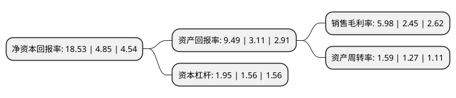

> 本页面由自动化程序生成于 2022年5月20日 01:12
> 内容可能存在错误，如有bug请提交issue至：https://github.com/Eroleice/doc-pi/issues
{.is-warning}

# 上市公司基本情况

## 基本资料

美格智能技术股份有限公司（以下简称“美格智能”）成立于2007年04月05日，深圳市。于2017年06月22日在深交所中小板上市。

美格智能注册资本18,456.32万元，主营业务为物联网技术开发服务，智能终端产品设计研发以及移动智能终端的精密组件制造，主要产品包括以智能手机结构件为代表的精密组件和以4G通信模块行业应用为代表的物联网技术开发服务及相关智能终端产品。以下是详细信息：

- 公司名称: 美格智能技术股份有限公司
- 股票代码: 002881.SZ
- 所在地: 广东 - 深圳市
- 成立日期: 2007年04月05日
- 注册资本: 18,456.32万元
- 法定代表人: 王平
- 主营业务: 主营业务为物联网技术开发服务，智能终端产品设计研发以及移动智能终端的精密组件制造，主要产品包括以智能手机结构件为代表的精密组件和以4G通信模块行业应用为代表的物联网技术开发服务及相关智能终端产品
- 公司官网: www.meigsmart.com
- 公司介绍: 公司是一家以新一代信息技术为基础的物联网解决方案、智能终端及其精密组件的综合提供商。公司不断拓展物联网业务，经过多年人才和技术积累，在通信、射频、数据传输、信号处理、平台软件等领域形成了较强的研发实力，在模具设计、注塑成型、表面处理等精密组件制造领域拥有丰富的经验，具备了物联网智能终端软硬件一体化解决方案交付能力。公司的主营业务为物联网技术开发服务、智能终端产品设计研发以及移动智能终端的精密组件制造，主要产品包括以智能手机结构件为代表的精密组件和以4G通信模块行业应用为代表的物联网技术开发服务及相关智能终端产品。

## 股东及高管情况

上市公司第一大股东为王平，持股78,771,200股，占比42.64%，为上市公司实际控制人。

截至2022年03月31日，上市公司的前十大股东中，共有2名自然人股东，2名机构股东，6个产品账户，其中5%以上大股东共有4名。上市公司前十大股东明细如下：

> 截至2022年03月31日，上市公司前十大股东信息如下：

| 股东名称 | 持股数量（股） | 持股比例 |
| --- | --- | --- |
| 王平 | 78,771,200 | 42.64% |
| 深圳市兆格投资企业(有限合伙) | 24,616,000 | 13.32% |
| 王成 | 19,692,800 | 10.66% |
| 深圳市凤凰山文化旅游投资有限公司 | 12,920,000 | 6.99% |
| 中国工商银行股份有限公司-富国创新科技混合型证券投资基金 | 2,119,900 | 1.15% |
| 中信银行股份有限公司-海富通成长价值混合型证券投资基金 | 1,823,300 | 0.99% |
| 中国农业银行股份有限公司-富国互联科技股票型证券投资基金 | 1,687,490 | 0.91% |
| 中国银行股份有限公司-上投摩根远见两年持有期混合型证券投资基金 | 1,627,820 | 0.88% |
| 中国工商银行股份有限公司-富国成长策略混合型证券投资基金 | 1,420,843 | 0.77% |
| 基本养老保险基金一二零二组合 | 1,289,100 | 0.7% |

## 利润表分析

上市公司2021年总收入为19.69亿元，净利润为1.17亿元，实现盈利。

## 杜邦分析

> 数据列示周期：2021年 | 2020年 | 2019年
{.is-info}

上市公司的净资产收益率在近一年有所上升，上升幅度为282.06%，其变化情况分解如下：
- 上市公司的销售毛利率在近一年上升了144.08%，可能是生产效率的提升、商品原材料价格下跌或商品价格的上涨所致。
- 上市公司的资产周转率在近一年上升了25.2%，可能是源自于更快的销售回款或库存管理效果提升。
- 上市公司的财务杠杆比率在近一年上升了25%，可能是增加负债扩大生产规模。

