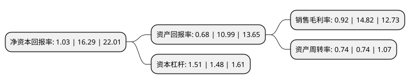

> 本页面由自动化程序生成于 2022年5月20日 01:13
> 内容可能存在错误，如有bug请提交issue至：https://github.com/Eroleice/doc-pi/issues
{.is-warning}

# 上市公司基本情况

## 基本资料

深圳市锐明技术股份有限公司（以下简称“锐明技术”）成立于2002年09月03日，深圳市。于2019年12月17日在深交所中小板上市。

锐明技术注册资本17,312万元，主要从事以视频为核心的商用车监控信息化产品的研发，生产和销售。主要产品包括车载视频监控设备，车载摄像机，驾驶主动安全套件，司乘交互终端等智能车载设备及管理平台软件，以及一系列面向城市公交，巡游/网约出租，两客一危，渣土清运等商用车辆营运场景的行业信息化解决方案。以下是详细信息：

- 公司名称: 深圳市锐明技术股份有限公司
- 股票代码: 002970.SZ
- 所在地: 广东 - 深圳市
- 成立日期: 2002年09月03日
- 注册资本: 17,312万元
- 法定代表人: 赵志坚
- 主营业务: 主要从事以视频为核心的商用车监控信息化产品的研发，生产和销售主要产品包括车载视频监控设备，车载摄像机，驾驶主动安全套件，司乘交互终端等智能车载设备及管理平台软件，以及一系列面向城市公交，巡游/网约出租，两客一危，渣土清运等商用车辆营运场景的行业信息化解决方案
- 公司官网: www.streamax.com
- 公司介绍: 公司主要从事商用车综合监控产品及信息化系统的研发、生产和销售。主要产品有商用车通用监控产品、商用车综合监控信息化系统、固定视频监控产品。公司致力于成为全球领先的商用车综合监控信息化系统及解决方案提供商。公司是国家级高新技术企业，也是深圳智能交通行业协会副会长单位、中国道路运输协会城市客运分会会员单位，参与了多项交通部交通运输行业标准、智能公交行业标准的制定。

## 股东及高管情况

上市公司第一大股东为赵志坚，持股45,659,200股，占比26.37%，**疑似为**上市公司实际控制人。

截至2022年03月31日，上市公司的前十大股东中，共有5名自然人股东，2名机构股东，2个产品账户，1个海外主体，其中5%以上大股东共有3名。上市公司前十大股东明细如下：

> 未能通过持股比例判定出上市公司实际控制人（持股30%以上）
> 可能存在通过间接持股、联合持股、协议控制等方式拥有实际控制权的主体，具体请参考上市公司定期公告！
{.is-warning}

> 截至2022年03月31日，上市公司前十大股东信息如下：

| 股东名称 | 持股数量（股） | 持股比例 |
| --- | --- | --- |
| 赵志坚 | 45,659,200 | 26.37% |
| 望西淀 | 33,410,800 | 19.3% |
| 嘉通投资有限公司 | 29,400,000 | 16.98% |
| 香港中央结算有限公司(陆股通) | 4,984,414 | 2.88% |
| 蒋明军 | 3,448,600 | 1.99% |
| 刘文涛 | 2,833,600 | 1.64% |
| 上海重阳投资管理股份有限公司-重阳金享私募基金 | 1,327,300 | 0.77% |
| 蒋文军 | 1,251,700 | 0.72% |
| 施罗德投资管理(香港)有限公司-施罗德环球基金系列中国A股(交易所) | 1,248,200 | 0.72% |
| 伊犁美旭超华信息咨询合伙企业(有限合伙) | 1,200,000 | 0.69% |

## 杜邦分析

> 数据列示周期：2021年 | 2020年 | 2019年
{.is-info}

上市公司的净资产收益率在近一年有所下降，下降幅度为-93.68%，其变化情况分解如下：
- 上市公司的销售毛利率在近一年下降了-93.79%，可能是生产效率的下降、商品原材料价格上涨或商品价格的下跌所致。
- 上市公司的资产周转率在近一年下降了0%，可能是源自于更慢的销售回款或库存管理效果下降。
- 上市公司的财务杠杆比率在近一年上升了2.03%，可能是增加负债扩大生产规模。

