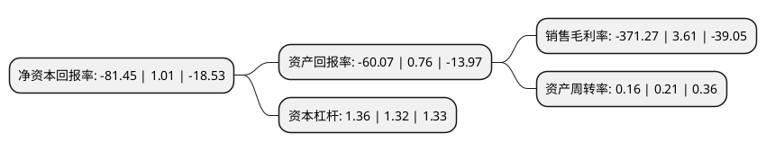

> 本页面由自动化程序生成于 2022年5月20日 01:14
> 内容可能存在错误，如有bug请提交issue至：https://github.com/Eroleice/doc-pi/issues
{.is-warning}

# 上市公司基本情况

## 基本资料

珠海世纪鼎利科技股份有限公司（以下简称“世纪鼎利”）成立于2001年10月19日，珠海市。于2010年01月20日在深交所创业板上市。

世纪鼎利注册资本56,003.672万元，主要产品:为通信运营商，系统设备商提供高技术含量的移动通信网络优化测试分析系统和服务，亦为相关行业客户提供工业机器人装备，RFID产品和物联网行业解决方案，为国内高职领域提供教育运营服务以及教育装备产品的销售。主营业务:通信及物联网业务，职业教育业务。以下是详细信息：

- 公司名称: 珠海世纪鼎利科技股份有限公司
- 股票代码: 300050.SZ
- 所在地: 广东 - 珠海市
- 成立日期: 2001年10月19日
- 注册资本: 56,003.672万元
- 法定代表人: 李涛
- 主营业务: 主要产品:为通信运营商，系统设备商提供高技术含量的移动通信网络优化测试分析系统和服务，亦为相关行业客户提供工业机器人装备，RFID产品和物联网行业解决方案，为国内高职领域提供教育运营服务以及教育装备产品的销售主营业务:通信及物联网业务，职业教育业务
- 公司官网: www.dingli.com
- 公司介绍: 公司保持“通信及物联网、职业教育”双主营的业务模式。在通信及物联网业务板块，公司既为通信运营商、系统设备商提供高技术含量的移动通信网络优化测试分析系统和服务，亦为相关行业客户提供工业机器人装备、RFID产品和物联网行业解决方案。职业教育方面，主要是为国内高职领域提供教育运营服务以及教育装备产品的销售。通信业务主要为电信运营商和电信设备供应商提供高技术含量的移动通信网络优化测试分析系统，同时亦为电信运营商提供“一站式”的移动通信网络优化服务。物联网业务主要以一芯智能为切入点，一芯智能的产品和服务主要包括工业机器人装备、RFID产品、物联网行业解决方案。教育运营服务主要是以“鼎利学院”建设计划为核心。教育装备产品的销售主要是根据国内高职院校的实训教学需求提供相关的教育装备产品，产品形态包括基础硬件、仿真软件系统、平台系统、课程、教案等。

## 股东及高管情况

上市公司第一大股东为四川特驱五月花教育管理有限公司，持股50,000,000股，占比8.93%，**疑似为**上市公司实际控制人。

截至2022年03月31日，上市公司的前十大股东中，共有8名自然人股东，1名机构股东，1个产品账户，其中5%以上大股东共有2名。上市公司前十大股东明细如下：

> 未能通过持股比例判定出上市公司实际控制人（持股30%以上）
> 可能存在通过间接持股、联合持股、协议控制等方式拥有实际控制权的主体，具体请参考上市公司定期公告！
{.is-warning}

> 上市公司第一大股东持股不超过10%，请检查是否存在公司控制权风险！
{.is-danger}

> 截至2022年03月31日，上市公司前十大股东信息如下：

| 股东名称 | 持股数量（股） | 持股比例 |
| --- | --- | --- |
| 四川特驱五月花教育管理有限公司 | 50,000,000 | 8.93% |
| 叶滨 | 45,744,700 | 8.17% |
| 王耘 | 26,696,800 | 4.77% |
| 王莉萍 | 18,396,083 | 3.28% |
| 珠海阿巴马资产管理有限公司-阿巴马元享红利122号私募证券投资基金 | 10,357,500 | 1.85% |
| 朱军 | 8,888,000 | 1.59% |
| 陈浩 | 8,583,177 | 1.53% |
| 陈勇 | 6,000,000 | 1.07% |
| 汪勇 | 5,698,800 | 1.02% |
| 李光明 | 4,917,800 | 0.88% |

## 利润表分析

上市公司2021年总收入为3.76亿元，净利润为-14亿元，**未实现盈利**。

## 杜邦分析

> 数据列示周期：2021年 | 2020年 | 2019年
{.is-info}

上市公司的净资产收益率在近一年有所下降，下降幅度为-8164.36%，其变化情况分解如下：
- 上市公司的销售毛利率在近一年下降了-10384.49%，可能是生产效率的下降、商品原材料价格上涨或商品价格的下跌所致。
- 上市公司的资产周转率在近一年下降了-23.81%，可能是源自于更慢的销售回款或库存管理效果下降。
- 上市公司的财务杠杆比率在近一年上升了3.03%，可能是增加负债扩大生产规模。

