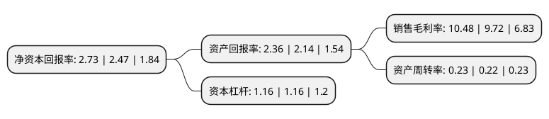

> 本页面由自动化程序生成于 2022年5月20日 01:14
> 内容可能存在错误，如有bug请提交issue至：https://github.com/Eroleice/doc-pi/issues
{.is-warning}

# 上市公司基本情况

## 基本资料

北京数码视讯科技股份有限公司（以下简称“数码视讯”）成立于2000年03月14日，北京市。于2010年04月30日在深交所创业板上市。

数码视讯注册资本142,900.886万元，公司主要从事数字电视软硬件产品的研发，生产，销售和技术服务业务。公司主要产品包括数字电视条件接收系统(CA系统)，数字电视前端设备等，其中数字电视前端设备包括编码器，解码器，复用器，调制器，加扰器，适配器等;基于公司齐全的产品线，自主研发和持续的技术创新能力，公司面向数字电视运营商提供数字电视整体解决方案。以下是详细信息：

- 公司名称: 北京数码视讯科技股份有限公司
- 股票代码: 300079.SZ
- 所在地: 北京 - 北京市
- 成立日期: 2000年03月14日
- 注册资本: 142,900.886万元
- 法定代表人: 郑海涛
- 主营业务: 公司主要从事数字电视软硬件产品的研发，生产，销售和技术服务业务公司主要产品包括数字电视条件接收系统(CA系统)，数字电视前端设备等，其中数字电视前端设备包括编码器，解码器，复用器，调制器，加扰器，适配器等;基于公司齐全的产品线，自主研发和持续的技术创新能力，公司面向数字电视运营商提供数字电视整体解决方案
- 公司官网: www.sumavision.com
- 公司介绍: 公司是中国数字电视软件及系统提供商，产品覆盖DVB-C/DVB-T/DVB-S前端硬件系统、CA系统、中间件系统、EPG系统，电视彩信、马赛克节目导视等增值服务系统，编解码、光传输以及CMMB手机电视等，其领先优势已经扩展到IPTV、高清监控等多个领域。公司是多项数字电视行业标准的制订单位之一，也是中国数字音视频标准(AVS)组织的主要成员。产品已经进入全国三十几个省区，产品及系统广泛应用于广电、政府、电信、军队等多个领域，并且参与了2004年雅典奥运会直播，2008年奥运圣火传递直播等重大项目。2008年成为“国家火炬计划重点高新技术企业”，荣获“北京市企业技术中心”。2011年，被福布斯评为“中国最具潜力上市企业”。

## 股东及高管情况

上市公司第一大股东为郑海涛，持股214,538,518股，占比15.01%，**疑似为**上市公司实际控制人。

截至2022年03月31日，上市公司的前十大股东中，共有7名自然人股东，1名机构股东，1个产品账户，1个海外主体，其中5%以上大股东共有1名。上市公司前十大股东明细如下：

> 未能通过持股比例判定出上市公司实际控制人（持股30%以上）
> 可能存在通过间接持股、联合持股、协议控制等方式拥有实际控制权的主体，具体请参考上市公司定期公告！
{.is-warning}

> 截至2022年03月31日，上市公司前十大股东信息如下：

| 股东名称 | 持股数量（股） | 持股比例 |
| --- | --- | --- |
| 郑海涛 | 214,538,518 | 15.01% |
| 香港中央结算有限公司(陆股通) | 12,137,655 | 0.85% |
| 崔雷 | 8,800,000 | 0.62% |
| 中国银行股份有限公司-华夏中证5G通信主题交易型开放式指数证券投资基金 | 8,197,286 | 0.57% |
| 北京华海德航科技有限公司 | 7,174,522 | 0.5% |
| 李葛卫 | 6,850,000 | 0.48% |
| 安伟 | 6,090,000 | 0.43% |
| 马志飞 | 6,072,803 | 0.42% |
| 马越飞 | 5,895,300 | 0.41% |
| 吴海燕 | 5,546,000 | 0.39% |

## 利润表分析

上市公司2021年总收入为10.27亿元，净利润为1.07亿元，实现盈利。

## 杜邦分析

> 数据列示周期：2021年 | 2020年 | 2019年
{.is-info}

上市公司的净资产收益率在近一年有所上升，上升幅度为10.53%，其变化情况分解如下：
- 上市公司的销售毛利率在近一年上升了7.82%，可能是生产效率的提升、商品原材料价格下跌或商品价格的上涨所致。
- 上市公司的资产周转率在近一年上升了4.55%，可能是源自于更快的销售回款或库存管理效果提升。
- 上市公司的财务杠杆比率在近一年下降了0%，可能是减少负债降低财务费用。

