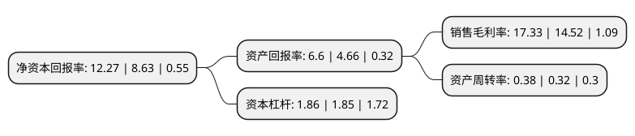

> 本页面由自动化程序生成于 2022年5月20日 01:15
> 内容可能存在错误，如有bug请提交issue至：https://github.com/Eroleice/doc-pi/issues
{.is-warning}

# 上市公司基本情况

## 基本资料

成都振芯科技股份有限公司（以下简称“振芯科技”）成立于2003年06月12日，成都市。于2010年08月06日在深交所创业板上市。

振芯科技注册资本56,006.6万元，主营业务:公司围绕北斗卫星导航应用的“元器件-终端-系统”产业链提供产品和服务，主要从事北斗卫星导航应用关键元器件，特种行业高性能集成电路，北斗卫星导航终端的设计，开发，生产和销售，以及北斗卫星导航定位应用系统的开发和建设。主要产品有北斗卫星导航应用关键元器件，特种行业高性能集成电路，北斗卫星导航定位用户终端，北斗卫星导航定位应用系统等。以下是详细信息：

- 公司名称: 成都振芯科技股份有限公司
- 股票代码: 300101.SZ
- 所在地: 四川 - 成都市
- 成立日期: 2003年06月12日
- 注册资本: 56,006.6万元
- 法定代表人: 莫晓宇
- 主营业务: 主营业务:公司围绕北斗卫星导航应用的“元器件-终端-系统”产业链提供产品和服务，主要从事北斗卫星导航应用关键元器件，特种行业高性能集成电路，北斗卫星导航终端的设计，开发，生产和销售，以及北斗卫星导航定位应用系统的开发和建设主要产品有北斗卫星导航应用关键元器件，特种行业高性能集成电路，北斗卫星导航定位用户终端，北斗卫星导航定位应用系统等
- 公司官网: www.corpro.cn
- 公司介绍: 公司多年来致力于围绕北斗卫星导航应用的“元器件-终端-系统”产业链提供产品和服务，拥有北斗分理级和终端级的民用运营服务资质，被列为国家重点支持的北斗系列终端产业化基地。主要产品包括北斗卫星导航应用关键元器件、高性能集成电路、北斗卫星导航终端及北斗卫星导航定位应用系统，自主研制生产的多种北斗卫星导航应用终端已广泛应用于国防、地质、电力、交通运输、公共安全、通信、水利、林业等专业应用领域。公司是入驻国家集成电路设计成都产业化基地的首批企业之一，是四川省第三批建设创新型培育企业、四川省集成电路设计产业技术创新联盟成员单位，也是航空、船舶等国有大型科技工业企业的电子元器件配套定点单位，通过了GB/T19001-2008idt ISO9001:2008质量体系认证。

## 股东及高管情况

上市公司第一大股东为成都国腾电子集团有限公司，持股165,860,000股，占比29.61%，**疑似为**上市公司实际控制人。

截至2022年04月27日，上市公司的前十大股东中，共有2名自然人股东，1名机构股东，6个产品账户，1个海外主体，其中5%以上大股东共有1名。上市公司前十大股东明细如下：

> 未能通过持股比例判定出上市公司实际控制人（持股30%以上）
> 可能存在通过间接持股、联合持股、协议控制等方式拥有实际控制权的主体，具体请参考上市公司定期公告！
{.is-warning}

> 截至2022年04月27日，上市公司前十大股东信息如下：

| 股东名称 | 持股数量（股） | 持股比例 |
| --- | --- | --- |
| 成都国腾电子集团有限公司 | 165,860,000 | 29.61% |
| 中国工商银行股份有限公司-农银汇理新能源主题灵活配置混合型证券投资基金 | 13,700,148 | 2.45% |
| 邹瀚枢 | 5,360,400 | 0.96% |
| 中国银行股份有限公司-国泰CES半导体芯片行业交易型开放式指数证券投资基金 | 3,593,452 | 0.64% |
| 全国社保基金一一三组合 | 3,507,700 | 0.63% |
| 中国工商银行股份有限公司-农银汇理工业4.0灵活配置混合型证券投资基金 | 3,234,000 | 0.58% |
| 中国建设银行股份有限公司-农银汇理研究精选灵活配置混合型证券投资基金 | 2,816,000 | 0.5% |
| 龚正 | 2,308,100 | 0.41% |
| 香港中央结算有限公司(陆股通) | 2,240,314 | 0.4% |
| 大成基金管理有限公司-社保基金17011组合 | 1,776,000 | 0.32% |

## 利润表分析

上市公司2021年总收入为7.93亿元，净利润为1.37亿元，实现盈利。

## 杜邦分析

> 数据列示周期：2021年 | 2020年 | 2019年
{.is-info}

上市公司的净资产收益率在近一年有所上升，上升幅度为42.18%，其变化情况分解如下：
- 上市公司的销售毛利率在近一年上升了19.35%，可能是生产效率的提升、商品原材料价格下跌或商品价格的上涨所致。
- 上市公司的资产周转率在近一年上升了18.75%，可能是源自于更快的销售回款或库存管理效果提升。
- 上市公司的财务杠杆比率在近一年上升了0.54%，可能是增加负债扩大生产规模。

