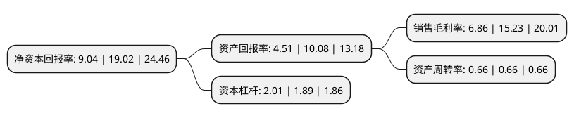

> 本页面由自动化程序生成于 2022年5月20日 01:15
> 内容可能存在错误，如有bug请提交issue至：https://github.com/Eroleice/doc-pi/issues
{.is-warning}

# 上市公司基本情况

## 基本资料

深圳市信维通信股份有限公司（以下简称“信维通信”）成立于2006年04月27日，深圳市。于2010年11月05日在深交所创业板上市。

信维通信注册资本96,756.864万元，主营业务为研发，生产和销售移动终端天线系统产品并提供相关技术服务。产品主要包括手机天线，蓝牙天线，天线组件，手机电视天线，GPS终端天线等移动终端天线。以下是详细信息：

- 公司名称: 深圳市信维通信股份有限公司
- 股票代码: 300136.SZ
- 所在地: 广东 - 深圳市
- 成立日期: 2006年04月27日
- 注册资本: 96,756.864万元
- 法定代表人: 彭浩
- 主营业务: 主营业务为研发，生产和销售移动终端天线系统产品并提供相关技术服务产品主要包括手机天线，蓝牙天线，天线组件，手机电视天线，GPS终端天线等移动终端天线
- 公司官网: www.sz-sunway.com.cn
- 公司介绍: 公司是国内小型天线行业发展的领跑者，集研发、制造、销售于一体，主要致力于研发和生产移动通信设备终端各类型天线，包括手机天线/GPS/WIFI/手机电视/无线网卡/AP天线等。公司积极围绕射频技术为核心，一方面不断夯实自身产品研发与制造能力；另一方面拓展高性能射频连接器及为解决整机EMC/EMI的精密五金部件、LDS产品、音频产品及音/射频模组等，新材料天线零部件如NFC、无线充电、无线支付模组等新品已批量交货，公司的产品线不断丰富，全方位为客户提供一站式解决方案服务，进一步加强与客户合作广度和深度，提升公司综合的竞争实力。公司拥有具备国家CNAS和国际CTIA认证资质的国际化标准的研发测试中心以及5G毫米波实验室。

## 股东及高管情况

上市公司第一大股东为彭浩，持股188,503,533股，占比19.48%，**疑似为**上市公司实际控制人。

截至2022年03月31日，上市公司的前十大股东中，共有4名自然人股东，2名机构股东，3个产品账户，1个海外主体，其中5%以上大股东共有1名。上市公司前十大股东明细如下：

> 未能通过持股比例判定出上市公司实际控制人（持股30%以上）
> 可能存在通过间接持股、联合持股、协议控制等方式拥有实际控制权的主体，具体请参考上市公司定期公告！
{.is-warning}

> 截至2022年03月31日，上市公司前十大股东信息如下：

| 股东名称 | 持股数量（股） | 持股比例 |
| --- | --- | --- |
| 彭浩 | 188,503,533 | 19.48% |
| 全国社保基金一零三组合 | 26,999,923 | 2.79% |
| 香港中央结算有限公司(陆股通) | 20,464,284 | 2.12% |
| 周瑾 | 9,073,694 | 0.94% |
| 安耐德合伙人有限公司-客户资金 | 8,022,146 | 0.83% |
| KB资产运用-KB中国大陆基金 | 7,999,919 | 0.83% |
| 莱恩达集团有限公司 | 7,550,082 | 0.78% |
| 中国银行股份有限公司-华夏中证5G通信主题交易型开放式指数证券投资基金 | 6,899,170 | 0.71% |
| 于伟 | 5,211,900 | 0.54% |
| 陈晓航 | 5,002,579 | 0.52% |

## 利润表分析

上市公司2021年总收入为75.81亿元，净利润为5.2亿元，实现盈利。

## 杜邦分析

> 数据列示周期：2021年 | 2020年 | 2019年
{.is-info}

上市公司的净资产收益率在近一年有所下降，下降幅度为-52.47%，其变化情况分解如下：
- 上市公司的销售毛利率在近一年下降了-54.96%，可能是生产效率的下降、商品原材料价格上涨或商品价格的下跌所致。
- 上市公司的资产周转率在近一年下降了0%，可能是源自于更慢的销售回款或库存管理效果下降。
- 上市公司的财务杠杆比率在近一年上升了6.35%，可能是增加负债扩大生产规模。

