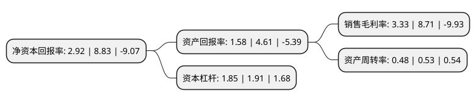

> 本页面由自动化程序生成于 2022年5月20日 01:15
> 内容可能存在错误，如有bug请提交issue至：https://github.com/Eroleice/doc-pi/issues
{.is-warning}

# 上市公司基本情况

## 基本资料

广州中海达卫星导航技术股份有限公司（以下简称“中海达”）成立于2006年06月21日，广州市。于2011年02月15日在深交所创业板上市。

中海达注册资本74,416.907万元，主营业务:从事高精度GNSS软硬件产品的研发，生产，销售，提供基于高精度GNSS系统工程解决方案及相关服务。主要产品:有高精度测量型GNSS，专业级GIS数据采集器，超声波数字化测深仪，GNSS系统工程解决方案等。以下是详细信息：

- 公司名称: 广州中海达卫星导航技术股份有限公司
- 股票代码: 300177.SZ
- 所在地: 广东 - 广州市
- 成立日期: 2006年06月21日
- 注册资本: 74,416.907万元
- 法定代表人: 廖定海
- 主营业务: 主营业务:从事高精度GNSS软硬件产品的研发，生产，销售，提供基于高精度GNSS系统工程解决方案及相关服务主要产品:有高精度测量型GNSS，专业级GIS数据采集器，超声波数字化测深仪，GNSS系统工程解决方案等
- 公司官网: www.hi-target.com.cn/www.zhdgps.com
- 公司介绍: 公司是专业从事高精度卫星导航定位系统(GNSS)软硬件产品的研发、生产、销售，提供基于高精度GNSS技术系统工程解决方案及相关服务的企业。公司主要产品有高精度测量型GNSS产品系列、超声波数字化测深仪系列、GIS数据采集系统、海洋工程应用集成系统和地质灾害监测系统等，可广泛运用于测绘勘探、国土规划、海洋开发、数字农林业等国民经济40多个领域。公司长期进行GNSS核心技术研发，积累了大量的自主知识产权和软件著作权，是国家高新技术企业和优秀软件企业，多年来一直以前瞻的技术引领着整个行业的革新和发展，是国内极具实力的GNSS龙头企业之一。公司致力于成为卫星导航领域全球第一品牌。公司曾被评为国家知识产权优势企业、高新技术企业、中国地理信息产业百强企业，建有广东省中海达卫星定位与空间智能感知院士工作站、广东省卫星导航(中海达)工程技术研究中心和省重点实验室和博士后工作站等。

## 股东及高管情况

上市公司第一大股东为廖定海，持股140,281,830股，占比18.85%，**疑似为**上市公司实际控制人。

截至2022年03月31日，上市公司的前十大股东中，共有8名自然人股东，1名机构股东，1个产品账户，其中5%以上大股东共有2名。上市公司前十大股东明细如下：

> 未能通过持股比例判定出上市公司实际控制人（持股30%以上）
> 可能存在通过间接持股、联合持股、协议控制等方式拥有实际控制权的主体，具体请参考上市公司定期公告！
{.is-warning}

> 截至2022年03月31日，上市公司前十大股东信息如下：

| 股东名称 | 持股数量（股） | 持股比例 |
| --- | --- | --- |
| 廖定海 | 140,281,830 | 18.85% |
| 廖文 | 43,349,696 | 5.83% |
| 董德伟 | 14,883,000 | 2% |
| 中国北方工业有限公司 | 7,000,000 | 0.94% |
| 詹培华 | 5,950,682 | 0.8% |
| 戚世旺 | 3,408,562 | 0.46% |
| 徐峰 | 3,252,028 | 0.44% |
| 李伟东 | 3,030,000 | 0.41% |
| 横琴广金美好基金管理有限公司-广金美好玻色八号私募证券投资基金 | 2,837,800 | 0.38% |
| 张桂龙 | 2,049,200 | 0.28% |

## 利润表分析

上市公司2021年总收入为17.95亿元，净利润为0.59亿元，实现盈利。

## 杜邦分析

> 数据列示周期：2021年 | 2020年 | 2019年
{.is-info}

上市公司的净资产收益率在近一年有所下降，下降幅度为-66.93%，其变化情况分解如下：
- 上市公司的销售毛利率在近一年下降了-61.77%，可能是生产效率的下降、商品原材料价格上涨或商品价格的下跌所致。
- 上市公司的资产周转率在近一年下降了-9.43%，可能是源自于更慢的销售回款或库存管理效果下降。
- 上市公司的财务杠杆比率在近一年下降了-3.14%，可能是减少负债降低财务费用。

