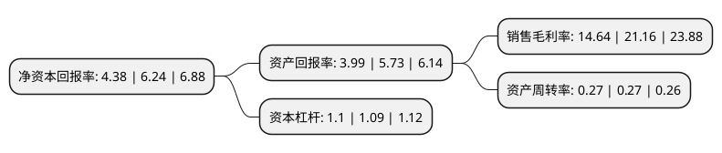

> 本页面由自动化程序生成于 2022年5月20日 01:15
> 内容可能存在错误，如有bug请提交issue至：https://github.com/Eroleice/doc-pi/issues
{.is-warning}

# 上市公司基本情况

## 基本资料

青岛东软载波科技股份有限公司（以下简称“东软载波”）成立于1993年06月30日，青岛市。于2011年02月22日在深交所创业板上市。

东软载波注册资本46,260.914万元，主要产品:MCU(微控制器)产品，智能化数据采集方案，智能电网领域从表计到主站系统的全方案解决方案，采用窄带低速，窄带高速与微功率无线结合的双模融合方案，高速载波方案等多种电力线通信方案，为国家电网提供用电信息采集系统解决方案。主营业务:集成电路板块，智能化板块，能源互联网板块。以下是详细信息：

- 公司名称: 青岛东软载波科技股份有限公司
- 股票代码: 300183.SZ
- 所在地: 山东 - 青岛市
- 成立日期: 1993年06月30日
- 注册资本: 46,260.914万元
- 法定代表人: 崔健
- 主营业务: 主要产品:MCU(微控制器)产品，智能化数据采集方案，智能电网领域从表计到主站系统的全方案解决方案，采用窄带低速，窄带高速与微功率无线结合的双模融合方案，高速载波方案等多种电力线通信方案，为国家电网提供用电信息采集系统解决方案主营业务:集成电路板块，智能化板块，能源互联网板块
- 公司官网: www.eastsoft.com.cn
- 公司介绍: 公司以集成电路设计为基础，开展以融合通信为平台的技术研发，不断提升公司的技术研发实力和技术设计水平，已形成“芯片、软件、终端、系统、信息服务”的全产业链布局，在智能化与能源互联网大发展的浪潮中打造新的增长点，成为智能化、能源互联网领域的国际一流企业。为更好地满足能源互联网和智能化的应用的需求，公司不仅在MCU产品上加大研发投入，也在积极投入射频、安全、触摸等领域的芯片设计研发，构建了国内领先的SMART产品线体系，形成了芯片-软件-终端-系统-信息服务全产业链布局，在智能化和能源互联网领域形成了巨大的技术优势，进一步夯实了行业领先者地位，取得了核心竞争优势。在能源互联网板块，公司主要聚焦智能电网领域，公司提供从表计到主站系统的全方案解决方案，采用窄带低速、窄带高速与微功率无线结合的双模融合方案、高速载波方案等多种电力线通信方案，为国家电网提供用电信息采集系统解决方案。

## 股东及高管情况

上市公司第一大股东为崔健，持股74,282,700股，占比16.06%，**疑似为**上市公司实际控制人。

截至2022年03月31日，上市公司的前十大股东中，共有8名自然人股东，1名机构股东，1个海外主体，其中5%以上大股东共有4名。上市公司前十大股东明细如下：

> 未能通过持股比例判定出上市公司实际控制人（持股30%以上）
> 可能存在通过间接持股、联合持股、协议控制等方式拥有实际控制权的主体，具体请参考上市公司定期公告！
{.is-warning}

> 截至2022年03月31日，上市公司前十大股东信息如下：

| 股东名称 | 持股数量（股） | 持股比例 |
| --- | --- | --- |
| 崔健 | 74,282,700 | 16.06% |
| 深圳山汇投资管理有限公司-佛山市澜海瑞盛股权投资合伙企业(有限合伙) | 68,775,700 | 14.87% |
| 胡亚军 | 47,270,800 | 10.22% |
| 王锐 | 47,270,800 | 10.22% |
| 陈一青 | 13,199,800 | 2.85% |
| 香港中央结算有限公司(陆股通) | 3,625,003 | 0.78% |
| 王乾江 | 3,440,000 | 0.74% |
| 郑小黎 | 2,580,500 | 0.56% |
| 娄玲利 | 1,673,900 | 0.36% |
| 施利勇 | 1,568,000 | 0.34% |

## 利润表分析

上市公司2021年总收入为9.06亿元，净利润为1.32亿元，实现盈利。

## 杜邦分析

> 数据列示周期：2021年 | 2020年 | 2019年
{.is-info}

上市公司的净资产收益率在近一年有所下降，下降幅度为-29.81%，其变化情况分解如下：
- 上市公司的销售毛利率在近一年下降了-30.81%，可能是生产效率的下降、商品原材料价格上涨或商品价格的下跌所致。
- 上市公司的资产周转率在近一年下降了0%，可能是源自于更慢的销售回款或库存管理效果下降。
- 上市公司的财务杠杆比率在近一年上升了0.92%，可能是增加负债扩大生产规模。

