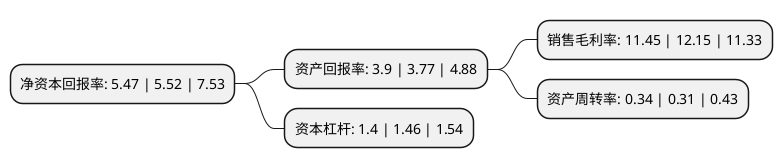

> 本页面由自动化程序生成于 2022年5月20日 01:15
> 内容可能存在错误，如有bug请提交issue至：https://github.com/Eroleice/doc-pi/issues
{.is-warning}

# 上市公司基本情况

## 基本资料

北京佳讯飞鸿电气股份有限公司（以下简称“佳讯飞鸿”）成立于1995年01月26日，北京市。于2011年05月05日在深交所创业板上市。

佳讯飞鸿注册资本59,371.856万元，主要产品:智能感知，智能传输，智慧决策，智慧分析能力的指挥调度系统，应急通信系统，综合视频监控系统，综合安全防灾系统，智能现场作业管理系统，道岔缺口监测系统，智能监管系统，通信安全监测系统及智能工厂解决方案等九大系列产品及解决方案。主营业务:通信信息领域的技术应用创新，向客户提供通信，信息，控制一体化的指挥调度系统及全面解决方案。以下是详细信息：

- 公司名称: 北京佳讯飞鸿电气股份有限公司
- 股票代码: 300213.SZ
- 所在地: 北京 - 北京市
- 成立日期: 1995年01月26日
- 注册资本: 59,371.856万元
- 法定代表人: 林菁
- 主营业务: 主要产品:智能感知，智能传输，智慧决策，智慧分析能力的指挥调度系统，应急通信系统，综合视频监控系统，综合安全防灾系统，智能现场作业管理系统，道岔缺口监测系统，智能监管系统，通信安全监测系统及智能工厂解决方案等九大系列产品及解决方案主营业务:通信信息领域的技术应用创新，向客户提供通信，信息，控制一体化的指挥调度系统及全面解决方案
- 公司官网: www.jiaxun.com
- 公司介绍: 公司是经北京市科学技术委员会认定的高新技术企业和软件企业，为国内领先的指挥调度通信系统提供商。公司紧紧抓住信息产业蓬勃发展的契机，聚焦行业需求，形成了具有智能感知、智能传输、智慧决策、智慧分析能力的指挥调度系统、应急通信系统、综合视频监控系统、综合安全防灾系统、智能现场作业管理系统、道岔缺口监测系统、智能监管系统、通信安全监测系统及智能工厂解决方案等九大系列产品及解决方案，致力于为全球客户提供“智慧指挥调度全产业链”的产品和解决方案，帮助客户实现智慧化运营管理。公司的客户涵盖了铁路、地铁、海关、国防、能源、水利、民航、金融等众多行业，且遍及全球十多个国家和地区，获得了国内外行业用户的高度认可。通过不断的技术开发和产品完善创新，公司已通过了ISO9001质量管理体系、GJB9001C质量管理体系和ISO14001环境管理体系认证，取得了计算机信息系统集成一级资质、安防工程企业设计施工维护能力评价一级资质。

## 股东及高管情况

上市公司第一大股东为林菁，持股53,998,102股，占比9.09%，**疑似为**上市公司实际控制人。

截至2022年03月31日，上市公司的前十大股东中，共有10名自然人股东，其中5%以上大股东共有2名。上市公司前十大股东明细如下：

> 未能通过持股比例判定出上市公司实际控制人（持股30%以上）
> 可能存在通过间接持股、联合持股、协议控制等方式拥有实际控制权的主体，具体请参考上市公司定期公告！
{.is-warning}

> 上市公司第一大股东持股不超过10%，请检查是否存在公司控制权风险！
{.is-danger}

> 截至2022年03月31日，上市公司前十大股东信息如下：

| 股东名称 | 持股数量（股） | 持股比例 |
| --- | --- | --- |
| 林菁 | 53,998,102 | 9.09% |
| 郑贵祥 | 30,938,000 | 5.21% |
| 林淑艺 | 17,856,300 | 3.01% |
| 王翊 | 16,090,000 | 2.71% |
| 王彤 | 11,997,300 | 2.02% |
| 刘文红 | 10,680,581 | 1.8% |
| 王义平 | 3,982,433 | 0.67% |
| 刘彬官 | 3,974,064 | 0.67% |
| 史仲宇 | 2,876,002 | 0.48% |
| 周军民 | 2,040,000 | 0.34% |

## 利润表分析

上市公司2021年总收入为10.32亿元，净利润为1.18亿元，实现盈利。

## 杜邦分析

> 数据列示周期：2021年 | 2020年 | 2019年
{.is-info}

上市公司的净资产收益率在近一年有所下降，下降幅度为-0.91%，其变化情况分解如下：
- 上市公司的销售毛利率在近一年下降了-5.76%，可能是生产效率的下降、商品原材料价格上涨或商品价格的下跌所致。
- 上市公司的资产周转率在近一年上升了9.68%，可能是源自于更快的销售回款或库存管理效果提升。
- 上市公司的财务杠杆比率在近一年下降了-4.11%，可能是减少负债降低财务费用。

