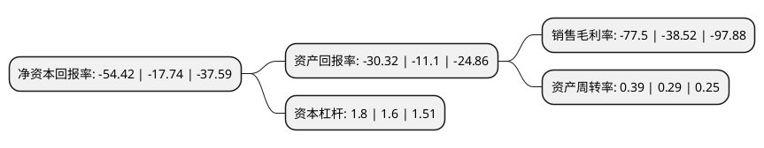

> 本页面由自动化程序生成于 2022年5月20日 01:16
> 内容可能存在错误，如有bug请提交issue至：https://github.com/Eroleice/doc-pi/issues
{.is-warning}

# 上市公司基本情况

## 基本资料

深圳市佳创视讯技术股份有限公司（以下简称“佳创视讯”）成立于2000年10月22日，深圳市。于2011年09月16日在深交所创业板上市。

佳创视讯注册资本41,310万元，主要产品:数字电视软件系统产品，数字电视系统集成和数字终端产品，市场需求主要来源于广电运营商。主营业务:数字电视系统整体解决方案提供商，主要从事数字电视软硬件产品的研发，生产，销售和系统集成，能够满足广电运营商对基础数模转换业务，增值业务及“三网融合”业务等整体解决方案的需求。以下是详细信息：

- 公司名称: 深圳市佳创视讯技术股份有限公司
- 股票代码: 300264.SZ
- 所在地: 广东 - 深圳市
- 成立日期: 2000年10月22日
- 注册资本: 41,310万元
- 法定代表人: 陈坤江
- 主营业务: 主要产品:数字电视软件系统产品，数字电视系统集成和数字终端产品，市场需求主要来源于广电运营商主营业务:数字电视系统整体解决方案提供商，主要从事数字电视软硬件产品的研发，生产，销售和系统集成，能够满足广电运营商对基础数模转换业务，增值业务及“三网融合”业务等整体解决方案的需求
- 公司官网: www.avit.com.cn
- 公司介绍: 公司成立于2000年，专注于数字电视系统研发与集成服务，是国内领先的数字电视整体解决方案提供商，也是中国最早投身于数字电视产业的高科技企业之一，于2002年率先在郑州、沈阳两个省会城市建设部署了可规模化运营的数字电视系统。公司坚持持续的自主研发和创新，公司具备完善的大型数字电视系统软硬件解决方案和产品线，VOD/互动电视、中间件、数据广播、EPG、NVOD、SMS等软件产品处于行业领先，公司掌握多项数字电视技术专利和优质的系统集成能力，使得公司在为客户设计方案、实施个性化、定制化开发、可持续技术升级方面具备显著优势。同事，公司实现国际化突破，向海外市场客户提供数字电视整体解决方案，并针对特定的国家和地区实行业务定制，向海外运营商提供“交钥匙”工程，现已为土耳其、越南、拉脱维亚、孟加拉、尼泊尔、泰国等四十多个国家的运营商提供了数字电视整体解决方案及数字电视产品，佳创视讯已经成为海外市场具有较高知名度的品牌。

## 股东及高管情况

上市公司第一大股东为陈坤江，持股74,610,668股，占比18.06%，**疑似为**上市公司实际控制人。

截至2022年03月31日，上市公司的前十大股东中，共有10名自然人股东，其中5%以上大股东共有1名。上市公司前十大股东明细如下：

> 未能通过持股比例判定出上市公司实际控制人（持股30%以上）
> 可能存在通过间接持股、联合持股、协议控制等方式拥有实际控制权的主体，具体请参考上市公司定期公告！
{.is-warning}

> 截至2022年03月31日，上市公司前十大股东信息如下：

| 股东名称 | 持股数量（股） | 持股比例 |
| --- | --- | --- |
| 陈坤江 | 74,610,668 | 18.06% |
| 邱佳芬 | 12,700,000 | 3.07% |
| 褚雯丽 | 2,797,600 | 0.68% |
| 吴为才 | 1,700,200 | 0.41% |
| 茅贞勇 | 1,491,400 | 0.36% |
| 童彬 | 1,052,700 | 0.25% |
| 任庆成 | 1,012,000 | 0.24% |
| 林敏之 | 954,300 | 0.23% |
| 陶杰 | 882,000 | 0.21% |
| 孟鹰 | 825,000 | 0.2% |

## 利润表分析

上市公司2021年总收入为1.36亿元，净利润为-1.06亿元，**未实现盈利**。

## 杜邦分析

> 数据列示周期：2021年 | 2020年 | 2019年
{.is-info}

上市公司的净资产收益率在近一年有所上升，上升幅度为206.76%，其变化情况分解如下：
- 上市公司的销售毛利率在近一年上升了101.19%，可能是生产效率的提升、商品原材料价格下跌或商品价格的上涨所致。
- 上市公司的资产周转率在近一年上升了34.48%，可能是源自于更快的销售回款或库存管理效果提升。
- 上市公司的财务杠杆比率在近一年上升了12.5%，可能是增加负债扩大生产规模。

