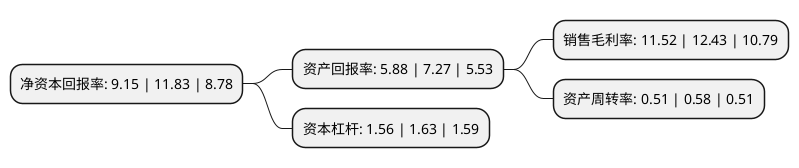

> 本页面由自动化程序生成于 2022年5月20日 01:16
> 内容可能存在错误，如有bug请提交issue至：https://github.com/Eroleice/doc-pi/issues
{.is-warning}

# 上市公司基本情况

## 基本资料

中际旭创股份有限公司（以下简称“中际旭创”）成立于2005年06月27日，烟台市。于2012年04月10日在深交所创业板上市。

中际旭创注册资本79,966.444万元，主要产品:电机定子绕组制造装备整机产品及其重要零部件。公司主要产品按照自动化程度和完成工序数量可分为单工序机，多工序机，半自动生产线和自动生产线四大类。其中，单工序机包含多工位机。主营业务:光模块业务及电机绕组装备制造业务。以下是详细信息：

- 公司名称: 中际旭创股份有限公司
- 股票代码: 300308.SZ
- 所在地: 山东 - 烟台市
- 成立日期: 2005年06月27日
- 注册资本: 79,966.444万元
- 法定代表人: 王伟修
- 主营业务: 主要产品:电机定子绕组制造装备整机产品及其重要零部件公司主要产品按照自动化程度和完成工序数量可分为单工序机，多工序机，半自动生产线和自动生产线四大类其中，单工序机包含多工位机主营业务:光模块业务及电机绕组装备制造业务
- 公司官网: www.zj-innolight.com
- 公司介绍: 公司是全球领先的数据中心光模块供应商，主要致力于高端光通信收发模块的研发、设计、封装、测试和销售，产品服务于云计算数据中心、数据通信、5G无线网络、电信传输和固网接入等领域的国内外客户。公司注重技术研发，并推动产品向高速率、小型化、低功耗、低成本方向发展，为云数据中心客户提供100G、200G、400G和800G的高速光模块，为电信设备商客户提供5G前传、中传和回传光模块，应用于城域网、骨干网和核心网传输光模块以及应用于固网FTTX光纤接入的光器件等高端整体解决方案，在行业内保持了出货量和市场份额的领先优势。根据市场权威机构LightCounting的报告，2017年、2018年，旭创科技连续两年位列全球光模块市场份额第二位；并预测有望在2020年排名全球光模块市场份额第一位。

## 股东及高管情况

上市公司第一大股东为山东中际投资控股有限公司，持股93,913,325股，占比11.74%，**疑似为**上市公司实际控制人。

截至2022年04月06日，上市公司的前十大股东中，共有1名自然人股东，6名机构股东，1个产品账户，2个海外主体，其中5%以上大股东共有4名。上市公司前十大股东明细如下：

> 未能通过持股比例判定出上市公司实际控制人（持股30%以上）
> 可能存在通过间接持股、联合持股、协议控制等方式拥有实际控制权的主体，具体请参考上市公司定期公告！
{.is-warning}

> 截至2022年04月06日，上市公司前十大股东信息如下：

| 股东名称 | 持股数量（股） | 持股比例 |
| --- | --- | --- |
| 山东中际投资控股有限公司 | 93,913,325 | 11.74% |
| 香港中央结算有限公司(陆股通) | 74,455,028 | 9.31% |
| 王伟修 | 64,158,837 | 8.02% |
| 苏州益兴福企业管理中心(有限合伙) | 50,239,391 | 6.28% |
| 苏州云昌锦企业管理中心(有限合伙) | 23,539,230 | 2.94% |
| 中移投资控股有限责任公司 | 16,096,774 | 2.01% |
| INNOLIGHT TECHNOLOGY HK LIMITED | 14,011,138 | 1.75% |
| 霍尔果斯凯风旭创创业投资合伙企业(有限合伙) | 13,759,231 | 1.72% |
| 中国工商银行股份有限公司-广发多因子灵活配置混合型证券投资基金 | 13,061,673 | 1.63% |
| 中信证券股份有限公司 | 11,830,062 | 1.48% |

## 利润表分析

上市公司2021年总收入为76.95亿元，净利润为8.86亿元，实现盈利。

## 杜邦分析

> 数据列示周期：2021年 | 2020年 | 2019年
{.is-info}

上市公司的净资产收益率在近一年有所下降，下降幅度为-22.65%，其变化情况分解如下：
- 上市公司的销售毛利率在近一年下降了-7.32%，可能是生产效率的下降、商品原材料价格上涨或商品价格的下跌所致。
- 上市公司的资产周转率在近一年下降了-12.07%，可能是源自于更慢的销售回款或库存管理效果下降。
- 上市公司的财务杠杆比率在近一年下降了-4.29%，可能是减少负债降低财务费用。

