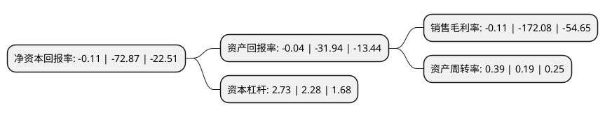

> 本页面由自动化程序生成于 2022年5月20日 01:17
> 内容可能存在错误，如有bug请提交issue至：https://github.com/Eroleice/doc-pi/issues
{.is-warning}

# 上市公司基本情况

## 基本资料

北京东土科技股份有限公司（以下简称“东土科技”）成立于2000年03月27日，北京市。于2012年09月27日在深交所创业板上市。

东土科技注册资本53,123.406万元，主要产品:芯片(通信，安全，总线，SDR自主网，动态加密)，工业服务器，交通服务器，边缘服务器，工业互联网操作系统/云平台，精密时钟产品，工业通信网络产品，作战指挥系统，战术互联网产品，战术通信终端等产品。主营业务:研究，开发，生产和销售工业以太网交换机，以及提供工业控制系统数据传输解决方案。以下是详细信息：

- 公司名称: 北京东土科技股份有限公司
- 股票代码: 300353.SZ
- 所在地: 北京 - 北京市
- 成立日期: 2000年03月27日
- 注册资本: 53,123.406万元
- 法定代表人: 李平
- 主营业务: 主要产品:芯片(通信，安全，总线，SDR自主网，动态加密)，工业服务器，交通服务器，边缘服务器，工业互联网操作系统/云平台，精密时钟产品，工业通信网络产品，作战指挥系统，战术互联网产品，战术通信终端等产品主营业务:研究，开发，生产和销售工业以太网交换机，以及提供工业控制系统数据传输解决方案
- 公司官网: www.kyland.com.cn
- 公司介绍: 公司是一家专注于工业互联网技术及产业的上市公司，致力于中国工业互联网平台技术的研究，用工业互联网技术创新各行业解决方案，应用于智慧工业、智慧城市、智慧军事、智慧能源四大领域，并在四大领域做到“自主可控、技术超越”。公司的主要产品有芯片(通信、安全、总线、SDR自主网、动态加密)、工业服务器、交通服务器、边缘服务器、工业互联网操作系统/云平台、精密时钟产品、工业通信网络产品、作战指挥系统、战术互联网产品、战术通信终端等产品，产品已广泛应用于智能电网、核电、风电、太阳能、石油化工、轨道交通、城市管廊、矿山、冶金、水务、智能交通、船舶等行业的国家重点工程和全球项目，同时成功应用于各类军工装备中，产品获得了KEMA、CE/FCC、UL508、Class I Div2、DNV等多项国际认证，在军工行业获得国军标认证。同时，公司是北京国科工业互联网研究院核心发起单位，是中国工业互联网核心标准的主要起草单位；先后参与和承担了多项工业自动化信息领域国际标准，主导起草了国家标准GB/T30094工业以太网交换机技术规范，获得国家多项核高基专项，承担了国家863课题。

## 股东及高管情况

上市公司第一大股东为李平，持股111,569,517股，占比21%，**疑似为**上市公司实际控制人。

截至2022年03月31日，上市公司的前十大股东中，共有5名自然人股东，2名机构股东，3个产品账户，其中5%以上大股东共有1名。上市公司前十大股东明细如下：

> 未能通过持股比例判定出上市公司实际控制人（持股30%以上）
> 可能存在通过间接持股、联合持股、协议控制等方式拥有实际控制权的主体，具体请参考上市公司定期公告！
{.is-warning}

> 截至2022年03月31日，上市公司前十大股东信息如下：

| 股东名称 | 持股数量（股） | 持股比例 |
| --- | --- | --- |
| 李平 | 111,569,517 | 21% |
| 北京大兴投资集团有限公司 | 25,549,045 | 4.81% |
| 深圳中航产业投资管理企业(有限合伙)-深圳中航智能装备股权投资基金合伙企业(有限合伙) | 12,300,000 | 2.32% |
| 吴作佳 | 11,623,322 | 2.19% |
| 薛百华 | 6,632,700 | 1.25% |
| 红塔证券-红塔证券股份有限公司-证券行业支持民企发展系列之红塔证券1号单一资产管理计划 | 6,300,000 | 1.19% |
| 陈辉 | 5,845,974 | 1.1% |
| 产业投资基金有限责任公司 | 5,481,016 | 1.03% |
| 北京中海盈创投资管理中心(有限合伙) | 4,006,666 | 0.75% |
| 宋永清 | 3,118,702 | 0.59% |

## 利润表分析

上市公司2021年总收入为9.41亿元，净利润为-0.02亿元，**未实现盈利**。

## 杜邦分析

> 数据列示周期：2021年 | 2020年 | 2019年
{.is-info}

上市公司的净资产收益率在近一年有所下降，下降幅度为-99.85%，其变化情况分解如下：
- 上市公司的销售毛利率在近一年下降了-99.94%，可能是生产效率的下降、商品原材料价格上涨或商品价格的下跌所致。
- 上市公司的资产周转率在近一年上升了105.26%，可能是源自于更快的销售回款或库存管理效果提升。
- 上市公司的财务杠杆比率在近一年上升了19.74%，可能是增加负债扩大生产规模。

