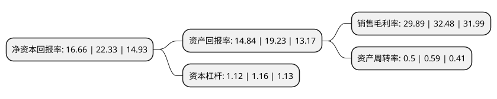

> 本页面由自动化程序生成于 2022年5月20日 01:17
> 内容可能存在错误，如有bug请提交issue至：https://github.com/Eroleice/doc-pi/issues
{.is-warning}

# 上市公司基本情况

## 基本资料

苏州天孚光通信股份有限公司（以下简称“天孚通信”）成立于2005年07月20日，苏州市。于2015年02月17日在深交所创业板上市。

天孚通信注册资本39,154.619万元，主要产品:陶瓷套管，光纤适配器，光收发组件，OSA ODM高速率光器件，光隔离器，MPO高密度线缆连接器，光纤透镜阵列(LENS ARRAY)，光学镀膜，插芯，Mux/Demux耦合，BOX封装OEM等。主要业务:光通信领域光器件的研发设计，高精密制造和销售业务，高速光器件封装ODM/OEM业务等。以下是详细信息：

- 公司名称: 苏州天孚光通信股份有限公司
- 股票代码: 300394.SZ
- 所在地: 江苏 - 苏州市
- 成立日期: 2005年07月20日
- 注册资本: 39,154.619万元
- 法定代表人: 邹支农
- 主营业务: 主要产品:陶瓷套管，光纤适配器，光收发组件，OSA ODM高速率光器件，光隔离器，MPO高密度线缆连接器，光纤透镜阵列(LENS ARRAY)，光学镀膜，插芯，Mux/Demux耦合，BOX封装OEM等光通信领域光器件的研发设计，高精密制造和销售业务，高速光器件封装ODM/OEM业务等
- 公司官网: www.tfcsz.com
- 公司介绍: 公司是光通信精密元器件一站式解决方案提供商，形成了多个产品系列齐头并进，互促发展的综合布局，为下游客户提供一站式、组合式产品解决方案，为全球光网络提供优质连接。公司主营业务包括光通信领域光器件的研发设计、高精密制造和销售业务，高速光器件封装ODM/OEM业务等，具体产品线包括陶瓷套管、光纤适配器、光收发组件、OSA ODM高速率光器件、光隔离器、MPO高密度线缆连接器、光纤透镜阵列(LENS ARRAY)、光学镀膜、插芯、Mux/Demux耦合、BOX封装OEM等。公司产品广泛应用于电信通信、数据通信、物联网等领域。公司成立十多年以来，始终坚持高端市场定位和高品质产品理念，目前已发展成为全球光器件领域光纤连接细分行业的领先企业。作为拥有“江苏省企业技术中心”和“江苏省工程技术研究中心”荣誉称号的国家级高新技术企业，公司持续加大研发投入，先后承担了科技部创新基金项目、国家火炬计划项目等数项省部级科技计划项目，获得了多项国家授权专利，产品被评为“江苏省名牌产品”，公司被评为“江苏省科技小巨人企业”和“江苏省隐形冠军企业”。

## 股东及高管情况

上市公司第一大股东为苏州天孚仁和投资管理有限公司，持股153,469,829股，占比39.2%，为上市公司实际控制人。

截至2022年03月31日，上市公司的前十大股东中，共有1名自然人股东，2名机构股东，6个产品账户，1个海外主体，其中5%以上大股东共有2名。上市公司前十大股东明细如下：

> 截至2022年03月31日，上市公司前十大股东信息如下：

| 股东名称 | 持股数量（股） | 持股比例 |
| --- | --- | --- |
| 苏州天孚仁和投资管理有限公司 | 153,469,829 | 39.2% |
| 朱国栋 | 43,048,489 | 10.99% |
| 全国社保基金一一五组合 | 6,000,000 | 1.53% |
| 苏州追梦人投资管理有限公司 | 4,809,476 | 1.23% |
| 上海浦东发展银行股份有限公司-易方达裕祥回报债券型证券投资基金 | 4,328,689 | 1.11% |
| 中国工商银行股份有限公司-广发多因子灵活配置混合型证券投资基金 | 3,719,135 | 0.95% |
| 香港中央结算有限公司(陆股通) | 3,167,608 | 0.81% |
| 前海人寿保险股份有限公司-分红保险产品华泰组合 | 2,999,940 | 0.77% |
| 中国农业银行股份有限公司-富国互联科技股票型证券投资基金 | 2,648,000 | 0.68% |
| 上海浦东发展银行股份有限公司-易方达瑞程灵活配置混合型证券投资基金 | 2,540,881 | 0.65% |

## 利润表分析

上市公司2021年总收入为10.32亿元，净利润为3.08亿元，实现盈利。

## 杜邦分析

> 数据列示周期：2021年 | 2020年 | 2019年
{.is-info}

上市公司的净资产收益率在近一年有所下降，下降幅度为-25.39%，其变化情况分解如下：
- 上市公司的销售毛利率在近一年下降了-7.97%，可能是生产效率的下降、商品原材料价格上涨或商品价格的下跌所致。
- 上市公司的资产周转率在近一年下降了-15.25%，可能是源自于更慢的销售回款或库存管理效果下降。
- 上市公司的财务杠杆比率在近一年下降了-3.45%，可能是减少负债降低财务费用。

