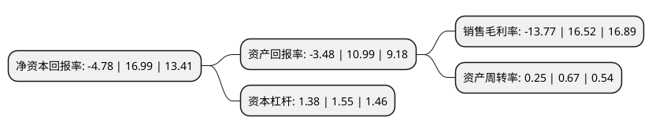

> 本页面由自动化程序生成于 2022年5月20日 01:17
> 内容可能存在错误，如有bug请提交issue至：https://github.com/Eroleice/doc-pi/issues
{.is-warning}

# 上市公司基本情况

## 基本资料

西安天和防务技术股份有限公司（以下简称“天和防务”）成立于2004年05月08日，西安市。于2014年09月10日在深交所创业板上市。

天和防务注册资本51,763.675万元，主要产品:军工装备，智能安防，综合电子，航管装备，通信电子，智能海防，军民融合智慧路灯，智能哨兵等。主要业务:为以连续波雷达技术和光电探测技术为核心的侦察，指挥，控制系统的研发，生产，销售及技术贸易。以下是详细信息：

- 公司名称: 西安天和防务技术股份有限公司
- 股票代码: 300397.SZ
- 所在地: 陕西 - 西安市
- 成立日期: 2004年05月08日
- 注册资本: 51,763.675万元
- 法定代表人: 贺增林
- 主营业务: 主要产品:军工装备，智能安防，综合电子，航管装备，通信电子，智能海防，军民融合智慧路灯，智能哨兵等为以连续波雷达技术和光电探测技术为核心的侦察，指挥，控制系统的研发，生产，销售及技术贸易
- 公司官网: www.thtw.com.cn
- 公司介绍: 公司是一家以军民融合为战略支撑的民营军工企业，是我国首家上市的民营军工企业，是我国最早一批进入军品整机系统科研生产领域的民营企业，也是国内最早一批实现军品整机系统装备部队并批量出口外销的民营军工企业。公司以军民融合企业战略为引领，专注于“军民融合综合电子信息体系”，构建“军民融合环境感知大数据服务”，打造以大数据、通信物联为代表的高端特色产业集群，在数字城市建设与管理、人工智能深度学习、大数据资源开放共享等重要领域实现规划和应用。目前，公司已形成了军工装备、智能安防、综合电子、通信电子、智能海防等五大产业板块。公司经过不断的积累与沉淀，其市场准入的资质优势、科研技术和人才优势、打造军民融合创新型防务集团标杆企业等核心竞争力得到进一步的巩固与强化。公司先后拥有百余项国防发明专利和实用专利，承担国家863计划，国家科技支撑计划重大项目，十余项“十三五”军方预研项目以及多项机密项目。

## 股东及高管情况

上市公司第一大股东为贺增林，持股129,971,700股，占比25.11%，**疑似为**上市公司实际控制人。

截至2022年03月31日，上市公司的前十大股东中，共有8名自然人股东，2名机构股东，其中5%以上大股东共有1名。上市公司前十大股东明细如下：

> 未能通过持股比例判定出上市公司实际控制人（持股30%以上）
> 可能存在通过间接持股、联合持股、协议控制等方式拥有实际控制权的主体，具体请参考上市公司定期公告！
{.is-warning}

> 截至2022年03月31日，上市公司前十大股东信息如下：

| 股东名称 | 持股数量（股） | 持股比例 |
| --- | --- | --- |
| 贺增林 | 129,971,700 | 25.11% |
| 刘丹英 | 15,747,300 | 3.04% |
| 陈传兴 | 11,118,378 | 2.15% |
| 徐国新 | 9,810,333 | 1.9% |
| 李汉国 | 7,779,900 | 1.5% |
| 西安天兴华盈企业管理咨询合伙企业(有限合伙) | 3,588,516 | 0.69% |
| 张发群 | 3,543,210 | 0.68% |
| 陕西金融资产管理股份有限公司 | 2,616,088 | 0.51% |
| 郭旺 | 2,552,400 | 0.49% |
| 张传如 | 2,366,565 | 0.46% |

## 利润表分析

上市公司2021年总收入为5.58亿元，净利润为-0.77亿元，**未实现盈利**。

## 杜邦分析

> 数据列示周期：2021年 | 2020年 | 2019年
{.is-info}

上市公司的净资产收益率在近一年有所下降，下降幅度为-128.13%，其变化情况分解如下：
- 上市公司的销售毛利率在近一年下降了-183.35%，可能是生产效率的下降、商品原材料价格上涨或商品价格的下跌所致。
- 上市公司的资产周转率在近一年下降了-62.69%，可能是源自于更慢的销售回款或库存管理效果下降。
- 上市公司的财务杠杆比率在近一年下降了-10.97%，可能是减少负债降低财务费用。

