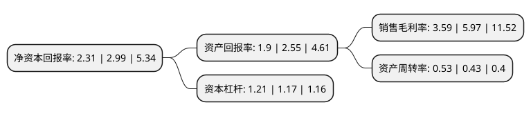

> 本页面由自动化程序生成于 2022年5月20日 01:17
> 内容可能存在错误，如有bug请提交issue至：https://github.com/Eroleice/doc-pi/issues
{.is-warning}

# 上市公司基本情况

## 基本资料

四川中光防雷科技股份有限公司（以下简称“中光防雷”）成立于2004年02月18日，成都市。于2015年05月13日在深交所创业板上市。

中光防雷注册资本32,574.197万元，主要产品:雷电防护产品，非雷电防护(含5G)产品。主要业务:防雷产品的研发，设计，生产和销售以下是详细信息：

- 公司名称: 四川中光防雷科技股份有限公司
- 股票代码: 300414.SZ
- 所在地: 四川 - 成都市
- 成立日期: 2004年02月18日
- 注册资本: 32,574.197万元
- 法定代表人: 王雪颖
- 主营业务: 主要产品:雷电防护产品，非雷电防护(含5G)产品防雷产品的研发，设计，生产和销售
- 公司官网: www.zhongguang.com
- 公司介绍: 公司为专业从事防雷产品的研发、设计、生产和销售，防雷工程的设计和安装，提供防雷产品和防雷工程一体化的整体解决方案的服务商。公司主要产品为SPD产品、接地产品、避雷针等防雷产品以及智能雷电预警系统、智能雷电监测系统、智能SPD和智能行波故障定位系统等系列智能化软硬件系统产品，同时公司也加大力度推出了系列滤波器产品和磁性器件产品，这些产品广泛应用于通信、航天国防、铁路与轨道交通、电力、石油石化、新能源、工业自动化、建筑等基础产业及新兴产业。公司拥有的核心技术与研发能力、产品质量控制能力以及全行业覆盖的市场与销售体系仍是公司立足行业领先地位的核心竞争力。公司为IEC TC37A委员、中国标准化协会团体会员单位、中国通信标准化协会全权会员、中国通信企业协会会员、中国工程标准化协会常务理事单位、国家高新技术产业标准化重点示范企业、首家通信行业雷电防护示范基地、四川省建设创新型企业试点企业、国家火炬计划项目单位、四川省重大科技成果转化工程示范项目单位。

## 股东及高管情况

上市公司第一大股东为四川中光高技术研究所有限责任公司，持股133,276,450股，占比40.88%，为上市公司实际控制人。

截至2022年04月29日，上市公司的前十大股东中，共有5名自然人股东，5名机构股东，其中5%以上大股东共有8名。上市公司前十大股东明细如下：

> 截至2022年04月29日，上市公司前十大股东信息如下：

| 股东名称 | 持股数量（股） | 持股比例 |
| --- | --- | --- |
| 四川中光高技术研究所有限责任公司 | 133,276,450 | 40.88% |
| 四川中光高技术研究所有限责任公司 | 133,276,450 | 40.88% |
| 上海广信科技发展有限公司 | 21,496,316 | 6.59% |
| 上海广信科技发展有限公司 | 20,735,000 | 6.36% |
| 上海广信科技发展有限公司 | 18,567,200 | 5.6951% |
| 王雪颖 | 18,552,778 | 5.69% |
| 王雪颖 | 18,552,778 | 5.69% |
| 王雪颖 | 18,552,778 | 5.69% |
| 何亨文 | 1,198,611 | 0.37% |
| 史俊伟 | 750,444 | 0.23% |

## 利润表分析

上市公司2021年总收入为5.91亿元，净利润为0.21亿元，实现盈利。

## 杜邦分析

> 数据列示周期：2021年 | 2020年 | 2019年
{.is-info}

上市公司的净资产收益率在近一年有所下降，下降幅度为-22.74%，其变化情况分解如下：
- 上市公司的销售毛利率在近一年下降了-39.87%，可能是生产效率的下降、商品原材料价格上涨或商品价格的下跌所致。
- 上市公司的资产周转率在近一年上升了23.26%，可能是源自于更快的销售回款或库存管理效果提升。
- 上市公司的财务杠杆比率在近一年上升了3.42%，可能是增加负债扩大生产规模。

