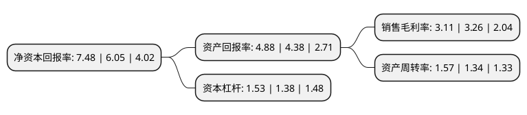

> 本页面由自动化程序生成于 2022年5月20日 01:18
> 内容可能存在错误，如有bug请提交issue至：https://github.com/Eroleice/doc-pi/issues
{.is-warning}

# 上市公司基本情况

## 基本资料

上海润欣科技股份有限公司（以下简称“润欣科技”）成立于2000年10月09日，上海市。于2015年12月10日在深交所创业板上市。

润欣科技注册资本50,553.915万元，主要产品:无线连接芯片，WiFi及网络处理器芯片，传感器芯片，射频及功率放大器件等;主营业务:通过向客户提供包括IC应用解决方案在内的一系列技术支持服务从而形成IC产品的销售，分销的IC产品以通讯连接芯片和传感器芯片为主。以下是详细信息：

- 公司名称: 上海润欣科技股份有限公司
- 股票代码: 300493.SZ
- 所在地: 上海 - 上海市
- 成立日期: 2000年10月09日
- 注册资本: 50,553.915万元
- 法定代表人: 郎晓刚
- 主营业务: 主要产品:无线连接芯片，WiFi及网络处理器芯片，传感器芯片，射频及功率放大器件等;主营业务:通过向客户提供包括IC应用解决方案在内的一系列技术支持服务从而形成IC产品的销售，分销的IC产品以通讯连接芯片和传感器芯片为主
- 公司官网: www.fortune-co.com
- 公司介绍: 公司是国内领先的IC产品授权分销商，分销的IC产品以通讯连接芯片、射频和功率放大芯片和传感器芯片为主。目前主要代理高通、AVX/京瓷、思佳讯、AAC等全球著名IC设计制造公司的IC产品，并拥有美的、共进电子、大疆创新等客户，是IC产业链中连接上下游的重要纽带。近年来，公司一直专注于无线通讯连接及传感技术的研发，形成了在智慧家电、无线城市、安防、指纹识别应用等多个领域的IC应用解决方案。凭借在无线连接及传感应用领域的积累，随着低功耗无线技术、物联网应用的高速发展，公司在WiFi、蓝牙BLE、射频和功率放大芯片、NB-IOT芯片和模块技术领域持续投入，不断扩充分销的产品种类，提升公司业务规模及盈利能力。

## 股东及高管情况

上市公司第一大股东为上海润欣信息技术有限公司，持股109,417,500股，占比21.64%，**疑似为**上市公司实际控制人。

截至2022年03月31日，上市公司的前十大股东中，共有3名自然人股东，4名机构股东，3个产品账户，其中5%以上大股东共有2名。上市公司前十大股东明细如下：

> 未能通过持股比例判定出上市公司实际控制人（持股30%以上）
> 可能存在通过间接持股、联合持股、协议控制等方式拥有实际控制权的主体，具体请参考上市公司定期公告！
{.is-warning}

> 截至2022年03月31日，上市公司前十大股东信息如下：

| 股东名称 | 持股数量（股） | 持股比例 |
| --- | --- | --- |
| 上海润欣信息技术有限公司 | 109,417,500 | 21.64% |
| 领元投资咨询(上海)有限公司 | 34,456,250 | 6.82% |
| 上海烜鼎资产管理有限公司-烜鼎星辰1号私募证券投资基金 | 24,328,400 | 4.81% |
| 上海银燕投资咨询有限公司 | 17,887,000 | 3.54% |
| 上海时芯投资合伙企业(有限合伙) | 6,534,925 | 1.29% |
| 上海银叶投资有限公司-银叶-攻玉主题精选2期私募证券投资基金 | 5,691,056 | 1.13% |
| 上海呈瑞投资管理有限公司-呈瑞华聚专享私募证券投资基金 | 5,160,301 | 1.02% |
| 石泉英 | 4,330,937 | 0.86% |
| 王莉 | 3,794,037 | 0.75% |
| 杨海 | 3,794,037 | 0.75% |

## 利润表分析

上市公司2021年总收入为18.57亿元，净利润为0.57亿元，实现盈利。

## 杜邦分析

> 数据列示周期：2021年 | 2020年 | 2019年
{.is-info}

上市公司的净资产收益率在近一年有所上升，上升幅度为23.64%，其变化情况分解如下：
- 上市公司的销售毛利率在近一年下降了-4.6%，可能是生产效率的下降、商品原材料价格上涨或商品价格的下跌所致。
- 上市公司的资产周转率在近一年上升了17.16%，可能是源自于更快的销售回款或库存管理效果提升。
- 上市公司的财务杠杆比率在近一年上升了10.87%，可能是增加负债扩大生产规模。

