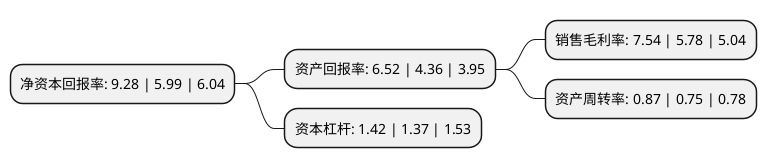

> 本页面由自动化程序生成于 2022年5月20日 01:18
> 内容可能存在错误，如有bug请提交issue至：https://github.com/Eroleice/doc-pi/issues
{.is-warning}

# 上市公司基本情况

## 基本资料

四川天邑康和通信股份有限公司（以下简称“天邑股份”）成立于2001年01月15日，成都市。于2018年03月30日在深交所创业板上市。

天邑股份注册资本27,309.1万元，主营业务:立足于光通信产业和移动通信产业，专业从事宽带网络终端设备，通信网络物理连接与保护设备，移动通信网络优化系统设备等的研发，生产，销售和服务。以下是详细信息：

- 公司名称: 四川天邑康和通信股份有限公司
- 股票代码: 300504.SZ
- 所在地: 四川 - 成都市
- 成立日期: 2001年01月15日
- 注册资本: 27,309.1万元
- 法定代表人: 李世宏
- 主营业务: 主营业务:立足于光通信产业和移动通信产业，专业从事宽带网络终端设备，通信网络物理连接与保护设备，移动通信网络优化系统设备等的研发，生产，销售和服务
- 公司官网: www.tianyisc.com
- 公司介绍: 公司立足于光通信产业和移动通信产业，专业从事通信网络物理连接及保护、移动通信网络优化系统及宽带网络终端设备的研发、生产、销售和服务。公司已经拥有自接入到应用的全产业链主要产品研发及生产能力。公司的产品及服务主要包括通信网络物理连接及保护设备、宽带网络终端设备、移动通信网络优化系统设备及系统集成服务、热缩制品与通信管材，广泛运用于通信网络中的接入网系统。公司执行ISO9001：2008质量体系要求并取得相应认证证书，公司主导产品均获得了包括信息产业部进网许可证、泰尔认证中心产品认证证书等在内的各种专业认证证书，通过并取得了《环境管理体系认证证书》和《职业健康安全管理体系认证证书》。公司始终贯彻以创新促发展的方针，围绕提升客户价值，进行技术、产品的持续改进和创新，同时完善营销渠道和服务网络，为客户提供高品质的产品和服务。

## 股东及高管情况

上市公司第一大股东为四川天邑集团有限公司，持股83,775,060股，占比30.68%，为上市公司实际控制人。

截至2022年03月31日，上市公司的前十大股东中，共有4名自然人股东，3名机构股东，3个产品账户，其中5%以上大股东共有4名。上市公司前十大股东明细如下：

> 截至2022年03月31日，上市公司前十大股东信息如下：

| 股东名称 | 持股数量（股） | 持股比例 |
| --- | --- | --- |
| 四川天邑集团有限公司 | 83,775,060 | 30.68% |
| 李世宏 | 27,974,700 | 10.24% |
| 李俊画 | 25,125,120 | 9.2% |
| 李俊霞 | 20,265,120 | 7.42% |
| 横琴广金美好基金管理有限公司-广金美好费米四号私募证券投资基金 | 4,860,000 | 1.78% |
| 成都国衡弘邑投资合伙企业(有限合伙) | 2,004,200 | 0.73% |
| 中国工商银行股份有限公司-南方大数据100指数证券投资基金 | 761,500 | 0.28% |
| 浙商银行股份有限公司-九泰久睿量化股票型证券投资基金 | 675,300 | 0.25% |
| 中信证券股份有限公司 | 634,561 | 0.23% |
| 陆伟健 | 500,000 | 0.18% |

## 利润表分析

上市公司2021年总收入为23.98亿元，净利润为1.8亿元，实现盈利。

## 杜邦分析

> 数据列示周期：2021年 | 2020年 | 2019年
{.is-info}

上市公司的净资产收益率在近一年有所上升，上升幅度为54.92%，其变化情况分解如下：
- 上市公司的销售毛利率在近一年上升了30.45%，可能是生产效率的提升、商品原材料价格下跌或商品价格的上涨所致。
- 上市公司的资产周转率在近一年上升了16%，可能是源自于更快的销售回款或库存管理效果提升。
- 上市公司的财务杠杆比率在近一年上升了3.65%，可能是增加负债扩大生产规模。

