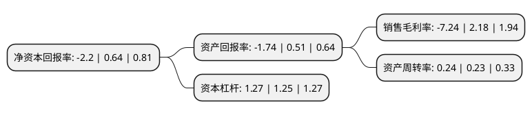

> 本页面由自动化程序生成于 2022年5月20日 01:18
> 内容可能存在错误，如有bug请提交issue至：https://github.com/Eroleice/doc-pi/issues
{.is-warning}

# 上市公司基本情况

## 基本资料

无锡路通视信网络股份有限公司（以下简称“路通视信”）成立于2007年02月16日，无锡市。于2016年10月18日在深交所创业板上市。

路通视信注册资本20,000万元，主要产品:G/EPON设备(OLT，ONU)，家用光终端设备，光发射机，光接收机，光放大器等网络传输产品，以及智慧社区，应急广播，视频监控为代表的智慧物联应用解决方案和为网络运营商宽带网络建设提供的规划设计服务。主要业务:网络传输系统，智慧物联应用和相关技术服务。以下是详细信息：

- 公司名称: 无锡路通视信网络股份有限公司
- 股票代码: 300555.SZ
- 所在地: 江苏 - 无锡市
- 成立日期: 2007年02月16日
- 注册资本: 20,000万元
- 法定代表人: 林竹
- 主营业务: 主要产品:G/EPON设备(OLT，ONU)，家用光终端设备，光发射机，光接收机，光放大器等网络传输产品，以及智慧社区，应急广播，视频监控为代表的智慧物联应用解决方案和为网络运营商宽带网络建设提供的规划设计服务网络传输系统，智慧物联应用和相关技术服务
- 公司官网: www.lootom.com
- 公司介绍: 公司是一家专业从事有线宽带网络传输系统及相关产品开发和生产的民营高科技企业。公司致力于提供广电网络接入网综合解决方案，主要业务方向包括网络传输系统、智慧物联应用和相关技术服务，主要产品为G/EPON设备(OLT、ONU)、家用光终端设备、光发射机、光接收机、光放大器等网络传输产品，以及智慧社区、应急广播、视频监控为代表的智慧物联应用解决方案和为网络运营商宽带网络建设提供的规划设计服务，是国内广电网络接入网综合解决方案的领军企业。公司是国家高新技术企业；江苏省高成长型中小企业重点培育企业；江苏省科技创业优秀民营企业；中国广播电视工业协会理事单位；无锡市十佳高新技术企业。公司“广电运维支撑综合网管系统”、“射频无源光网络(RFPON)宽带传输网络系统”等多个研发项目被列入国家火炬计划、中小科技企业技术创新基金、江苏省重大科技成果转化专项资金等计划项目。同时，公司还积极开展下一代广电接入网前沿技术研究，参与了国家广电总局NGB多个专题工作组和EPOC论坛的研究工作。

## 股东及高管情况

上市公司第一大股东为宁波余姚华晟云城智慧城市运营科技有限公司，持股25,101,283股，占比12.55%，**疑似为**上市公司实际控制人。

截至2022年03月31日，上市公司的前十大股东中，共有8名自然人股东，2名机构股东，其中5%以上大股东共有3名。上市公司前十大股东明细如下：

> 未能通过持股比例判定出上市公司实际控制人（持股30%以上）
> 可能存在通过间接持股、联合持股、协议控制等方式拥有实际控制权的主体，具体请参考上市公司定期公告！
{.is-warning}

> 截至2022年03月31日，上市公司前十大股东信息如下：

| 股东名称 | 持股数量（股） | 持股比例 |
| --- | --- | --- |
| 宁波余姚华晟云城智慧城市运营科技有限公司 | 25,101,283 | 12.55% |
| 贾清 | 12,550,600 | 6.28% |
| 永新县汇德企业管理中心(有限合伙) | 10,300,000 | 5.15% |
| 顾纪明 | 7,859,127 | 3.93% |
| 仇一兵 | 5,380,016 | 2.69% |
| 尹冠民 | 4,552,058 | 2.28% |
| 刘毅 | 3,870,000 | 1.94% |
| 庄小正 | 3,243,050 | 1.62% |
| 蒋秀军 | 3,060,970 | 1.53% |
| 高志泰 | 3,000,000 | 1.5% |

## 利润表分析

上市公司2021年总收入为1.92亿元，净利润为-0.14亿元，**未实现盈利**。

## 杜邦分析

> 数据列示周期：2021年 | 2020年 | 2019年
{.is-info}

上市公司的净资产收益率在近一年有所下降，下降幅度为-443.75%，其变化情况分解如下：
- 上市公司的销售毛利率在近一年下降了-432.11%，可能是生产效率的下降、商品原材料价格上涨或商品价格的下跌所致。
- 上市公司的资产周转率在近一年上升了4.35%，可能是源自于更快的销售回款或库存管理效果提升。
- 上市公司的财务杠杆比率在近一年上升了1.6%，可能是增加负债扩大生产规模。

