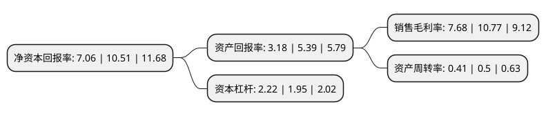

> 本页面由自动化程序生成于 2022年5月20日 01:18
> 内容可能存在错误，如有bug请提交issue至：https://github.com/Eroleice/doc-pi/issues
{.is-warning}

# 上市公司基本情况

## 基本资料

中富通集团股份有限公司（以下简称“中富通”）成立于2001年11月07日，福州市。于2016年11月01日在深交所创业板上市。

中富通注册资本22,626.981万元，主营业务:通信网络管理服务，具体分为通信网络维护服务和通信网络优化服务。主要产品:通讯产品，电子产品等。以下是详细信息：

- 公司名称: 中富通集团股份有限公司
- 股票代码: 300560.SZ
- 所在地: 福建 - 福州市
- 成立日期: 2001年11月07日
- 注册资本: 22,626.981万元
- 法定代表人: 陈融洁
- 主营业务: 主营业务:通信网络管理服务，具体分为通信网络维护服务和通信网络优化服务主要产品:通讯产品，电子产品等
- 公司官网: www.zftii.com
- 公司介绍: 公司是一家专业的第三方通信网络管理服务提供商，致力于为通信与信息领域提供一流的通信网络维护和通信网络优化服务，主要客户包括中国移动、中国电信、中国联通等电信运营商，以及华为、中兴、上海贝尔等知名通信设备供应商。公司是国家高新技术企业，福建省技术创新工程创新型试点企业，一直紧跟通信技术的发展趋势，注重技术创新及研发投入。公司自主研发的光网监测云平台、网优测试数据管理平台和WLAN测试系统等分析测试技术在通信网络维护和通信网络优化业务中获得了广泛应用。公司是福建省内综合实力最强的通信网络管理服务提供商之一。公司市场影响力正不断增强，业务区域逐步由福建拓展到山东、广东、安徽、江西、吉林、黑龙江、江苏等十多个省市以及泰国、马来西亚等境外国家；客户结构亦不断优化，由电信运营商和通信设备供应商扩展到广电运营商、部队及市政部门等。

## 股东及高管情况

上市公司第一大股东为陈融洁，持股57,020,549股，占比25.2%，**疑似为**上市公司实际控制人。

截至2022年03月31日，上市公司的前十大股东中，共有6名自然人股东，3名机构股东，1个海外主体，其中5%以上大股东共有3名。上市公司前十大股东明细如下：

> 未能通过持股比例判定出上市公司实际控制人（持股30%以上）
> 可能存在通过间接持股、联合持股、协议控制等方式拥有实际控制权的主体，具体请参考上市公司定期公告！
{.is-warning}

> 截至2022年03月31日，上市公司前十大股东信息如下：

| 股东名称 | 持股数量（股） | 持股比例 |
| --- | --- | --- |
| 陈融洁 | 57,020,549 | 25.2% |
| 福建融嘉科技有限公司 | 36,945,812 | 16.33% |
| 济南铁富投资合伙企业(有限合伙) | 15,936,255 | 7.04% |
| 陶开德 | 11,315,000 | 5% |
| 王数红 | 11,315,000 | 5% |
| 永新县融磊商务信息咨询中心(有限合伙) | 5,884,300 | 2.6% |
| 刘运华 | 1,560,000 | 0.69% |
| 庄尔燕 | 700,000 | 0.31% |
| UBS AG | 596,951 | 0.26% |
| 武勋 | 570,000 | 0.25% |

## 利润表分析

上市公司2021年总收入为9.76亿元，净利润为0.75亿元，实现盈利。

## 杜邦分析

> 数据列示周期：2021年 | 2020年 | 2019年
{.is-info}

上市公司的净资产收益率在近一年有所下降，下降幅度为-32.83%，其变化情况分解如下：
- 上市公司的销售毛利率在近一年下降了-28.69%，可能是生产效率的下降、商品原材料价格上涨或商品价格的下跌所致。
- 上市公司的资产周转率在近一年下降了-18%，可能是源自于更慢的销售回款或库存管理效果下降。
- 上市公司的财务杠杆比率在近一年上升了13.85%，可能是增加负债扩大生产规模。

