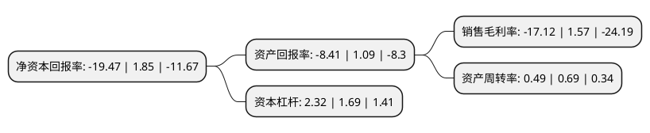

> 本页面由自动化程序生成于 2022年5月20日 01:18
> 内容可能存在错误，如有bug请提交issue至：https://github.com/Eroleice/doc-pi/issues
{.is-warning}

# 上市公司基本情况

## 基本资料

深圳市科信通信技术股份有限公司（以下简称“科信技术”）成立于2001年08月28日，深圳市。于2016年11月22日在深交所创业板上市。

科信技术注册资本20,800万元，主要产品:FTTX接入网ODN系列产品，无线接入系列产品以及传输网相关产品等。主要业务:FTTX接入网，无线接入网和传输网中通信网络物理连接设备，应用解决方案和技术服务。以下是详细信息：

- 公司名称: 深圳市科信通信技术股份有限公司
- 股票代码: 300565.SZ
- 所在地: 广东 - 深圳市
- 成立日期: 2001年08月28日
- 注册资本: 20,800万元
- 法定代表人: 陈登志
- 主营业务: 主要产品:FTTX接入网ODN系列产品，无线接入系列产品以及传输网相关产品等FTTX接入网，无线接入网和传输网中通信网络物理连接设备，应用解决方案和技术服务
- 公司官网: www.szkexin.com.cn
- 公司介绍: 公司是一家专注于提供FTTX接入网、无线接入网和传输网中通信网络物理连接设备、应用解决方案和技术服务的高新技术企业。公司可向通信运营商、ICT设备商河网络集成商提供FTTX接入网ODN端到端解决方案、无线接入解决方案和传输网物理连接、分配解决方案，在FTTX、3G/4G、传输网等通信网络中得到广泛应用。公司主要产品包括FTTX接入网ODN系列产品、无线接入系列产品以及传输网相关产品等，拥有较为完善的销售渠道和服务网络，覆盖国内运营商、海外运营商、ICT设备商等客户群体公司长期保持较高比例的研发投入，围绕客户需求和技术领先持续创新，开发出一系列适应市场需求的创新产品和解决方案，为客户不断创造价值。通过多年努力，公司共拥有专利两百余项，计算机软件著作权多项，同时是中国通信标准化协会会员，为推动行业标准制定做出了积极贡献，主导或参与了多项行业标准的起草修订。

## 股东及高管情况

上市公司第一大股东为陈登志，持股26,277,420股，占比12.63%，**疑似为**上市公司实际控制人。

截至2022年03月31日，上市公司的前十大股东中，共有9名自然人股东，1名机构股东，其中5%以上大股东共有3名。上市公司前十大股东明细如下：

> 未能通过持股比例判定出上市公司实际控制人（持股30%以上）
> 可能存在通过间接持股、联合持股、协议控制等方式拥有实际控制权的主体，具体请参考上市公司定期公告！
{.is-warning}

> 截至2022年03月31日，上市公司前十大股东信息如下：

| 股东名称 | 持股数量（股） | 持股比例 |
| --- | --- | --- |
| 陈登志 | 26,277,420 | 12.63% |
| 张锋峰 | 15,719,587 | 7.56% |
| 曾宪琦 | 13,439,137 | 6.46% |
| 云南众恒兴企业管理有限公司 | 10,073,190 | 4.84% |
| 吴晓斌 | 6,980,716 | 3.36% |
| 花育东 | 4,138,434 | 1.99% |
| 李永毫 | 2,563,400 | 1.23% |
| 欧阳星涛 | 2,180,000 | 1.05% |
| 唐建安 | 1,909,567 | 0.92% |
| 赵英姿 | 1,797,332 | 0.86% |

## 利润表分析

上市公司2021年总收入为7.04亿元，净利润为-1.21亿元，**未实现盈利**。

## 杜邦分析

> 数据列示周期：2021年 | 2020年 | 2019年
{.is-info}

上市公司的净资产收益率在近一年有所下降，下降幅度为-1152.43%，其变化情况分解如下：
- 上市公司的销售毛利率在近一年下降了-1190.45%，可能是生产效率的下降、商品原材料价格上涨或商品价格的下跌所致。
- 上市公司的资产周转率在近一年下降了-28.99%，可能是源自于更慢的销售回款或库存管理效果下降。
- 上市公司的财务杠杆比率在近一年上升了37.28%，可能是增加负债扩大生产规模。

