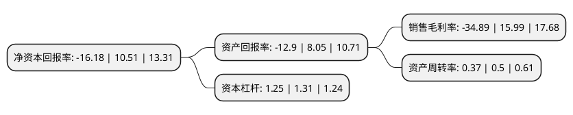

> 本页面由自动化程序生成于 2022年5月20日 01:18
> 内容可能存在错误，如有bug请提交issue至：https://github.com/Eroleice/doc-pi/issues
{.is-warning}

# 上市公司基本情况

## 基本资料

上海会畅通讯股份有限公司（以下简称“会畅通讯”）成立于2006年02月08日，上海市。于2017年01月25日在深交所创业板上市。

会畅通讯注册资本19,978.204万元，公司的主营业务是国内多方通信服务业务，是目前国内最大的企业级多方通信服务商之一。以下是详细信息：

- 公司名称: 上海会畅通讯股份有限公司
- 股票代码: 300578.SZ
- 所在地: 上海 - 上海市
- 成立日期: 2006年02月08日
- 注册资本: 19,978.204万元
- 法定代表人: 路路
- 主营业务: 公司的主营业务是国内多方通信服务业务，是目前国内最大的企业级多方通信服务商之一
- 公司官网: www.bizconf.cn
- 公司介绍: 公司成立于2006年，是云视频会议领导者，秉承“沟通创造价值”的服务理念，专注于为企业提供高品质的视频会议、网络直播、电话会议和网络会议等云视频会议服务，并在全球范围内与国际运营商开展战略合作，服务网络遍布全球150多个国家和地区，向用户提供7*24小时的中英双语优质服务，真正实现“为客户全球服务，服务于全球客户”。会畅通讯的客户群体遍布各个行业及领域，70%的世界500强在华企业都选用会畅通讯的云视频平台作为日常工作和沟通的重要工具。目前公司在北京、上海、广州、深圳、南京设有分支机构，并在中国超过三分之一的省份和直辖区域设有服务团队。2018年，公司通过收购数智源85.0006%股权及明日实业100%股权，新增视频监控软件技术的研究和开发、视频监控系统的集成销售等业务，及信息通讯类摄像机、广播类摄像机以及工业领域应用摄像机产品的研究、开发、生产和销售业务，业务布局更为完善。

## 股东及高管情况

上市公司第一大股东为北京会畅企业管理合伙企业(有限合伙)，持股31,308,120股，占比15.67%，**疑似为**上市公司实际控制人。

截至2022年03月31日，上市公司的前十大股东中，共有6名自然人股东，2名机构股东，2个产品账户，其中5%以上大股东共有3名。上市公司前十大股东明细如下：

> 未能通过持股比例判定出上市公司实际控制人（持股30%以上）
> 可能存在通过间接持股、联合持股、协议控制等方式拥有实际控制权的主体，具体请参考上市公司定期公告！
{.is-warning}

> 截至2022年03月31日，上市公司前十大股东信息如下：

| 股东名称 | 持股数量（股） | 持股比例 |
| --- | --- | --- |
| 北京会畅企业管理合伙企业(有限合伙) | 31,308,120 | 15.67% |
| 上海会畅企业管理咨询有限公司 | 31,308,120 | 15.67% |
| 黄元元 | 30,506,971 | 15.27% |
| 罗德英 | 8,914,080 | 4.46% |
| 杨祖栋 | 5,150,057 | 2.58% |
| 戴元永 | 4,869,259 | 2.44% |
| 徐志英 | 4,409,171 | 2.21% |
| 吕强 | 3,527,336 | 1.77% |
| 平安证券-罗德英-平安证券新创20号单一资产管理计划 | 1,500,000 | 0.75% |
| 广州市玄元投资管理有限公司-玄元科新13号私募证券投资基金 | 1,350,068 | 0.68% |

## 利润表分析

上市公司2021年总收入为6.78亿元，净利润为-2.37亿元，**未实现盈利**。

## 杜邦分析

> 数据列示周期：2021年 | 2020年 | 2019年
{.is-info}

上市公司的净资产收益率在近一年有所下降，下降幅度为-253.95%，其变化情况分解如下：
- 上市公司的销售毛利率在近一年下降了-318.2%，可能是生产效率的下降、商品原材料价格上涨或商品价格的下跌所致。
- 上市公司的资产周转率在近一年下降了-26%，可能是源自于更慢的销售回款或库存管理效果下降。
- 上市公司的财务杠杆比率在近一年下降了-4.58%，可能是减少负债降低财务费用。

