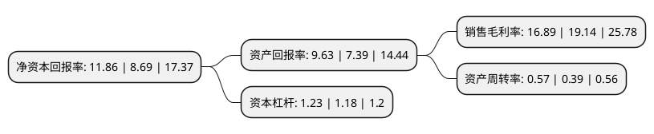

> 本页面由自动化程序生成于 2022年5月20日 01:18
> 内容可能存在错误，如有bug请提交issue至：https://github.com/Eroleice/doc-pi/issues
{.is-warning}

# 上市公司基本情况

## 基本资料

上海移为通信技术股份有限公司（以下简称“移为通信”）成立于2009年06月11日，上海市。于2017年01月11日在深交所创业板上市。

移为通信注册资本30,452.7万元，主要产品:车载追踪通讯产品，物品追踪通讯产品，个人追踪通讯产品，动物追踪溯源产品。主营业务:物联网行业，嵌入式无线M2M终端设备研发，销售业务。以下是详细信息：

- 公司名称: 上海移为通信技术股份有限公司
- 股票代码: 300590.SZ
- 所在地: 上海 - 上海市
- 成立日期: 2009年06月11日
- 注册资本: 30,452.7万元
- 法定代表人: 廖荣华
- 主营业务: 主要产品:车载追踪通讯产品，物品追踪通讯产品，个人追踪通讯产品，动物追踪溯源产品主营业务:物联网行业，嵌入式无线M2M终端设备研发，销售业务
- 公司官网: www.queclink.com
- 公司介绍: 公司是业界领先的无线物联网设备和解决方案提供商。公司属于物联网中的无线M2M行业，当前主营业务为嵌入式无线M2M终端设备研发、销售业务，主要产品分为：车载追踪通讯产品、物品追踪通讯产品、个人追踪通讯产品、动物追踪溯源产品，公司的M2M终端设备可以应用于车辆管理、移动物品管理、个人追踪通讯三大领域。作为中国M2M(机器与机器通信)设备的主要出口供应商之一，公司系列产品获得了CE，FCC及PTCRB等认证，远销北美，南美，欧亚等世界各地。公司产品质量稳定可靠，可根据客户需求提供定制化服务，针对客户的需求、售后问题，迅速反馈、解决，已经在欧美地区建立良好的品牌效应。公司拥有较强的核心研发团队，获得多项发明专利、实用新型专利和软件著作权。

## 股东及高管情况

上市公司第一大股东为廖荣华，持股104,346,720股，占比34.27%，为上市公司实际控制人。

截至2022年03月31日，上市公司的前十大股东中，共有2名自然人股东，2名机构股东，6个产品账户，其中5%以上大股东共有3名。上市公司前十大股东明细如下：

> 截至2022年03月31日，上市公司前十大股东信息如下：

| 股东名称 | 持股数量（股） | 持股比例 |
| --- | --- | --- |
| 廖荣华 | 104,346,720 | 34.27% |
| 精速国际有限公司 | 36,639,120 | 12.03% |
| 信威顾问有限公司 | 27,999,120 | 9.19% |
| 中国工商银行股份有限公司-交银施罗德趋势优先混合型证券投资基金 | 11,273,441 | 3.7% |
| 上海浦东发展银行股份有限公司-长信金利趋势混合型证券投资基金 | 6,700,338 | 2.2% |
| 中国工商银行股份有限公司-诺安先锋混合型证券投资基金 | 5,485,160 | 1.8% |
| 招商银行股份有限公司-交银施罗德启诚混合型证券投资基金 | 3,780,427 | 1.24% |
| 基本养老保险基金三零三组合 | 2,970,121 | 0.98% |
| 彭嵬 | 1,882,500 | 0.62% |
| 湖南轻盐创业投资管理有限公司-轻盐智选15号私募证券投资基金 | 1,418,744 | 0.47% |

## 利润表分析

上市公司2021年总收入为9.2亿元，净利润为1.55亿元，实现盈利。

## 杜邦分析

> 数据列示周期：2021年 | 2020年 | 2019年
{.is-info}

上市公司的净资产收益率在近一年有所上升，上升幅度为36.48%，其变化情况分解如下：
- 上市公司的销售毛利率在近一年下降了-11.76%，可能是生产效率的下降、商品原材料价格上涨或商品价格的下跌所致。
- 上市公司的资产周转率在近一年上升了46.15%，可能是源自于更快的销售回款或库存管理效果提升。
- 上市公司的财务杠杆比率在近一年上升了4.24%，可能是增加负债扩大生产规模。

