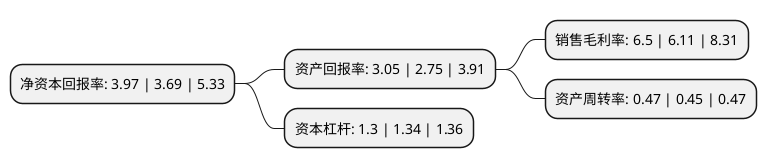

> 本页面由自动化程序生成于 2022年5月20日 01:19
> 内容可能存在错误，如有bug请提交issue至：https://github.com/Eroleice/doc-pi/issues
{.is-warning}

# 上市公司基本情况

## 基本资料

吉林吉大通信设计院股份有限公司（以下简称“吉大通信”）成立于1985年04月10日，长春市。于2017年01月23日在深交所创业板上市。

吉大通信注册资本24,000万元，公司主营业务为提供通信网络设计服务及通信网络工程服务。以下是详细信息：

- 公司名称: 吉林吉大通信设计院股份有限公司
- 股票代码: 300597.SZ
- 所在地: 吉林 - 长春市
- 成立日期: 1985年04月10日
- 注册资本: 24,000万元
- 法定代表人: 周伟
- 主营业务: 公司主营业务为提供通信网络设计服务及通信网络工程服务
- 公司官网: www.jlucdi.com
- 公司介绍: 公司原隶属于长春邮电学院，现隶属吉林大学，是专业从事通信工程项目咨询、勘察、设计的企业，具有国家住房和城乡建设部批准的甲级勘察、设计资质；国家发展和改革委员会批准的通信信息专业甲级工程咨询资质；中国通信企业协会批准的通信信息网络系统集成甲级资质。公司多年被吉林省工商行政管理局、吉林省信用认证中心评为“质量诚信企业”、获得吉林省高新技术企业认证。公司可在全国范围内承担通信领域内各专业、各种规模的规划、可行性研究、评估、方案设计、项目建议书、技术规范书、勘察、设计、优化和技术咨询、技术研发等工作。公司的服务范围已覆盖东北、华北、西北、西南、华南等大部分地区。

## 股东及高管情况

上市公司第一大股东为吉林吉大控股有限公司，持股48,000,000股，占比20%，**疑似为**上市公司实际控制人。

截至2022年03月31日，上市公司的前十大股东中，共有9名自然人股东，1名机构股东，其中5%以上大股东共有1名。上市公司前十大股东明细如下：

> 未能通过持股比例判定出上市公司实际控制人（持股30%以上）
> 可能存在通过间接持股、联合持股、协议控制等方式拥有实际控制权的主体，具体请参考上市公司定期公告！
{.is-warning}

> 截至2022年03月31日，上市公司前十大股东信息如下：

| 股东名称 | 持股数量（股） | 持股比例 |
| --- | --- | --- |
| 吉林吉大控股有限公司 | 48,000,000 | 20% |
| 林佳云 | 6,655,481 | 2.77% |
| 武良春 | 5,658,743 | 2.36% |
| 于沆 | 3,937,500 | 1.64% |
| 金谊晶 | 3,650,800 | 1.52% |
| 孟庆开 | 3,305,429 | 1.38% |
| 邸朝生 | 2,715,100 | 1.13% |
| 赵琛 | 2,543,929 | 1.06% |
| 李宝岩 | 1,941,314 | 0.81% |
| 张青山 | 1,605,614 | 0.67% |

## 利润表分析

上市公司2021年总收入为5.14亿元，净利润为0.33亿元，实现盈利。

## 杜邦分析

> 数据列示周期：2021年 | 2020年 | 2019年
{.is-info}

上市公司的净资产收益率在近一年有所上升，上升幅度为7.59%，其变化情况分解如下：
- 上市公司的销售毛利率在近一年上升了6.38%，可能是生产效率的提升、商品原材料价格下跌或商品价格的上涨所致。
- 上市公司的资产周转率在近一年上升了4.44%，可能是源自于更快的销售回款或库存管理效果提升。
- 上市公司的财务杠杆比率在近一年下降了-2.99%，可能是减少负债降低财务费用。

