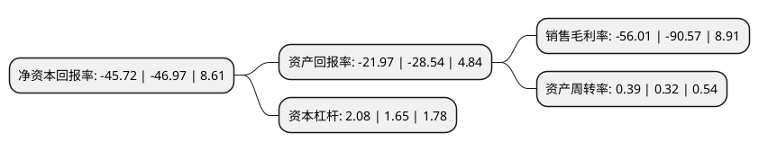

> 本页面由自动化程序生成于 2022年5月20日 01:19
> 内容可能存在错误，如有bug请提交issue至：https://github.com/Eroleice/doc-pi/issues
{.is-warning}

# 上市公司基本情况

## 基本资料

立昂技术股份有限公司（以下简称“立昂技术”）成立于1996年01月08日，乌鲁木齐市。于2017年01月26日在深交所创业板上市。

立昂技术注册资本36,394.184万元，主营业务:信息技术服务，主要从事为通信运营商提供通信网络技术服务，并基于需方业务需求提供安防系统一体化服务以下是详细信息：

- 公司名称: 立昂技术股份有限公司
- 股票代码: 300603.SZ
- 所在地: 新疆 - 乌鲁木齐市
- 成立日期: 1996年01月08日
- 注册资本: 36,394.184万元
- 法定代表人: 王刚
- 主营业务: 主营业务:信息技术服务，主要从事为通信运营商提供通信网络技术服务，并基于需方业务需求提供安防系统一体化服务
- 公司官网: www.leon.top
- 公司介绍: 公司是一家以信息技术服务为主营业务的高新技术企业，主要从事为通信运营商提供通信网络技术服务，并基于需方业务需求提供安防系统一体化服务，业务范围涉及新疆、宁夏、甘肃、青海、贵州、四川等地，公司具备满足多种少数民族语言需求的技术服务能力。2018年，公司收购了沃驰科技100.00%股权与大一互联100.00%股权，沃驰科技主要围绕电信运营商基地开展数字阅读、视频、动漫等增值电信业务，主营业务收入主要为增值电信业务收入。大一互联围绕电信运营商互联网数据中心资源，为客户提供机房模块定制、云优化服务、互联网专线、流量清洗、多云互联等增值服务，主营业务收入主要为带宽租用收入、机柜租用收入等。

## 股东及高管情况

上市公司第一大股东为王刚，持股98,537,255股，占比27.08%，**疑似为**上市公司实际控制人。

截至2022年03月31日，上市公司的前十大股东中，共有7名自然人股东，3名机构股东，其中5%以上大股东共有2名。上市公司前十大股东明细如下：

> 未能通过持股比例判定出上市公司实际控制人（持股30%以上）
> 可能存在通过间接持股、联合持股、协议控制等方式拥有实际控制权的主体，具体请参考上市公司定期公告！
{.is-warning}

> 截至2022年03月31日，上市公司前十大股东信息如下：

| 股东名称 | 持股数量（股） | 持股比例 |
| --- | --- | --- |
| 王刚 | 98,537,255 | 27.08% |
| 葛良娣 | 27,908,689 | 7.67% |
| 钱炽峰 | 11,877,166 | 3.26% |
| 天津宏瑞管理咨询有限公司 | 10,068,549 | 2.77% |
| 金泼 | 6,620,306 | 1.82% |
| 潍坊立源企业管理合伙企业(有限合伙) | 4,046,466 | 1.11% |
| 赵天雷 | 3,152,894 | 0.87% |
| 周路 | 1,893,653 | 0.52% |
| 王海江 | 1,286,122 | 0.35% |
| 云南荣隆企业管理中心(有限合伙) | 1,250,473 | 0.34% |

## 利润表分析

上市公司2021年总收入为9.67亿元，净利润为-5.43亿元，**未实现盈利**。

## 杜邦分析

> 数据列示周期：2021年 | 2020年 | 2019年
{.is-info}

上市公司的净资产收益率在近一年有所下降，下降幅度为-2.66%，其变化情况分解如下：
- 上市公司的销售毛利率在近一年下降了-38.16%，可能是生产效率的下降、商品原材料价格上涨或商品价格的下跌所致。
- 上市公司的资产周转率在近一年上升了21.88%，可能是源自于更快的销售回款或库存管理效果提升。
- 上市公司的财务杠杆比率在近一年上升了26.06%，可能是增加负债扩大生产规模。

