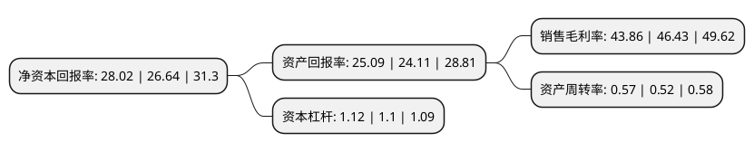

> 本页面由自动化程序生成于 2022年5月20日 01:19
> 内容可能存在错误，如有bug请提交issue至：https://github.com/Eroleice/doc-pi/issues
{.is-warning}

# 上市公司基本情况

## 基本资料

厦门亿联网络技术股份有限公司（以下简称“亿联网络”）成立于2001年11月05日，厦门市。于2017年03月17日在深交所创业板上市。

亿联网络注册资本90,231.141万元，主要产品:统一通信个人桌面终端及视频会议系统;主营业务:为中小型企业用户提供多款先进的统一通信终端以下是详细信息：

- 公司名称: 厦门亿联网络技术股份有限公司
- 股票代码: 300628.SZ
- 所在地: 福建 - 厦门市
- 成立日期: 2001年11月05日
- 注册资本: 90,231.141万元
- 法定代表人: 陈智松
- 主营业务: 主要产品:统一通信个人桌面终端及视频会议系统;主营业务:为中小型企业用户提供多款先进的统一通信终端
- 公司官网: www.yealink.com
- 公司介绍: 公司是专业的企业通信与协作解决方案提供商，集研发、销售及服务于一体，并通过外协加工的方式，为全球企业客户提供智能、高效的企业通信终端设备。公司生产的终端产品销售量及销售收入均居行业前列，并保持快速增长。公司专注于向中小型企业提供产品和服务。统一通信使企业用户无论何时何地都能以任何设备进行音频、视频及数据通讯，并通过桌面电话、视频会议系统和手机通讯软件等统一通信技术设备及软件，达到互联互通的通信目的。

## 股东及高管情况

上市公司第一大股东为陈智松，持股156,000,000股，占比17.29%，**疑似为**上市公司实际控制人。

截至2022年03月31日，上市公司的前十大股东中，共有7名自然人股东，1名机构股东，1个产品账户，1个海外主体，其中5%以上大股东共有5名。上市公司前十大股东明细如下：

> 未能通过持股比例判定出上市公司实际控制人（持股30%以上）
> 可能存在通过间接持股、联合持股、协议控制等方式拥有实际控制权的主体，具体请参考上市公司定期公告！
{.is-warning}

> 截至2022年03月31日，上市公司前十大股东信息如下：

| 股东名称 | 持股数量（股） | 持股比例 |
| --- | --- | --- |
| 陈智松 | 156,000,000 | 17.29% |
| 吴仲毅 | 152,000,000 | 16.85% |
| 卢荣富 | 94,500,000 | 10.47% |
| 周继伟 | 71,000,000 | 7.87% |
| 厦门亿网联信息技术服务有限公司 | 54,232,898 | 6.01% |
| 张联昌 | 42,000,000 | 4.65% |
| 陈建荣 | 39,275,000 | 4.35% |
| 胡继丹 | 35,000,000 | 3.88% |
| 香港中央结算有限公司(陆股通) | 12,992,762 | 1.44% |
| 全国社保基金六零一组合 | 8,864,999 | 0.98% |

## 利润表分析

上市公司2021年总收入为36.84亿元，净利润为16.16亿元，实现盈利。

## 杜邦分析

> 数据列示周期：2021年 | 2020年 | 2019年
{.is-info}

上市公司的净资产收益率在近一年有所上升，上升幅度为5.18%，其变化情况分解如下：
- 上市公司的销售毛利率在近一年下降了-5.54%，可能是生产效率的下降、商品原材料价格上涨或商品价格的下跌所致。
- 上市公司的资产周转率在近一年上升了9.62%，可能是源自于更快的销售回款或库存管理效果提升。
- 上市公司的财务杠杆比率在近一年上升了1.82%，可能是增加负债扩大生产规模。

