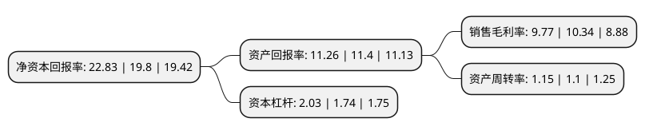

> 本页面由自动化程序生成于 2022年5月20日 01:19
> 内容可能存在错误，如有bug请提交issue至：https://github.com/Eroleice/doc-pi/issues
{.is-warning}

# 上市公司基本情况

## 基本资料

深圳市广和通无线股份有限公司（以下简称“广和通”）成立于1999年11月11日，深圳市。于2017年04月13日在深交所创业板上市。

广和通注册资本41,408.803万元，主要产品:2G，3G，4G，NB—IOT技术的无线通信模块以及基于其行业应用的通信解决方案。主营业务:无线通信模块及其应用行业的通信解决方案的设计，研发与销售服务。以下是详细信息：

- 公司名称: 深圳市广和通无线股份有限公司
- 股票代码: 300638.SZ
- 所在地: 广东 - 深圳市
- 成立日期: 1999年11月11日
- 注册资本: 41,408.803万元
- 法定代表人: 张天瑜
- 主营业务: 主要产品:2G，3G，4G，NB—IOT技术的无线通信模块以及基于其行业应用的通信解决方案主营业务:无线通信模块及其应用行业的通信解决方案的设计，研发与销售服务
- 公司官网: www.fibocom.com
- 公司介绍: 公司自成立以来一直致力于物联网与移动互联网无线通信技术和应用的推广及其解决方案的应用拓展，在通信技术、射频技术、数据传输技术、信号处理技术上形成了较强的研发实力，是无线通信技术领域拥有自主知识产权的专业产品与方案提供商。公司在物联网产业链中处于网络层，并涉及与感知层的交叉领域，主要从事无线通信模块及其应用行业的通信解决方案的设计，研发与销售服务，主要产品包括2G、3G、4G、NB—IOT技术的无线通信模块以及基于其行业应用的通信解决方案，通过集成到各类物联网和移动互联网设备使其实现数据的互联互通和智能化，产品主要应用于移动支付、移动互联网、车联网、智能电网、安防监控等领域。

## 股东及高管情况

上市公司第一大股东为张天瑜，持股167,858,656股，占比40.54%，为上市公司实际控制人。

截至2022年03月31日，上市公司的前十大股东中，共有3名自然人股东，1名机构股东，4个产品账户，2个海外主体，其中5%以上大股东共有2名。上市公司前十大股东明细如下：

> 截至2022年03月31日，上市公司前十大股东信息如下：

| 股东名称 | 持股数量（股） | 持股比例 |
| --- | --- | --- |
| 张天瑜 | 167,858,656 | 40.54% |
| 新余市广和创虹企业管理中心(有限合伙) | 21,404,791 | 5.17% |
| 应凌鹏 | 17,766,360 | 4.29% |
| 应凌鹏 | 17,766,360 | 4.29% |
| 兴业银行股份有限公司-博时汇兴回报一年持有期灵活配置混合型证券投资基金 | 6,493,590 | 1.57% |
| 全国社保基金一一五组合 | 5,500,000 | 1.33% |
| 全国社保基金一一五组合 | 5,500,000 | 1.33% |
| 香港中央结算有限公司(陆股通) | 3,976,839 | 0.96% |
| 香港中央结算有限公司(陆股通) | 3,976,839 | 0.96% |
| 基本养老保险基金八零五组合 | 3,809,946 | 0.92% |

## 利润表分析

上市公司2021年总收入为41.09亿元，净利润为4.01亿元，实现盈利。

## 杜邦分析

> 数据列示周期：2021年 | 2020年 | 2019年
{.is-info}

上市公司的净资产收益率在近一年有所上升，上升幅度为15.3%，其变化情况分解如下：
- 上市公司的销售毛利率在近一年下降了-5.51%，可能是生产效率的下降、商品原材料价格上涨或商品价格的下跌所致。
- 上市公司的资产周转率在近一年上升了4.55%，可能是源自于更快的销售回款或库存管理效果提升。
- 上市公司的财务杠杆比率在近一年上升了16.67%，可能是增加负债扩大生产规模。

