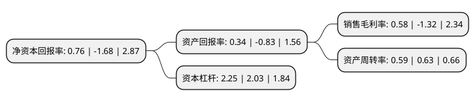

> 本页面由自动化程序生成于 2022年5月20日 01:19
> 内容可能存在错误，如有bug请提交issue至：https://github.com/Eroleice/doc-pi/issues
{.is-warning}

# 上市公司基本情况

## 基本资料

万马科技股份有限公司（以下简称“万马科技”）成立于1997年01月28日，杭州市。于2017年08月31日在深交所创业板上市。

万马科技注册资本13,400万元，主要产品:通信网络配线及信息化机柜产品和医疗信息化产品。主营业务:通信与信息化设备的研发，生产，系统集成与销售。以下是详细信息：

- 公司名称: 万马科技股份有限公司
- 股票代码: 300698.SZ
- 所在地: 浙江 - 杭州市
- 成立日期: 1997年01月28日
- 注册资本: 13,400万元
- 法定代表人: 张禾阳
- 主营业务: 主要产品:通信网络配线及信息化机柜产品和医疗信息化产品主营业务:通信与信息化设备的研发，生产，系统集成与销售
- 公司官网: www.wanma-tech.cn
- 公司介绍: 公司主营业务为通信与信息化设备的研发、生产、系统集成与销售。公司产品包括通信网络配线及信息化机柜产品和医疗信息化产品两大类。公司生产的通信网络配线及信息化机柜产品广泛运用于通信网络、云平台IDC机房、铁路通信网络和城市轨道交通通信网络等领域，公司的医疗信息化产品主要应用于国内各医院。

## 股东及高管情况

上市公司第一大股东为张德生，持股28,843,500股，占比21.53%，**疑似为**上市公司实际控制人。

截至2022年03月31日，上市公司的前十大股东中，共有9名自然人股东，1名机构股东，其中5%以上大股东共有4名。上市公司前十大股东明细如下：

> 未能通过持股比例判定出上市公司实际控制人（持股30%以上）
> 可能存在通过间接持股、联合持股、协议控制等方式拥有实际控制权的主体，具体请参考上市公司定期公告！
{.is-warning}

> 截至2022年03月31日，上市公司前十大股东信息如下：

| 股东名称 | 持股数量（股） | 持股比例 |
| --- | --- | --- |
| 张德生 | 28,843,500 | 21.53% |
| 盛涛 | 27,175,200 | 20.28% |
| 张禾阳 | 12,361,500 | 9.23% |
| 唐金元 | 6,783,500 | 5.06% |
| 章志坚 | 3,636,700 | 2.71% |
| 梁艾 | 3,381,400 | 2.52% |
| 杨义谦 | 2,979,600 | 2.22% |
| 浙江万马智能科技集团有限公司 | 2,010,000 | 1.5% |
| 张珊珊 | 1,543,910 | 1.15% |
| 皮敏蓉 | 700,084 | 0.52% |

## 利润表分析

上市公司2021年总收入为4.98亿元，净利润为0.02亿元，实现盈利。

## 杜邦分析

> 数据列示周期：2021年 | 2020年 | 2019年
{.is-info}

上市公司的净资产收益率在近一年有所下降，下降幅度为-145.24%，其变化情况分解如下：
- 上市公司的销售毛利率在近一年下降了-143.94%，可能是生产效率的下降、商品原材料价格上涨或商品价格的下跌所致。
- 上市公司的资产周转率在近一年下降了-6.35%，可能是源自于更慢的销售回款或库存管理效果下降。
- 上市公司的财务杠杆比率在近一年上升了10.84%，可能是增加负债扩大生产规模。

