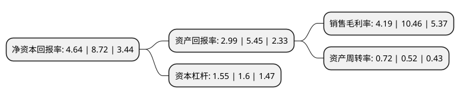

> 本页面由自动化程序生成于 2022年5月20日 01:19
> 内容可能存在错误，如有bug请提交issue至：https://github.com/Eroleice/doc-pi/issues
{.is-warning}

# 上市公司基本情况

## 基本资料

杭州万隆光电设备股份有限公司（以下简称“万隆光电”）成立于2001年05月13日，杭州市。于2017年10月19日在深交所创业板上市。

万隆光电注册资本6,861.4万元，主营业务:主要从事广电网络设备及数据通信系统的研发，生产，销售和技术服务，主要产品:有线电视光纤传输设备，有线电视电缆传输设备，前端系统，数据通信系统四类。以下是详细信息：

- 公司名称: 杭州万隆光电设备股份有限公司
- 股票代码: 300710.SZ
- 所在地: 浙江 - 杭州市
- 成立日期: 2001年05月13日
- 注册资本: 6,861.4万元
- 法定代表人: 雷骞国
- 主营业务: 主营业务:主要从事广电网络设备及数据通信系统的研发，生产，销售和技术服务，主要产品:有线电视光纤传输设备，有线电视电缆传输设备，前端系统，数据通信系统四类
- 公司官网: www.prevail-catv.com
- 公司介绍: 公司是一家规模化、专业化的有线电视及数据通信设备研发、生产企业，其生产规模、产品质量及市场覆盖名列国内同行前茅。“以人为本、注重细节”是万隆人的管理理念。公司具备完善的现代企业管理体制，拥有一支高素质的新产品研发、设计、试验及检测队伍，公司始终奉行“精益求精、品质至上”的质量方针，在全国同行业中率先通过了ISO9001质量管理体系认证，积极贯彻ISO14001环境管理体系和OHSAS18001职业健康安全管理体系。凭借多年来在有线电视设备制造业界的丰厚积淀，其产品的技术、性能及研发水平均处于国内领先地位。擅长射频技术和数据通信传输设备的研究，并在成都设立了数字电视设备研发中心，使公司的产品覆盖整个CATV系统，模拟、数字前端设备、1550nm、1310nm、1490nm数据光纤传输设备、RF系统传输(双向)设备、EPON、EOC数据通信设备，是目前国内产品品种最全的CATV及数据通信专业厂家。

## 股东及高管情况

上市公司第一大股东为许泉海，持股10,652,800股，占比15.53%，**疑似为**上市公司实际控制人。

截至2022年03月31日，上市公司的前十大股东中，共有8名自然人股东，2名机构股东，其中5%以上大股东共有4名。上市公司前十大股东明细如下：

> 未能通过持股比例判定出上市公司实际控制人（持股30%以上）
> 可能存在通过间接持股、联合持股、协议控制等方式拥有实际控制权的主体，具体请参考上市公司定期公告！
{.is-warning}

> 截至2022年03月31日，上市公司前十大股东信息如下：

| 股东名称 | 持股数量（股） | 持股比例 |
| --- | --- | --- |
| 许泉海 | 10,652,800 | 15.53% |
| 付小铜 | 6,458,191 | 9.41% |
| 海南立安民投资合伙企业(有限合伙) | 4,773,148 | 6.96% |
| 杭州千泉科技合伙企业(有限合伙) | 3,579,861 | 5.22% |
| 许梦飞 | 2,443,700 | 3.56% |
| 孙珏 | 1,058,200 | 1.54% |
| 徐立勋 | 993,300 | 1.45% |
| 潘雪康 | 895,100 | 1.3% |
| 李阿毛 | 563,200 | 0.82% |
| 施海蓉 | 559,400 | 0.82% |

## 利润表分析

上市公司2021年总收入为7.28亿元，净利润为0.3亿元，实现盈利。

## 杜邦分析

> 数据列示周期：2021年 | 2020年 | 2019年
{.is-info}

上市公司的净资产收益率在近一年有所下降，下降幅度为-46.79%，其变化情况分解如下：
- 上市公司的销售毛利率在近一年下降了-59.94%，可能是生产效率的下降、商品原材料价格上涨或商品价格的下跌所致。
- 上市公司的资产周转率在近一年上升了38.46%，可能是源自于更快的销售回款或库存管理效果提升。
- 上市公司的财务杠杆比率在近一年下降了-3.12%，可能是减少负债降低财务费用。

