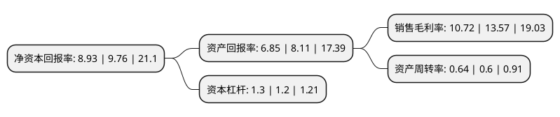

> 本页面由自动化程序生成于 2022年5月20日 01:20
> 内容可能存在错误，如有bug请提交issue至：https://github.com/Eroleice/doc-pi/issues
{.is-warning}

# 上市公司基本情况

## 基本资料

惠州光弘科技股份有限公司（以下简称“光弘科技”）成立于1995年03月24日，惠州市。于2017年12月29日在深交所创业板上市。

光弘科技注册资本77,462.112万元，主要产品:消费电子类(智能手机，平板电脑);网络通讯类(网络路由器，基站定位终端);物联网，汽车电子类(OBD，行车记录仪)等电子产品。主营业务:专业从事消费电子类，网络通讯类，汽车电子类等电子产品的PCBA和成品组装，并提供制程技术研发，工艺设计，采购管理，生产控制，仓储物流等完整服务的电子制造服务(EMS)。以下是详细信息：

- 公司名称: 惠州光弘科技股份有限公司
- 股票代码: 300735.SZ
- 所在地: 广东 - 惠州市
- 成立日期: 1995年03月24日
- 注册资本: 77,462.112万元
- 法定代表人: 唐建兴
- 主营业务: 主要产品:消费电子类(智能手机，平板电脑);网络通讯类(网络路由器，基站定位终端);物联网，汽车电子类(OBD，行车记录仪)等电子产品主营业务:专业从事消费电子类，网络通讯类，汽车电子类等电子产品的PCBA和成品组装，并提供制程技术研发，工艺设计，采购管理，生产控制，仓储物流等完整服务的电子制造服务(EMS)
- 公司官网: www.dbg.com.cn
- 公司介绍: 公司的主营业务为专业从事消费电子类、网络通讯类、汽车电子类等电子产品的PCBA和成品组装，并提供制程技术研发、工艺设计、采购管理、生产控制、仓储物流等完整服务的电子制造服务(EMS)。公司提供电子制造服务的主要产品包括消费电子类(智能手机、平板电脑)；网络通讯类(网络路由器、基站定位终端)；物联网、汽车电子类(OBD、行车记录仪)等电子产品。公司的品质管控能力得到了监督机构和客户的高度认可，公司已通过ISO多项管理体系认证，并于2017年11月顺利通过ISO9001、14001及IATF16949三体系换版审核，建立了质量、环境及职业健康安全一体化管理体系。公司连续荣获“中国质量诚信企业”、被授予中国质量认证中心“A类企业”、获“广东省先进电子制造工程技术研究中心”称号。

## 股东及高管情况

上市公司第一大股东为光弘投资有限公司，持股395,691,660股，占比51.08%，为上市公司实际控制人。

截至2022年05月10日，上市公司的前十大股东中，共有2名自然人股东，2名机构股东，5个产品账户，1个海外主体，其中5%以上大股东共有1名。上市公司前十大股东明细如下：

> 截至2022年05月10日，上市公司前十大股东信息如下：

| 股东名称 | 持股数量（股） | 持股比例 |
| --- | --- | --- |
| 光弘投资有限公司 | 395,691,660 | 51.08% |
| 广东恒健资本管理有限公司 | 14,258,030 | 1.84% |
| 香港中央结算有限公司(陆股通) | 8,079,890 | 1.04% |
| 苏志彪 | 6,152,196 | 0.79% |
| 朱建军 | 6,026,433 | 0.78% |
| 深圳市国协一期股权投资基金合伙企业(有限合伙) | 5,912,161 | 0.76% |
| 建信(北京)投资基金管理有限责任公司 | 4,729,729 | 0.61% |
| 珠海云意道阳股权投资基金(有限合伙) | 4,147,972 | 0.54% |
| 中信证券-无锡产发服务贸易投资基金合伙企业(有限合伙)-中信证券无锡服贸一号单一资产管理计划 | 4,138,513 | 0.53% |
| 广州市玄元投资管理有限公司-玄元科新29号私募证券投资基金 | 3,660,000 | 0.47% |

## 利润表分析

上市公司2021年总收入为36.03亿元，净利润为3.86亿元，实现盈利。

## 杜邦分析

> 数据列示周期：2021年 | 2020年 | 2019年
{.is-info}

上市公司的净资产收益率在近一年有所下降，下降幅度为-8.5%，其变化情况分解如下：
- 上市公司的销售毛利率在近一年下降了-21%，可能是生产效率的下降、商品原材料价格上涨或商品价格的下跌所致。
- 上市公司的资产周转率在近一年上升了6.67%，可能是源自于更快的销售回款或库存管理效果提升。
- 上市公司的财务杠杆比率在近一年上升了8.33%，可能是增加负债扩大生产规模。

