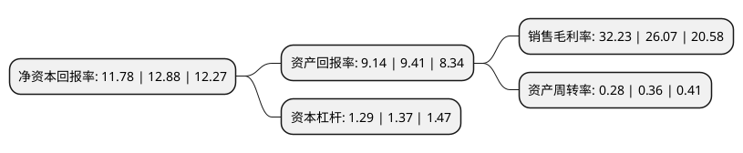

> 本页面由自动化程序生成于 2022年5月20日 01:20
> 内容可能存在错误，如有bug请提交issue至：https://github.com/Eroleice/doc-pi/issues
{.is-warning}

# 上市公司基本情况

## 基本资料

上海瀚讯信息技术股份有限公司（以下简称“上海瀚讯”）成立于2006年03月20日，上海市。于2019年03月14日在深交所创业板上市。

上海瀚讯注册资本39,250.901万元，公司主要从事军用宽带移动通信系统及军用战术通信设备的研发，制造，销售及工程实施，结合业务应用软件，指挥调度软件等配套产品，向军方等行业用户提供宽带移动通信系统的整体解决方案。以下是详细信息：

- 公司名称: 上海瀚讯信息技术股份有限公司
- 股票代码: 300762.SZ
- 所在地: 上海 - 上海市
- 成立日期: 2006年03月20日
- 注册资本: 39,250.901万元
- 法定代表人: 卜智勇
- 主营业务: 公司主要从事军用宽带移动通信系统及军用战术通信设备的研发，制造，销售及工程实施，结合业务应用软件，指挥调度软件等配套产品，向军方等行业用户提供宽带移动通信系统的整体解决方案
- 公司官网: www.jushri.com
- 公司介绍: 公司前身瀚讯有限系由无线中心、上海科技投资公司、上海创业投资有限公司、上海信息技术创业投资有限公司、卜智勇、王克星、王晓东、顾小华以货币和人力资本出资设立，成立时的公司名称为“上海睿智通无线技术有限公司”,是在新一代宽带移动通信领域长期研究积累基础上，聚焦国家4G/5G长期技术发展及军队信息化升级等重大战略逐步发展起来的，主要从事行业宽带移动通信设备的研发、制造、销售及工程实施，结合业务应用软件、指挥调度软件等配套产品，向军方客户和铁路等行业客户提供行业宽带移动通信系统的整体解决方案。在军用宽带移动通信系统装备领域，公司拥有完整的军工科研生产资质，是业内少数既拥有自主核心知识产权又具备完整资质的供应商,公司还为北京奥运会、广州亚运会、上海世博会、博鳌论坛等一系列的重大活动提供通信保障,连续参与我军近年重大演习作训活动，为“嫦娥五号”、“神舟十一号”的返回着陆提供通信保障,并多次受到使用单位及我军各级机关的表扬和嘉奖，是我军移动通信从窄带到宽带的跨越式发展的重要产业力量。

## 股东及高管情况

上市公司第一大股东为上海双由信息科技有限公司，持股76,220,528股，占比19.42%，**疑似为**上市公司实际控制人。

截至2022年03月31日，上市公司的前十大股东中，共有2名自然人股东，4名机构股东，3个产品账户，1名其他股东，其中5%以上大股东共有4名。上市公司前十大股东明细如下：

> 未能通过持股比例判定出上市公司实际控制人（持股30%以上）
> 可能存在通过间接持股、联合持股、协议控制等方式拥有实际控制权的主体，具体请参考上市公司定期公告！
{.is-warning}

> 截至2022年03月31日，上市公司前十大股东信息如下：

| 股东名称 | 持股数量（股） | 持股比例 |
| --- | --- | --- |
| 上海双由信息科技有限公司 | 76,220,528 | 19.42% |
| 上海力鼎投资管理有限公司 | 41,394,201 | 10.55% |
| 中金佳讯(天津)投资中心(有限合伙) | 30,254,608 | 7.71% |
| 中国科学院上海微系统与信息技术研究所 | 20,697,101 | 5.27% |
| 上海联和投资有限公司 | 18,627,421 | 4.75% |
| 上海军民融合产业股权投资基金合伙企业(有限合伙) | 9,846,154 | 2.51% |
| 杜水萍 | 5,669,960 | 1.44% |
| 全国社保基金四一三组合 | 5,190,000 | 1.32% |
| 国投创合(上海)投资管理有限公司-军民融合发展产业投资基金(有限合伙) | 4,923,077 | 1.25% |
| 鲍银胜 | 3,177,838 | 0.81% |

## 利润表分析

上市公司2021年总收入为7.29亿元，净利润为2.35亿元，实现盈利。

## 杜邦分析

> 数据列示周期：2021年 | 2020年 | 2019年
{.is-info}

上市公司的净资产收益率在近一年有所下降，下降幅度为-8.54%，其变化情况分解如下：
- 上市公司的销售毛利率在近一年上升了23.63%，可能是生产效率的提升、商品原材料价格下跌或商品价格的上涨所致。
- 上市公司的资产周转率在近一年下降了-22.22%，可能是源自于更慢的销售回款或库存管理效果下降。
- 上市公司的财务杠杆比率在近一年下降了-5.84%，可能是减少负债降低财务费用。

