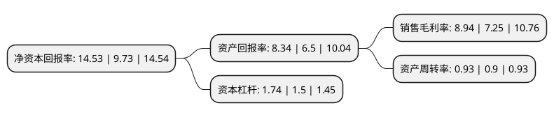

> 本页面由自动化程序生成于 2022年5月20日 01:20
> 内容可能存在错误，如有bug请提交issue至：https://github.com/Eroleice/doc-pi/issues
{.is-warning}

# 上市公司基本情况

## 基本资料

安福县海能实业股份有限公司（以下简称“海能实业”）成立于2009年07月15日，吉安市。于2019年08月15日在深交所创业板上市。

海能实业注册资本15,278.4万元，公司主要产品为电子信号传输适配产品(消费电子连接线，信号适配器)及其他消费电子产品。主要产品分为三大类:一是线束类产品，其主要功能是实现数据，信号和能量的传输，产品主要包括USB，USB Type-C，DVI，DP，HDMI，网线线束等;二是信号适配器产品，该产品则主要通过信号转换，切换，延长，放大等方式对各类电子信号进行适配管理，产品主要包括信号转换器，信号切换器，信号分配器，信号延长器等;三是其他消费电子产品。主营业务:电子信号传输适配产品及其他消费电子产品的定制化设计生产以下是详细信息：

- 公司名称: 安福县海能实业股份有限公司
- 股票代码: 300787.SZ
- 所在地: 江西 - 吉安市
- 成立日期: 2009年07月15日
- 注册资本: 15,278.4万元
- 法定代表人: 周洪亮
- 主营业务: 公司主要产品为电子信号传输适配产品(消费电子连接线，信号适配器)及其他消费电子产品主要产品分为三大类:一是线束类产品，其主要功能是实现数据，信号和能量的传输，产品主要包括USB，USB Type-C，DVI，DP，HDMI，网线线束等;二是信号适配器产品，该产品则主要通过信号转换，切换，延长，放大等方式对各类电子信号进行适配管理，产品主要包括信号转换器，信号切换器，信号分配器，信号延长器等;三是其他消费电子产品主营业务:电子信号传输适配产品及其他消费电子产品的定制化设计生产
- 公司官网: www.ce-link.com\www.ce-link.com.cn
- 公司介绍: 公司主要从事电子信号传输适配产品及其他消费电子产品的定制化设计生产，是专业化的消费电子产品提供商，高新技术企业。公司自成立以来，始终专注于以电子信号传输适配产品为主的产品设计生产，依托持续进步的技术实力和快速的研发响应能力，为各类下游消费电子客户提供定制化产品。公司的产品主要应用在智能移动通讯、影音设备、PC、智能可穿戴设备及各类电子终端产品领域，各类电子终端产品市场的持续发展带动了电子信号传输适配产品市场需求的稳健增长，具有广阔的市场空间。公司产品主要以ODM/OEM形式生产并供应给海外零售市场客户及消费电子系统厂商客户。公司近年来逐步拓展新产品范围，布局具备市场潜力的领域，不断增加有效产能，相关产品未来市场空间较大，为公司未来经营规模的不断扩大奠定了基础。

## 股东及高管情况

上市公司第一大股东为周洪亮，持股75,600,000股，占比49.33%，为上市公司实际控制人。

截至2022年04月29日，上市公司的前十大股东中，共有5名自然人股东，3名机构股东，2个产品账户，其中5%以上大股东共有3名。上市公司前十大股东明细如下：

> 截至2022年04月29日，上市公司前十大股东信息如下：

| 股东名称 | 持股数量（股） | 持股比例 |
| --- | --- | --- |
| 周洪亮 | 75,600,000 | 49.33% |
| 安福百盛投资管理合伙企业(有限合伙) | 10,800,000 | 7.05% |
| 李伟雄 | 9,896,533 | 6.46% |
| 李咚怡 | 4,798,327 | 3.13% |
| 上海烜鼎资产管理有限公司-烜鼎星辰12号私募证券投资基金 | 3,872,140 | 2.53% |
| 安福大盛投资管理合伙企业(有限合伙) | 3,740,400 | 2.44% |
| 安福和盛投资管理合伙企业(有限合伙) | 2,847,600 | 1.86% |
| 广发证券股份有限公司-博道成长智航股票型证券投资基金 | 474,760 | 0.31% |
| 王宏明 | 372,700 | 0.24% |
| 钱凯 | 319,000 | 0.21% |

## 利润表分析

上市公司2021年总收入为20.8亿元，净利润为1.86亿元，实现盈利。

## 杜邦分析

> 数据列示周期：2021年 | 2020年 | 2019年
{.is-info}

上市公司的净资产收益率在近一年有所上升，上升幅度为49.33%，其变化情况分解如下：
- 上市公司的销售毛利率在近一年上升了23.31%，可能是生产效率的提升、商品原材料价格下跌或商品价格的上涨所致。
- 上市公司的资产周转率在近一年上升了3.33%，可能是源自于更快的销售回款或库存管理效果提升。
- 上市公司的财务杠杆比率在近一年上升了16%，可能是增加负债扩大生产规模。

