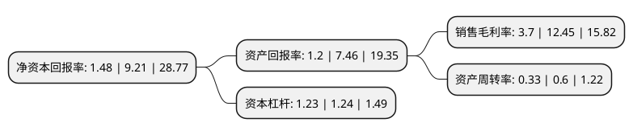

> 本页面由自动化程序生成于 2022年5月20日 01:21
> 内容可能存在错误，如有bug请提交issue至：https://github.com/Eroleice/doc-pi/issues
{.is-warning}

# 上市公司基本情况

## 基本资料

深圳市杰美特科技股份有限公司（以下简称“杰美特”）成立于2006年05月30日，深圳市。于2020年08月24日在深交所创业板上市。

杰美特注册资本12,800万元，从事移动智能终端配件的研发，设计，生产及销售，主要产品:主要为智能手机，平板电脑等移动智能终端提供保护套产品。以下是详细信息：

- 公司名称: 深圳市杰美特科技股份有限公司
- 股票代码: 300868.SZ
- 所在地: 广东 - 深圳市
- 成立日期: 2006年05月30日
- 注册资本: 12,800万元
- 法定代表人: 黄新
- 主营业务: 从事移动智能终端配件的研发，设计，生产及销售，主要产品:主要为智能手机，平板电脑等移动智能终端提供保护套产品
- 公司官网: www.jamepda.com
- 公司介绍: 公司是一家专业从事移动智能终端配件的研发、设计、生产及销售的高新技术企业，产品类型以智能手机与平板电脑保护类配件为主，涵盖移动电源、数据线等其他配件。公司坚持以ODM/OEM与自有品牌相结合的方式开拓市场，坚持做大ODM/OEM业务、做强自有品牌的思路，为客户提供更优质的产品和服务。公司是国内较早从事移动智能终端配件产品ODM/OEM业务的企业之一，拥有成熟的开发设计团队和专业的制造技术，是业内为数不多的具有“研发设计—模具开发—生产制造—包装入库”全工序以及大规模生产能力的企业之一，能够针对客户需求，提供设计支持、快速样品、规模量产等方面的综合服务。凭借丰富的研发设计、多工艺生产经验，以及稳定、可靠的质量保证，公司与华为等智能终端制造商以及Targus、Pelican等国际知名智能终端配件品牌商建立了良好、稳定的合作关系，产品广泛应用于华为、苹果等品牌终端。公司已取得全球知名的Disney、Hello Kitty商标及卡通形象在其自有品牌产品中应用的授权许可，自有品牌产品系列丰富，主要客户已涵盖沃尔玛、亚马逊、Target、百思买等全球零售百强客户，产品销售遍及美国、欧洲及日本等多个国家或地区。

## 股东及高管情况

上市公司第一大股东为谌建平，持股45,523,009股，占比35.56%，为上市公司实际控制人。

截至2022年03月31日，上市公司的前十大股东中，共有8名自然人股东，1名机构股东，1个产品账户，其中5%以上大股东共有3名。上市公司前十大股东明细如下：

> 截至2022年03月31日，上市公司前十大股东信息如下：

| 股东名称 | 持股数量（股） | 持股比例 |
| --- | --- | --- |
| 谌建平 | 45,523,009 | 35.56% |
| 杨美华 | 15,174,336 | 11.85% |
| 黄新 | 7,674,336 | 6% |
| 赣州大埠企业管理咨询中心(有限合伙) | 5,728,320 | 4.48% |
| 李春梅 | 4,320,000 | 3.38% |
| 黄志浩 | 3,677,419 | 2.87% |
| 深圳市杰美特科技股份有限公司回购专用证券账户 | 1,999,903 | 1.56% |
| 许佩丽 | 1,722,393 | 1.35% |
| 李永松 | 1,470,968 | 1.15% |
| 陈娜娜 | 1,029,677 | 0.8% |

## 利润表分析

上市公司2021年总收入为7.14亿元，净利润为0.26亿元，实现盈利。

## 杜邦分析

> 数据列示周期：2021年 | 2020年 | 2019年
{.is-info}

上市公司的净资产收益率在近一年有所下降，下降幅度为-83.93%，其变化情况分解如下：
- 上市公司的销售毛利率在近一年下降了-70.28%，可能是生产效率的下降、商品原材料价格上涨或商品价格的下跌所致。
- 上市公司的资产周转率在近一年下降了-45%，可能是源自于更慢的销售回款或库存管理效果下降。
- 上市公司的财务杠杆比率在近一年下降了-0.81%，可能是减少负债降低财务费用。

