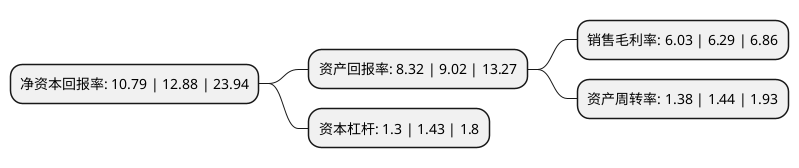

> 本页面由自动化程序生成于 2022年5月20日 01:21
> 内容可能存在错误，如有bug请提交issue至：https://github.com/Eroleice/doc-pi/issues
{.is-warning}

# 上市公司基本情况

## 基本资料

浙江兆龙互连科技股份有限公司（以下简称“兆龙互连”）成立于1995年08月21日，湖州市。于2020年12月07日在深交所创业板上市。

兆龙互连注册资本12,250万元，专业从事数据电缆，专用电缆和连接产品设计，制造与销售，主要产品为数据电缆，专用电缆及连接产品。以下是详细信息：

- 公司名称: 浙江兆龙互连科技股份有限公司
- 股票代码: 300913.SZ
- 所在地: 浙江 - 湖州市
- 成立日期: 1995年08月21日
- 注册资本: 12,250万元
- 法定代表人: 姚金龙
- 主营业务: 专业从事数据电缆，专用电缆和连接产品设计，制造与销售，主要产品为数据电缆，专用电缆及连接产品
- 公司官网: www.zhaolong.com.cn
- 公司介绍: 公司是专业从事数据电缆、专用电缆和连接产品设计、制造与销售的高新技术企业。自成立以来，公司凭借自身的技术沉淀、设计能力及品质优势，为境内外客户提供各类产品。公司产品销售覆盖中国大陆、欧洲、北美、中东、东南亚、澳大利亚等多个国家和地区，被广泛应用于网络结构化布线、智能安防、通信设备、数据中心、工业互联网、工业机器视觉、轨交机车和医疗器械等领域。根据中国机电产品进出口商会统计，2015年度、2016年度、2017年度、2018年度，公司产品出口额在全国同类产品的出口企业中连续4年排名第1位。

## 股东及高管情况

上市公司第一大股东为浙江兆龙控股有限公司，持股55,000,000股，占比44.9%，为上市公司实际控制人。

截至2022年03月31日，上市公司的前十大股东中，共有6名自然人股东，4名机构股东，其中5%以上大股东共有2名。上市公司前十大股东明细如下：

> 截至2022年03月31日，上市公司前十大股东信息如下：

| 股东名称 | 持股数量（股） | 持股比例 |
| --- | --- | --- |
| 浙江兆龙控股有限公司 | 55,000,000 | 44.9% |
| 姚金龙 | 18,000,000 | 14.69% |
| 姚银龙 | 6,000,000 | 4.9% |
| 姚云涛 | 6,000,000 | 4.9% |
| 德清兆兴企业管理咨询合伙企业(有限合伙) | 3,500,000 | 2.86% |
| 德清县百盛企业管理有限公司 | 1,875,000 | 1.53% |
| 德清兆信企业管理咨询合伙企业(有限合伙) | 1,500,000 | 1.22% |
| 潘广钊 | 588,400 | 0.48% |
| 谢艳 | 564,300 | 0.46% |
| 邹新杰 | 262,200 | 0.21% |

## 利润表分析

上市公司2021年总收入为14.64亿元，净利润为0.88亿元，实现盈利。

## 杜邦分析

> 数据列示周期：2021年 | 2020年 | 2019年
{.is-info}

上市公司的净资产收益率在近一年有所下降，下降幅度为-16.23%，其变化情况分解如下：
- 上市公司的销售毛利率在近一年下降了-4.13%，可能是生产效率的下降、商品原材料价格上涨或商品价格的下跌所致。
- 上市公司的资产周转率在近一年下降了-4.17%，可能是源自于更慢的销售回款或库存管理效果下降。
- 上市公司的财务杠杆比率在近一年下降了-9.09%，可能是减少负债降低财务费用。

