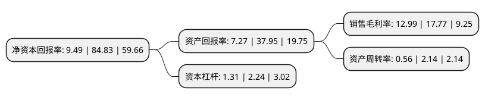

> 本页面由自动化程序生成于 2022年5月20日 01:23
> 内容可能存在错误，如有bug请提交issue至：https://github.com/Eroleice/doc-pi/issues
{.is-warning}

# 上市公司基本情况

## 基本资料

深圳奥尼电子股份有限公司（以下简称“奥尼电子”）成立于2005年08月09日，深圳市。于2021年12月28日在深交所创业板上市。

奥尼电子注册资本11,489.647万元，公司定位于智能视听硬件方案商与制造商，主营业务是为全球品牌企业提供行车记录仪，智能云摄像头等智能视听硬件产品的定制服务，主要产品包括行车记录仪，智能云摄像头，PC/TV摄像头，耳机等智能视听硬件产品以下是详细信息：

- 公司名称: 深圳奥尼电子股份有限公司
- 股票代码: 301189.SZ
- 所在地: 广东 - 深圳市
- 成立日期: 2005年08月09日
- 注册资本: 11,489.647万元
- 法定代表人: 吴世杰
- 主营业务: 公司定位于智能视听硬件方案商与制造商，主营业务是为全球品牌企业提供行车记录仪，智能云摄像头等智能视听硬件产品的定制服务，主要产品包括行车记录仪，智能云摄像头，PC/TV摄像头，耳机等智能视听硬件产品
- 公司官网: www.aoni.cc
- 公司介绍: 公司在国内外建立有多家全资子公司，拥有1000多名高素质员工队伍，建立有从产品创意到工业设计、产品研发、规模化生产、自主营销的专业团队，与英特尔、微软、三星、联想、现代等国内外知名企业建立了多年的合作伙伴关系，并与百度、腾讯、京东等巨头开展物联网云技术方面的智能家居产品研发合作。公司旗下现拥有aoni奥尼、AUSDOM阿斯盾、ANC、百脑通、明月等子品牌，产品线涵盖网络摄像机、行车记录仪、多功能MINI摄像机、摄像头、移动电源、小音响、耳机等消费类电子产品。

## 股东及高管情况

上市公司第一大股东为深圳奥信通创新投资有限公司，持股49,400,000股，占比43%，为上市公司实际控制人。

截至2022年03月31日，上市公司的前十大股东中，共有4名自然人股东，4名机构股东，2个产品账户，其中5%以上大股东共有2名。上市公司前十大股东明细如下：

> 截至2022年03月31日，上市公司前十大股东信息如下：

| 股东名称 | 持股数量（股） | 持股比例 |
| --- | --- | --- |
| 深圳奥信通创新投资有限公司 | 49,400,000 | 43% |
| 深圳前海汇鑫投资合伙企业(有限合伙) | 15,200,000 | 13.23% |
| 深圳前海中泰富兴投资合伙企业(有限合伙) | 5,320,000 | 4.63% |
| 黄旭盛 | 4,180,000 | 3.64% |
| 中航南山股权投资基金管理(深圳)有限公司-深圳南山中航无人系统股权投资基金合伙企业(有限合伙) | 2,358,233 | 2.05% |
| 中航南山股权投资基金管理(深圳)有限公司-深圳中航坪山集成电路创业投资合伙企业(有限合伙) | 2,358,232 | 2.05% |
| 深圳市凯东创新实业有限公司 | 2,280,000 | 1.98% |
| 吴世杰 | 1,938,000 | 1.69% |
| 吴斌 | 1,140,000 | 0.99% |
| 吴承辉 | 722,000 | 0.63% |

## 利润表分析

上市公司2021年总收入为9.57亿元，净利润为1.24亿元，实现盈利。

## 杜邦分析

> 数据列示周期：2021年 | 2020年 | 2019年
{.is-info}

上市公司的净资产收益率在近一年有所下降，下降幅度为-88.81%，其变化情况分解如下：
- 上市公司的销售毛利率在近一年下降了-26.9%，可能是生产效率的下降、商品原材料价格上涨或商品价格的下跌所致。
- 上市公司的资产周转率在近一年下降了-73.83%，可能是源自于更慢的销售回款或库存管理效果下降。
- 上市公司的财务杠杆比率在近一年下降了-41.52%，可能是减少负债降低财务费用。

