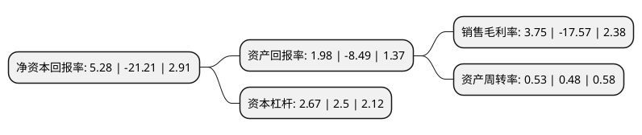

> 本页面由自动化程序生成于 2022年5月20日 01:24
> 内容可能存在错误，如有bug请提交issue至：https://github.com/Eroleice/doc-pi/issues
{.is-warning}

# 上市公司基本情况

## 基本资料

江苏永鼎股份有限公司（以下简称“永鼎股份”）成立于1994年06月30日，苏州市。于1997年09月29日在上交所主板上市。

永鼎股份注册资本141,105.406万元，主要产品:光缆，电缆，电力电缆，开关。以下是详细信息：

- 公司名称: 江苏永鼎股份有限公司
- 股票代码: 600105.SH
- 所在地: 江苏 - 苏州市
- 成立日期: 1994年06月30日
- 注册资本: 141,105.406万元
- 法定代表人: 莫思铭
- 主营业务: 主要产品:光缆，电缆，电力电缆，开关
- 公司官网: www.yongding.com.cn
- 公司介绍: 公司是研制、生产和销售通信光缆、光器件、通信电缆、电力电缆、电力柜等系列产品，提供配套工程服务的专业公司。公司以“永恒创造，卓越追求”为理念，把诚信承诺在质量和服务全过程，严格完善ISO9001质量认证和ISO14001环境管理体系，主要产品通过国家免检。产品长期并稳定服务于电信、移动、联通、网通、广电、电力、航空、铁路、隧道、桥梁、海底工程等领域，还远销十多个国家和地区，公司作为我国最大的线缆生产基地之一，从市场占有率和综合实力来衡量，处于行业领先地位。“永鼎”品牌，多年来在国内市场有较高的声誉，公司已连续多年被评为“中国光通信最具综合竞争力企业十强”和“中国光纤光缆最具竞争力企业十强”，公司把品牌战略做为一项系统工程进行有计划的实施。公司通过收购金亭线束，主营业务增加了与汽车行业相关联的汽车零部件行业，公司的产业布局也从最早的单一通信线缆制造商，扩展到多产业发展，并逐步成为集成型一体化解决方案服务商。

## 股东及高管情况

上市公司第一大股东为永鼎集团有限公司，持股410,703,747股，占比29.11%，**疑似为**上市公司实际控制人。

截至2022年03月31日，上市公司的前十大股东中，共有7名自然人股东，3名机构股东，其中5%以上大股东共有1名。上市公司前十大股东明细如下：

> 未能通过持股比例判定出上市公司实际控制人（持股30%以上）
> 可能存在通过间接持股、联合持股、协议控制等方式拥有实际控制权的主体，具体请参考上市公司定期公告！
{.is-warning}

> 截至2022年03月31日，上市公司前十大股东信息如下：

| 股东名称 | 持股数量（股） | 持股比例 |
| --- | --- | --- |
| 永鼎集团有限公司 | 410,703,747 | 29.11% |
| 上海东昌企业集团有限公司 | 48,081,539 | 3.41% |
| 上海东昌广告有限公司 | 29,517,256 | 2.09% |
| 聂鹏举 | 10,100,300 | 0.72% |
| 秦大均 | 7,885,730 | 0.56% |
| 潘坚强 | 4,700,800 | 0.33% |
| 秦伟 | 3,253,200 | 0.23% |
| 郑洪印 | 3,230,000 | 0.23% |
| 华烨 | 3,008,000 | 0.21% |
| 朱伟 | 2,940,000 | 0.21% |

## 利润表分析

上市公司2021年总收入为39.09亿元，净利润为1.46亿元，实现盈利。

## 杜邦分析

> 数据列示周期：2021年 | 2020年 | 2019年
{.is-info}

上市公司的净资产收益率在近一年有所下降，下降幅度为-124.89%，其变化情况分解如下：
- 上市公司的销售毛利率在近一年下降了-121.34%，可能是生产效率的下降、商品原材料价格上涨或商品价格的下跌所致。
- 上市公司的资产周转率在近一年上升了10.42%，可能是源自于更快的销售回款或库存管理效果提升。
- 上市公司的财务杠杆比率在近一年上升了6.8%，可能是增加负债扩大生产规模。

