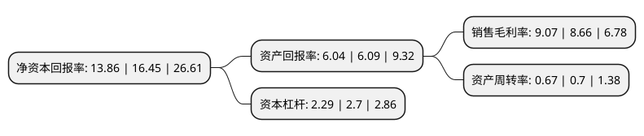

> 本页面由自动化程序生成于 2022年5月20日 01:24
> 内容可能存在错误，如有bug请提交issue至：https://github.com/Eroleice/doc-pi/issues
{.is-warning}

# 上市公司基本情况

## 基本资料

国网信息通信股份有限公司（以下简称“国网信通”）成立于1997年01月05日，阿坝藏族羌族自治州。于1998年04月02日在上交所主板上市。

国网信通注册资本119,539.454万元，主要业务:水利发电，配套发展与水电有关的输供电业务。以下是详细信息：

- 公司名称: 国网信息通信股份有限公司
- 股票代码: 600131.SH
- 所在地: 四川 - 阿坝藏族羌族自治州
- 成立日期: 1997年01月05日
- 注册资本: 119,539.454万元
- 法定代表人: 杨树
- 主营业务: 水利发电，配套发展与水电有关的输供电业务
- 公司官网: www.sgitc.com
- 公司介绍: 公司是能源行业领先的“云网融合”产业服务提供商，以“集成算力服务+能源数据服务”为基础，致力于提供能源行业多场景信息化融合服务。公司2019年底完成重大资产重组，主营业务转变为新型信息通信业务，重点立足能源领域，面向电网及发电企业、水气热公共事业单位，以及市场竞争售电主体等行业用户，提供包括云网基础设施、云平台及云应用在内的产品、解决方案，以及“云网融合”运营一体化服务，助力能源互联网建设和企业数字化转型。公司设有院士工作站和博士后科研工作站，拥有北京市云计算重点实验室、电力系统人工智能联合实验室等科研机构，与高校院所建立了稳定的产学研合作体系。2020年荣获上市公司资本运作标杆、中国能源企业信息化管理创新奖，持续推动信息通信技术与工业经济深度融合，创造良好的经济效益和股东投资回报。

## 股东及高管情况

上市公司第一大股东为国网信息通信产业集团有限公司，持股583,920,295股，占比48.85%，为上市公司实际控制人。

截至2022年03月31日，上市公司的前十大股东中，共有5名机构股东，4个产品账户，1个海外主体，其中5%以上大股东共有3名。上市公司前十大股东明细如下：

> 截至2022年03月31日，上市公司前十大股东信息如下：

| 股东名称 | 持股数量（股） | 持股比例 |
| --- | --- | --- |
| 国网信息通信产业集团有限公司 | 583,920,295 | 48.85% |
| 国网四川省电力公司 | 95,385,704 | 7.98% |
| 新华水利控股集团有限公司 | 59,849,416 | 5.01% |
| 兴业银行股份有限公司-兴全趋势投资混合型证券投资基金 | 34,793,725 | 2.91% |
| 阿坝州国有资产投资管理有限公司 | 25,513,161 | 2.13% |
| 北京新华国泰水利资产管理有限公司 | 19,873,000 | 1.66% |
| 中国工商银行股份有限公司-华安媒体互联网混合型证券投资基金 | 13,720,433 | 1.15% |
| 香港中央结算有限公司(陆股通) | 13,307,208 | 1.11% |
| 中国建设银行股份有限公司-华安沪港深外延增长灵活配置混合型证券投资基金 | 11,669,600 | 0.98% |
| 招商银行股份有限公司-兴全轻资产投资混合型证券投资基金(LOF) | 9,797,851 | 0.82% |

## 利润表分析

上市公司2021年总收入为74.65亿元，净利润为6.77亿元，实现盈利。

## 杜邦分析

> 数据列示周期：2021年 | 2020年 | 2019年
{.is-info}

上市公司的净资产收益率在近一年有所下降，下降幅度为-15.74%，其变化情况分解如下：
- 上市公司的销售毛利率在近一年上升了4.73%，可能是生产效率的提升、商品原材料价格下跌或商品价格的上涨所致。
- 上市公司的资产周转率在近一年下降了-4.29%，可能是源自于更慢的销售回款或库存管理效果下降。
- 上市公司的财务杠杆比率在近一年下降了-15.19%，可能是减少负债降低财务费用。

