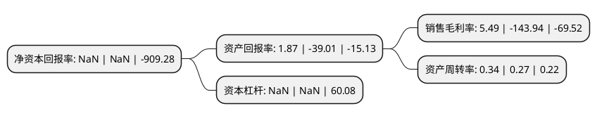

> 本页面由自动化程序生成于 2022年5月20日 01:25
> 内容可能存在错误，如有bug请提交issue至：https://github.com/Eroleice/doc-pi/issues
{.is-warning}

# 上市公司基本情况

## 基本资料

大唐电信科技股份有限公司（以下简称“大唐电信”）成立于1998年09月21日，北京市。于1998年10月21日在上交所主板上市。

大唐电信注册资本131,370.891万元，主要产品:交换及接入类，移动通信类，传输类，无线类，集成电路及软件类。主营业务:可信识别芯片，汽车电子芯片，融合通信芯片等方向。以下是详细信息：

- 公司名称: 大唐电信科技股份有限公司
- 股票代码: 600198.SH
- 所在地: 北京 - 北京市
- 成立日期: 1998年09月21日
- 注册资本: 131,370.891万元
- 法定代表人: 雷信生
- 主营业务: 主要产品:交换及接入类，移动通信类，传输类，无线类，集成电路及软件类主营业务:可信识别芯片，汽车电子芯片，融合通信芯片等方向
- 公司官网: www.datang.com
- 公司介绍: 公司作为国内具有自主知识产权的国家级高新技术企业和国家级企业技术中心，公司秉承深厚的技术积淀，已持续多年入选中国电子百强企业、软件百家企业前列，并获评国家技术创新示范企业。公司拥有多项核心专利技术，并参与承建无线移动通信国家重点实验室和新一代移动通信无线网络与芯片技术国家工程实验室。在集成电路设计领域，公司业务涵盖可信识别芯片、汽车电子芯片、融合通信芯片等方向。在终端设计领域，主要业务面向公安、城管、铁路、机场、安监等行业，提供专用终端产品和应用平台。在网络与服务领域，公司面向运营商、政府等行业客户，提供智慧城市、行业信息化、信息安全、电信运营支撑、IT分销、网络游戏等产品和解决方案。

## 股东及高管情况

上市公司第一大股东为电信科学技术研究院有限公司，持股295,195,174股，占比22.47%，**疑似为**上市公司实际控制人。

截至2022年03月31日，上市公司的前十大股东中，共有3名自然人股东，4名机构股东，3个产品账户，其中5%以上大股东共有3名。上市公司前十大股东明细如下：

> 未能通过持股比例判定出上市公司实际控制人（持股30%以上）
> 可能存在通过间接持股、联合持股、协议控制等方式拥有实际控制权的主体，具体请参考上市公司定期公告！
{.is-warning}

> 截至2022年03月31日，上市公司前十大股东信息如下：

| 股东名称 | 持股数量（股） | 持股比例 |
| --- | --- | --- |
| 电信科学技术研究院有限公司 | 295,195,174 | 22.47% |
| 中国信息通信科技集团有限公司 | 190,839,694 | 14.53% |
| 大唐电信科技产业控股有限公司 | 155,896,602 | 11.87% |
| 湖北长江中信科移动通信技术产业投资基金合伙企业(有限合伙) | 53,422,979 | 4.07% |
| 北京金融街资本运营集团有限公司 | 17,808,504 | 1.36% |
| 中国国有企业结构调整基金股份有限公司 | 17,808,504 | 1.36% |
| 嘉实基金-农业银行-嘉实中证金融资产管理计划 | 6,583,350 | 0.5% |
| 牛桂兰 | 6,000,000 | 0.46% |
| 王燕 | 5,899,900 | 0.45% |
| 高如田 | 5,758,000 | 0.44% |

## 利润表分析

上市公司2021年总收入为13.1亿元，净利润为0.71亿元，实现盈利。

## 杜邦分析

> 数据列示周期：2021年 | 2020年 | 2019年
{.is-info}

上市公司的净资产收益率在近一年有所下降，下降幅度为NaN%，其变化情况分解如下：
- 上市公司的销售毛利率在近一年下降了-103.81%，可能是生产效率的下降、商品原材料价格上涨或商品价格的下跌所致。
- 上市公司的资产周转率在近一年上升了25.93%，可能是源自于更快的销售回款或库存管理效果提升。
- 上市公司的财务杠杆比率在近一年下降了NaN%，可能是减少负债降低财务费用。

