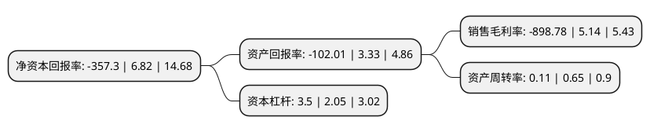

> 本页面由自动化程序生成于 2022年5月20日 01:25
> 内容可能存在错误，如有bug请提交issue至：https://github.com/Eroleice/doc-pi/issues
{.is-warning}

# 上市公司基本情况

## 基本资料

湖北凯乐科技股份有限公司（以下简称“*ST凯乐”）成立于1993年02月28日，荆州市。于2000年07月06日在上交所主板上市。

*ST凯乐注册资本99,488.606万元，主要产品:网状数据通讯机等数据链产品。主营业务:网通信产品，通信光纤，光缆，通信硅管，量子保密通信等产品的研发，生产与销售。以下是详细信息：

- 公司名称: 湖北凯乐科技股份有限公司
- 股票代码: 600260.SH
- 所在地: 湖北 - 荆州市
- 成立日期: 1993年02月28日
- 注册资本: 99,488.606万元
- 法定代表人: 朱弟雄
- 主营业务: 主要产品:网状数据通讯机等数据链产品主营业务:网通信产品，通信光纤，光缆，通信硅管，量子保密通信等产品的研发，生产与销售
- 公司官网: www.cnkaile.com
- 公司介绍: 公司是一家专注于大通信产业闭环和互联网领域的高科技企业，为信息化产业高端通信设备软硬件制造服务商。其大通信产业闭环产品主要涵盖光纤、光缆、数据线缆、量子通信数据链产品、自主可控计算平台、智能指控终端等民用和军用产品；其互联网产品涵盖“互联网+医疗”、“互联网+网络安全”、“互联网+金融”、“互联网+房地产营销”等多个领域。公司专网通信产品质量稳定可靠，得到客户的认可，竞争优势明显；公司在通信光纤、光缆、通信硅管制造行业内排名前列，是国内唯一纤、缆、管生产企业；所涉及智能指控终端产品在业内认可度较高；所涉及网络信息安全产业成为细分领域的发展较快的创新型企业。

## 股东及高管情况

上市公司第一大股东为荆州市科达商贸有限公司，持股122,123,577股，占比12.28%，**疑似为**上市公司实际控制人。

截至2022年03月31日，上市公司的前十大股东中，共有8名自然人股东，2名机构股东，其中5%以上大股东共有1名。上市公司前十大股东明细如下：

> 未能通过持股比例判定出上市公司实际控制人（持股30%以上）
> 可能存在通过间接持股、联合持股、协议控制等方式拥有实际控制权的主体，具体请参考上市公司定期公告！
{.is-warning}

> 截至2022年03月31日，上市公司前十大股东信息如下：

| 股东名称 | 持股数量（股） | 持股比例 |
| --- | --- | --- |
| 荆州市科达商贸有限公司 | 122,123,577 | 12.28% |
| 黄全成 | 9,289,100 | 0.93% |
| 上海卓凡园林有限公司 | 5,000,000 | 0.5% |
| 马英 | 4,342,200 | 0.44% |
| 刘海林 | 3,936,969 | 0.4% |
| 马红星 | 3,500,000 | 0.35% |
| 张万容 | 3,259,000 | 0.33% |
| 张胜敏 | 3,000,000 | 0.3% |
| 吕国潮 | 2,775,700 | 0.28% |
| 刘增伟 | 2,365,000 | 0.24% |

## 利润表分析

上市公司2021年总收入为9.58亿元，净利润为-86.15亿元，**未实现盈利**。

## 杜邦分析

> 数据列示周期：2021年 | 2020年 | 2019年
{.is-info}

上市公司的净资产收益率在近一年有所下降，下降幅度为-5339%，其变化情况分解如下：
- 上市公司的销售毛利率在近一年下降了-17585.99%，可能是生产效率的下降、商品原材料价格上涨或商品价格的下跌所致。
- 上市公司的资产周转率在近一年下降了-83.08%，可能是源自于更慢的销售回款或库存管理效果下降。
- 上市公司的财务杠杆比率在近一年上升了70.73%，可能是增加负债扩大生产规模。

