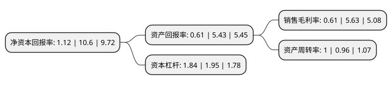

> 本页面由自动化程序生成于 2022年5月20日 01:27
> 内容可能存在错误，如有bug请提交issue至：https://github.com/Eroleice/doc-pi/issues
{.is-warning}

# 上市公司基本情况

## 基本资料

江苏中天科技股份有限公司（以下简称“中天科技”）成立于1996年02月09日，南通市。于2002年10月24日在上交所主板上市。

中天科技注册资本341,294.965万元，主要产品:1。电信产品;2。电力产品;3。新能源产业。以下是详细信息：

- 公司名称: 江苏中天科技股份有限公司
- 股票代码: 600522.SH
- 所在地: 江苏 - 南通市
- 成立日期: 1996年02月09日
- 注册资本: 341,294.965万元
- 法定代表人: 薛济萍
- 主营业务: 主要产品:1电信产品;2电力产品;3新能源产业
- 公司官网: www.chinaztt.com
- 公司介绍: 公司是国内光电缆品种最齐全的专业企业、国家级重点高新技术企业，主营光纤通信和电力传输。公司在国内率先建成海底光缆完整生产线，拥有海底光缆制造的核心技术，公司旗下子公司中天科技海缆有限公司是我国第一家拥有完全自主知识产权的海底光缆厂商。公司控股子公司中天科技光纤有限公司是一家专业从事光纤生产的高科技制造商，处于国内同行前列并进入世界前十名，已成为中国移动、中国网通、中国电信省公司等集中采购主流供应商。公司控股子公司上海中天铝线有限公司主要生产新型耐热铝合金导线，性能质量优良，得到市场青睐。在射频电缆领域，公司与日立电线联合南京邮电大学共同出资设立的中天日立射频电缆有限公司，打造出了具有独特竞争优势的射频电缆产品。

## 股东及高管情况

上市公司第一大股东为中天科技集团有限公司，持股774,117,883股，占比22.68%，**疑似为**上市公司实际控制人。

截至2022年03月31日，上市公司的前十大股东中，共有3名自然人股东，3名机构股东，3个产品账户，1个海外主体，其中5%以上大股东共有2名。上市公司前十大股东明细如下：

> 未能通过持股比例判定出上市公司实际控制人（持股30%以上）
> 可能存在通过间接持股、联合持股、协议控制等方式拥有实际控制权的主体，具体请参考上市公司定期公告！
{.is-warning}

> 截至2022年03月31日，上市公司前十大股东信息如下：

| 股东名称 | 持股数量（股） | 持股比例 |
| --- | --- | --- |
| 中天科技集团有限公司 | 774,117,883 | 22.68% |
| 香港中央结算有限公司(陆股通) | 172,898,414 | 5.07% |
| 中国证券金融股份有限公司 | 92,396,397 | 2.71% |
| 中央汇金资产管理有限责任公司 | 70,954,150 | 2.08% |
| 毛幼聪 | 53,522,492 | 1.57% |
| 李东璘 | 38,751,500 | 1.14% |
| 交通银行股份有限公司-南方成长先锋混合型证券投资基金 | 34,240,828 | 1% |
| 中国工商银行股份有限公司-中欧价值智选回报混合型证券投资基金 | 27,638,548 | 0.81% |
| 魏娟意 | 26,081,297 | 0.76% |
| 中国银行股份有限公司-泰达宏利转型机遇股票型证券投资基金 | 21,516,111 | 0.63% |

## 利润表分析

上市公司2021年总收入为461.63亿元，净利润为2.81亿元，实现盈利。

## 杜邦分析

> 数据列示周期：2021年 | 2020年 | 2019年
{.is-info}

上市公司的净资产收益率在近一年有所下降，下降幅度为-89.43%，其变化情况分解如下：
- 上市公司的销售毛利率在近一年下降了-89.17%，可能是生产效率的下降、商品原材料价格上涨或商品价格的下跌所致。
- 上市公司的资产周转率在近一年上升了4.17%，可能是源自于更快的销售回款或库存管理效果提升。
- 上市公司的财务杠杆比率在近一年下降了-5.64%，可能是减少负债降低财务费用。

